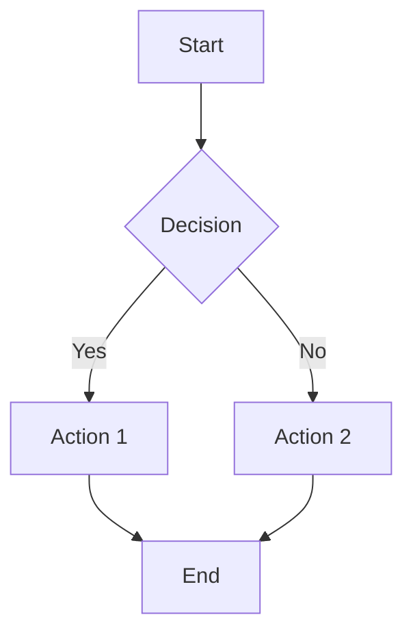
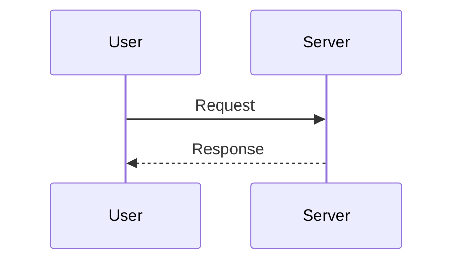

# Blog Post Guide

Complete guide to writing blog posts with all available features and configuration options.

## 📝 Post Front Matter Fields

All posts must include YAML front matter at the beginning of the file. Front matter is enclosed between `---` markers.

### Required Fields

```yaml
---
title: "Your Post Title"
date: "2025-01-20"
---
```

- **`title`** (string, required): The title of your blog post
  - Displayed as the main heading
  - Used in browser tab and meta tags
  - Example: `"Getting Started with Next.js"`

- **`date`** (string, required): Publication date in YYYY-MM-DD format
  - Must be in ISO format: `"2025-01-20"`
  - Used for sorting posts (newest first)
  - Displayed on post cards and post pages

### Optional Fields

```yaml
---
title: "Complete Example Post"
date: "2025-01-20"
excerpt: "A brief summary of your post"
category: "Tutorial"
tags: ["nextjs", "react", "typescript"]
draft: false
---
```

- **`excerpt`** (string, optional): Short description of the post
  - Displayed on the homepage post list
  - Used in meta description for SEO
  - Recommended length: 150-200 characters
  - Example: `"Learn how to build a modern blog with Next.js and deploy it to Vercel"`

- **`category`** (string, optional): Single category for the post
  - Used for organizing and filtering posts
  - Displayed as a colored badge on post cards
  - Categories are automatically collected and shown on homepage
  - Example: `"Tutorial"`, `"Web Development"`, `"DevOps"`

- **`tags`** (array of strings, optional): Multiple tags for the post
  - Used for detailed categorization
  - Displayed as hashtag badges on post cards
  - Tags are automatically collected and shown on homepage
  - Example: `["nextjs", "react", "typescript"]`

- **`draft`** (boolean, optional): Whether the post is a draft
  - Default: `false`
  - If `true`, the post will NOT be visible on the site
  - Useful for work-in-progress posts
  - Example: `draft: true`

## 📄 Complete Example

Here's a complete example of a blog post with all features:

```markdown
---
title: "Building a Modern Blog with Next.js"
date: "2025-01-20"
excerpt: "Learn how to create a fast, SEO-friendly blog using Next.js, Tailwind CSS, and Markdown. Complete guide with code examples."
category: "Web Development"
tags: ["nextjs", "react", "tailwind", "markdown"]
draft: false
---

# Building a Modern Blog with Next.js

In this tutorial, we'll build a complete blog from scratch.

## What We'll Cover

- Setting up Next.js
- Working with Markdown
- Styling with Tailwind CSS
- Deploying to Vercel

## Getting Started

First, create a new Next.js project:

\`\`\`bash
npx create-next-app@latest my-blog
cd my-blog
npm run dev
\`\`\`

### Project Structure

Your project will look like this:

\`\`\`
my-blog/
├── app/
├── posts/
└── package.json
\`\`\`

## Markdown Features

### Code Blocks

\`\`\`javascript
function hello() {
  console.log("Hello, World!");
}
\`\`\`

### Images


### Lists

- Feature 1
- Feature 2
- Feature 3

### Inline Code

Use \`npm install\` to install dependencies.

## Conclusion

You now have a working blog!
```

## ✨ Markdown Features

This blog supports GitHub Flavored Markdown (GFM) and additional features:

### Basic Formatting

```markdown
**bold text**
*italic text*
~~strikethrough~~
`inline code`
```

### Headings

```markdown
# H1 Heading
## H2 Heading
### H3 Heading
#### H4 Heading
##### H5 Heading
###### H6 Heading
```

### Lists

**Unordered:**
```markdown
- Item 1
- Item 2
  - Nested item
  - Another nested item
```

**Ordered:**
```markdown
1. First item
2. Second item
3. Third item
```

**Task Lists:**
```markdown
- [x] Completed task
- [ ] Incomplete task
```

### Links

```markdown
[Link text](https://example.com)
[Link with title](https://example.com "Hover title")
```

### Images

```markdown


<!-- With HTML for sizing -->

```

### Blockquotes

```markdown
> This is a blockquote
> It can span multiple lines
```

### Code Blocks

**With language syntax highlighting:**
````markdown
```javascript
function example() {
  return "Hello";
}
```

```python
def example():
    return "Hello"
```

```typescript
function example(): string {
  return "Hello";
}
```
````

**Without language:**
````markdown
```
Plain code block
No syntax highlighting
```
````

### Tables

```markdown
| Header 1 | Header 2 | Header 3 |
|----------|----------|----------|
| Cell 1   | Cell 2   | Cell 3   |
| Cell 4   | Cell 5   | Cell 6   |
```

### Horizontal Rule

```markdown
---
```

### Emoji

```markdown
:smile: :rocket: :heart: :+1:
```

Renders as: 😄 🚀 ❤️ 👍

### Math Equations (KaTeX)

**Inline math:**
```markdown
This is an inline equation: $E = mc^2$
```

**Block math:**
```markdown
$$
\int_{-\infty}^{\infty} e^{-x^2} dx = \sqrt{\pi}
$$
```

### Mermaid Diagrams

````markdown



````

## 📁 File Organization

### Simple Structure (Flat)

All posts in the `posts/` directory:

```
posts/
├── welcome.md
├── getting-started.md
└── advanced-tips.md
```

### Nested Structure (Organized)

Organize posts in subdirectories:

```
posts/
├── tutorials/
│   ├── beginner-guide.md
│   └── advanced-techniques.md
├── reviews/
│   ├── book-review.md
│   └── tool-review.md
└── news/
    └── latest-updates.md
```

Both structures are supported! The slug will be based on the file path.

**Examples:**
- `posts/welcome.md` → URL: `/posts/welcome`
- `posts/tutorials/beginner-guide.md` → URL: `/posts/tutorials/beginner-guide`

## 🖼️ Adding Images

### 1. Local Images

Save images in `public/images/` and reference them:

```markdown

```

**Recommended structure:**
```
public/
  images/
    posts/
      2025-01/
        post1-image.jpg
      2025-02/
        post2-image.jpg
```

### 2. External Images

Use full URLs:

```markdown

```

### 3. Image Sizing with HTML

```html


```

## 🎯 Best Practices

### Front Matter

1. **Always include required fields** (`title`, `date`)
2. **Write descriptive excerpts** (150-200 characters)
3. **Use meaningful categories** (2-3 words max)
4. **Add relevant tags** (3-7 tags recommended)
5. **Use `draft: true`** for unpublished posts

### Content

1. **Start with an introduction** explaining what the post covers
2. **Use headings** to structure content (H2 for main sections)
3. **Include code examples** with proper syntax highlighting
4. **Add images** to break up text and illustrate concepts
5. **End with a conclusion** or call-to-action

### Markdown Style

1. **Use blank lines** between sections
2. **Consistent heading levels** (don't skip levels)
3. **Descriptive link text** (avoid "click here")
4. **Meaningful alt text** for images (accessibility & SEO)
5. **Code blocks with language** for syntax highlighting

### File Naming

1. **Use lowercase** for file names
2. **Use hyphens** instead of spaces
3. **Be descriptive** but concise
4. **Match URL structure**

**Good:**
- `getting-started-with-nextjs.md`
- `2025-year-review.md`
- `tutorial-typescript-basics.md`

**Bad:**
- `Post1.md`
- `my new post.md`
- `ARTICLE.md`

## 🚀 Publishing Workflow

### 1. Create Post

Create a new `.md` file in `posts/`:

```bash
touch posts/my-new-post.md
```

### 2. Write Content

Add front matter and content:

```markdown
---
title: "My New Post"
date: "2025-01-20"
excerpt: "This is my new post"
category: "Tutorial"
tags: ["example"]
---

# My New Post

Content goes here...
```

### 3. Preview Locally

Run the dev server to preview:

```bash
npm run dev
```

Visit `http://localhost:3000`

### 4. Commit and Push

```bash
git add posts/my-new-post.md
git commit -m "Add new post: My New Post"
git push
```

### 5. Auto-Deploy

If connected to Vercel, your post will be live in 1-2 minutes!

## 📊 Automatic Features

Your posts automatically include:

- **Reading time estimate** (calculated from word count)
- **Table of Contents** (extracted from headings)
- **SEO metadata** (title, description, Open Graph tags)
- **Social sharing** (Twitter, Facebook, LinkedIn)
- **Previous/Next navigation** (between posts)
- **Syntax highlighting** (for code blocks)
- **Responsive images** (automatically styled)
- **Dark mode support** (follows system preference)

## ❓ Troubleshooting

### Post Not Showing Up

1. Check if `draft: true` in front matter (remove or set to `false`)
2. Verify file is in `posts/` directory with `.md` extension
3. Ensure `title` and `date` are present in front matter
4. Check for YAML syntax errors (proper indentation, quotes)

### Formatting Issues

1. Ensure front matter is enclosed in `---` markers
2. Check that code blocks use triple backticks: ` ``` `
3. Verify heading syntax (# with space after)
4. Test locally with `npm run dev` before deploying

### Images Not Loading

1. Verify image is in `public/` directory
2. Check path starts with `/` (e.g., `/images/photo.jpg`)
3. Ensure file name matches exactly (case-sensitive on some systems)
4. Try opening the image URL directly in browser

## 📚 Examples

See the `posts/samples/` directory for complete examples:

- `posts/samples/template-basic.md` - Basic post template with required fields
- `posts/samples/template-complete.md` - Complete template with all features
- `posts/samples/code-block-test.md` - Code blocks and syntax highlighting examples
- `posts/samples/image-usage-example.md` - Image usage examples
- `posts/samples/getting-started-nextjs.md` - Tutorial example

## 🎨 Customization

To customize how posts are displayed, edit:

- **Theme settings**: `config/theme.config.ts`
- **Post layout**: `app/posts/[slug]/page.tsx`
- **Post styling**: `app/globals.css`

See [THEME_CONFIG.md](THEME_CONFIG.md) for detailed configuration options.

---

Happy blogging! 🎉 If you have questions, please open an issue on GitHub.
