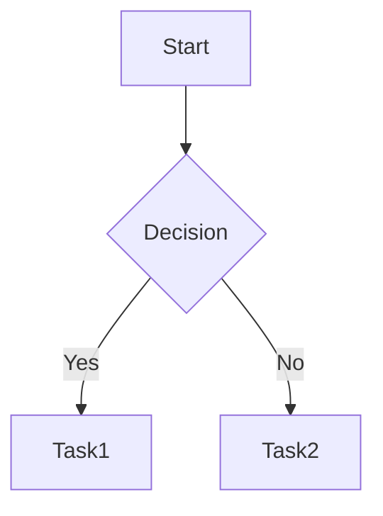

# Blog Template Guide

This guide helps you quickly start your blog using the available templates.

## 📝 Available Post Templates

### 1. Korean Basic Template
**File**: `posts/my-first-post.md`

A basic template written in Korean, perfect for Korean-speaking users starting their first blog.

**Features**:
- Korean explanations and examples
- Basic Markdown syntax included
- Suitable for daily blog posts

**Usage**:
```bash
# Copy the template
cp posts/my-first-post.md posts/2025-01-20-my-post.md

# Edit the file
# - Update title, date, excerpt, category, tags
# - Change draft: true to draft: false or remove it
# - Write your content
```

### 2. English Basic Template
**File**: `posts/samples/template-basic.md`

A minimal template with only essential fields.

**Features**:
- Required fields only
- Quick and simple start
- Suitable for simple posts

### 3. English Complete Template
**File**: `posts/samples/template-complete.md`

A comprehensive template with all features and options.

**Features**:
- All frontmatter fields explained
- Advanced Markdown features (math, diagrams, etc.)
- Code blocks, tables, images, and more examples
- Suitable for detailed documentation

## 🚀 Quick Start

### Step 1: Choose a Template

Select and copy your preferred template:

```bash
# Use Korean template
cp posts/my-first-post.md posts/2025-01-20-my-new-post.md

# Or use English basic template
cp posts/samples/template-basic.md posts/2025-01-20-my-new-post.md

# Or use English complete template
cp posts/samples/template-complete.md posts/2025-01-20-complete-post.md
```

### Step 2: Edit Frontmatter

Update the frontmatter at the top of the file:

```yaml
---
title: "Your Post Title Here"
date: "2025-01-20"  # Change to today's date
excerpt: "Brief description of your post"
category: "Category Name"
tags: ["tag1", "tag2", "tag3"]
draft: false  # Set to false to publish
---
```

### Step 3: Write Content

Write your content below the frontmatter using Markdown format.

### Step 4: Preview

Preview locally with the development server:

```bash
npm run dev
# Open http://localhost:3000
```

### Step 5: Deploy

Push changes to GitHub for automatic deployment:

```bash
git add posts/2025-01-20-my-new-post.md
git commit -m "Add: new post"
git push
```

## 📋 Frontmatter Fields

### Required Fields

| Field | Description | Example |
|-------|-------------|---------|
| `title` | Post title | `"My First Blog Post"` |
| `date` | Publication date (YYYY-MM-DD) | `"2025-01-20"` |

### Optional Fields

| Field | Description | Example |
|-------|-------------|---------|
| `excerpt` | Post summary (150-200 chars recommended) | `"Getting started guide"` |
| `category` | Category (single) | `"Tutorial"`, `"Daily"`, `"Review"` |
| `tags` | Tags (multiple) | `["nextjs", "react", "typescript"]` |
| `draft` | Draft status | `true` (hidden), `false` (visible) |

## 📂 Recommended File Structures

### Simple Structure
```
posts/
├── 2025-01-20-first-post.md
├── 2025-01-21-second-post.md
└── 2025-01-22-third-post.md
```

### Category-Based Structure
```
posts/
├── dev/
│   ├── 2025-01-20-nextjs-tutorial.md
│   └── 2025-01-21-react-hooks.md
├── daily/
│   └── 2025-01-20-my-diary.md
└── reviews/
    └── 2025-01-20-book-review.md
```

### Date-Based Structure
```
posts/
├── 2025/
│   ├── 01/
│   │   ├── first-post.md
│   │   └── second-post.md
│   └── 02/
│       └── third-post.md
```

## 🎨 Recommended Categories

Choose categories that fit your blog's theme:

**Development Blog**:
- Development
- Tutorial
- Troubleshooting
- Project

**Personal Blog**:
- Daily
- Travel
- Hobby
- Thoughts

**Tech Blog**:
- Web Development
- Backend
- Frontend
- DevOps
- Algorithm

## 🏷️ Tag Writing Tips

1. **Be specific**: Use `"javascript"`, `"react"` instead of `"coding"`
2. **Consistency**: Choose between `"Next.js"` vs `"nextjs"` and stick with it
3. **Optimal count**: 3-7 tags per post recommended
4. **Use lowercase**: `"nextjs"`, `"react"` (for consistency)
5. **Use hyphens**: For multiple words use `"web-development"` format

## 🖼️ Adding Images

### Local Images

1. Save images in `public/images/` folder
2. Reference in your post:

```markdown

```

### External Images

```markdown

```

### Resize Images

```html

```

For more details, see [IMAGE_GUIDE.md](IMAGE_GUIDE.md).

## ✍️ Markdown Syntax Cheat Sheet

### Basic Formatting

```markdown
**bold**
*italic*
~~strikethrough~~
`inline code`
```

### Headings

```markdown
# H1 Heading
## H2 Heading
### H3 Heading
```

### Lists

```markdown
1. Ordered list
2. Second item

- Unordered list
- Second item
```

### Links and Images

```markdown
[Link text](https://example.com)

```

### Code Blocks

````markdown
```javascript
function hello() {
  console.log("Hello!");
}
```
````

### Blockquotes

```markdown
> This is a blockquote.
```

### Tables

```markdown
| Header1 | Header2 |
|---------|---------|
| Cell1   | Cell2   |
```

## 🔧 Advanced Features

### Math Equations (KaTeX)

**Inline**: `$E = mc^2$`

**Block**:
```markdown
$$
\int_{-\infty}^{\infty} e^{-x^2} dx = \sqrt{\pi}
$$
```

### Diagrams (Mermaid)

````markdown

````

## 📚 Additional Documentation

For more details, see:

- **[POST_GUIDE.md](/POST_GUIDE.md)** - Complete post writing guide
- **[IMAGE_GUIDE.md](/IMAGE_GUIDE.md)** - Image usage guide
- **[THEME_CONFIG.md](/THEME_CONFIG.md)** - Theme customization
- **[FORK_SETUP.md](/FORK_SETUP.md)** - Blog setup guide
- **[DEPLOYMENT.md](/DEPLOYMENT.md)** - Deployment guide
- **[DEPLOYMENT-KO.md](/DEPLOYMENT-KO.md)** - Deployment guide (Korean)
- **[TEMPLATE_GUIDE_KO.md](/TEMPLATE_GUIDE_KO.md)** - Template guide (Korean)

## 💡 Tips

### Writing Drafts

Keep posts as drafts before publishing:

```yaml
---
title: "Work in Progress"
date: "2025-01-20"
draft: true  # Won't appear on the blog
---
```

### SEO Optimization

1. **Meaningful title**: Keep under 60 characters
2. **Detailed excerpt**: 150-200 character post summary
3. **Relevant tags**: Use tags related to the post
4. **Image alt text**: Add descriptions to all images

### Writing Readable Content

1. **Short paragraphs**: Break into 3-4 lines
2. **Use headings**: Structure with H2, H3
3. **Use lists**: When multiple items
4. **Code blocks**: Specify language for code
5. **Add images**: Visual aids improve understanding

## 🎯 Checklist

Before publishing your post:

- [ ] Is the title clear and engaging?
- [ ] Is the date correct?
- [ ] Does the excerpt describe the post well?
- [ ] Are categories and tags appropriate?
- [ ] Did you change draft to false?
- [ ] Are image paths correct?
- [ ] Did you preview locally?
- [ ] Did you check spelling?
- [ ] Did you specify language for code blocks?

---

**Have questions?** Ask on [GitHub Issues](https://github.com/kimmandoo/blog/issues)! 🙋‍♂️
