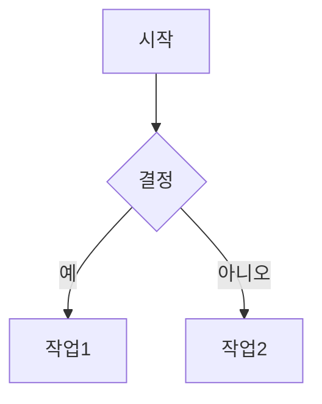

# 블로그 템플릿 사용 가이드

이 문서는 블로그를 빠르게 시작할 수 있도록 도와주는 템플릿 사용 가이드입니다.

## 📝 포스트 템플릿 종류

### 1. 한국어 기본 템플릿
**파일**: `posts/my-first-post.md`

한국어로 작성된 기본 템플릿으로, 처음 블로그를 시작하는 분들에게 적합합니다.

**특징**:
- 한국어 설명과 예시
- 기본 마크다운 문법 포함
- 일상적인 블로그 포스트에 적합

**사용법**:
```bash
# 템플릿 복사
cp posts/my-first-post.md posts/2025-01-20-my-post.md

# 파일 편집
# - title, date, excerpt, category, tags 수정
# - draft: true를 draft: false로 변경하거나 삭제
# - 본문 내용 작성
```

### 2. 영문 기본 템플릿
**파일**: `posts/samples/template-basic.md`

영어로 작성된 최소한의 템플릿입니다.

**특징**:
- 필수 필드만 포함
- 간단하고 빠른 시작
- 심플한 포스트에 적합

### 3. 영문 완전 템플릿
**파일**: `posts/samples/template-complete.md`

모든 기능과 옵션을 포함한 완전한 템플릿입니다.

**특징**:
- 모든 프론트매터 필드 설명
- 고급 마크다운 기능 (수식, 다이어그램 등)
- 코드 블록, 표, 이미지 등 다양한 예시
- 상세한 문서에 적합

## 🚀 빠른 시작

### 1단계: 템플릿 선택

원하는 템플릿을 선택하고 복사합니다:

```bash
# 한국어 템플릿 사용
cp posts/my-first-post.md posts/2025-01-20-나의-새-포스트.md

# 또는 영문 기본 템플릿 사용
cp posts/samples/template-basic.md posts/2025-01-20-my-new-post.md

# 또는 영문 완전 템플릿 사용
cp posts/samples/template-complete.md posts/2025-01-20-complete-post.md
```

### 2단계: 프론트매터 수정

파일 상단의 프론트매터를 수정합니다:

```yaml
---
title: "여기에 제목 입력"
date: "2025-01-20"  # 오늘 날짜로 변경
excerpt: "포스트에 대한 간단한 설명"
category: "카테고리명"
tags: ["태그1", "태그2", "태그3"]
draft: false  # 발행하려면 false로 변경
---
```

### 3단계: 내용 작성

프론트매터 아래에 마크다운 형식으로 내용을 작성합니다.

### 4단계: 미리보기

로컬 개발 서버로 미리보기:

```bash
npm run dev
# http://localhost:3000 에서 확인
```

### 5단계: 배포

변경사항을 GitHub에 푸시하면 자동으로 배포됩니다:

```bash
git add posts/2025-01-20-나의-새-포스트.md
git commit -m "Add: 새 포스트 추가"
git push
```

## 📋 프론트매터 필드 설명

### 필수 필드

| 필드 | 설명 | 예시 |
|------|------|------|
| `title` | 포스트 제목 | `"나의 첫 블로그 포스트"` |
| `date` | 작성 날짜 (YYYY-MM-DD) | `"2025-01-20"` |

### 선택 필드

| 필드 | 설명 | 예시 |
|------|------|------|
| `excerpt` | 포스트 요약 (150-200자 권장) | `"블로그 시작 가이드"` |
| `category` | 카테고리 (하나만) | `"개발"`, `"일상"`, `"리뷰"` |
| `tags` | 태그 (여러 개 가능) | `["nextjs", "react", "typescript"]` |
| `draft` | 임시글 여부 | `true` (숨김), `false` (표시) |

## 📂 파일 구조 추천

### 단순한 구조
```
posts/
├── 2025-01-20-first-post.md
├── 2025-01-21-second-post.md
└── 2025-01-22-third-post.md
```

### 카테고리별 구조
```
posts/
├── dev/
│   ├── 2025-01-20-nextjs-tutorial.md
│   └── 2025-01-21-react-hooks.md
├── daily/
│   └── 2025-01-20-my-diary.md
└── reviews/
    └── 2025-01-20-book-review.md
```

### 날짜별 구조
```
posts/
├── 2025/
│   ├── 01/
│   │   ├── first-post.md
│   │   └── second-post.md
│   └── 02/
│       └── third-post.md
```

## 🎨 카테고리 추천

블로그 주제에 맞는 카테고리를 선택하세요:

**개발 블로그**:
- 개발 (Development)
- 튜토리얼 (Tutorial)
- 트러블슈팅 (Troubleshooting)
- 프로젝트 (Project)

**일상 블로그**:
- 일상 (Daily)
- 여행 (Travel)
- 취미 (Hobby)
- 생각 (Thoughts)

**기술 블로그**:
- 웹 개발 (Web Development)
- 백엔드 (Backend)
- 프론트엔드 (Frontend)
- DevOps
- 알고리즘 (Algorithm)

## 🏷️ 태그 작성 팁

1. **구체적으로**: `"코딩"` 보다 `"javascript"`, `"react"` 처럼 구체적으로
2. **일관성**: `"Next.js"` vs `"nextjs"` - 하나로 통일
3. **적정 개수**: 포스트당 3-7개 권장
4. **소문자 사용**: `"nextjs"`, `"react"` (일관성을 위해)
5. **하이픈 사용**: 여러 단어는 `"web-development"` 형식으로

## 🖼️ 이미지 추가하기

### 로컬 이미지

1. 이미지를 `public/images/` 폴더에 저장
2. 포스트에서 참조:

```markdown

```

### 외부 이미지

```markdown

```

### 이미지 크기 조절

```html

```

자세한 내용은 [IMAGE_GUIDE.md](IMAGE_GUIDE.md)를 참고하세요.

## ✍️ 마크다운 문법 치트시트

### 기본 서식

```markdown
**굵게**
*기울임*
~~취소선~~
`인라인 코드`
```

### 제목

```markdown
# H1 제목
## H2 제목
### H3 제목
```

### 리스트

```markdown
1. 순서 있는 리스트
2. 두 번째 항목

- 순서 없는 리스트
- 두 번째 항목
```

### 링크와 이미지

```markdown
[링크 텍스트](https://example.com)

```

### 코드 블록

````markdown
```javascript
function hello() {
  console.log("Hello!");
}
```
````

### 인용구

```markdown
> 이것은 인용구입니다.
```

### 표

```markdown
| 헤더1 | 헤더2 |
|-------|-------|
| 셀1   | 셀2   |
```

## 🔧 고급 기능

### 수학 수식 (KaTeX)

**인라인**: `$E = mc^2$`

**블록**:
```markdown
$$
\int_{-\infty}^{\infty} e^{-x^2} dx = \sqrt{\pi}
$$
```

### 다이어그램 (Mermaid)

````markdown

````

## 📚 추가 문서

더 자세한 내용은 다음 문서를 참고하세요:

- **[POST_GUIDE.md](/POST_GUIDE.md)** - 포스트 작성 완벽 가이드 (영문)
- **[IMAGE_GUIDE.md](/IMAGE_GUIDE.md)** - 이미지 사용 가이드 (영문)
- **[THEME_CONFIG.md](/THEME_CONFIG.md)** - 테마 커스터마이징 (영문)
- **[FORK_SETUP.md](/FORK_SETUP.md)** - 블로그 설정 가이드 (영문)
- **[DEPLOYMENT-KO.md](/DEPLOYMENT-KO.md)** - 배포 가이드 (한국어)

## 💡 팁

### 초안 작성하기

포스트를 공개하기 전에 초안으로 작성:

```yaml
---
title: "작성 중인 포스트"
date: "2025-01-20"
draft: true  # 블로그에 표시되지 않음
---
```

### SEO 최적화

1. **의미있는 제목**: 60자 이내로 작성
2. **상세한 excerpt**: 150-200자로 포스트 요약
3. **관련 태그**: 포스트와 관련된 태그 사용
4. **이미지 alt 텍스트**: 모든 이미지에 설명 추가

### 읽기 쉬운 글 작성

1. **짧은 문단**: 3-4줄로 나누기
2. **제목 활용**: H2, H3로 구조화
3. **리스트 사용**: 항목이 여러 개일 때
4. **코드 블록**: 코드는 언어 지정
5. **이미지 추가**: 시각 자료로 이해도 향상

## 🎯 체크리스트

포스트를 발행하기 전 확인사항:

- [ ] 제목이 명확하고 매력적인가?
- [ ] 날짜가 올바른가?
- [ ] excerpt가 포스트를 잘 설명하는가?
- [ ] 카테고리와 태그가 적절한가?
- [ ] draft를 false로 변경했는가?
- [ ] 이미지 경로가 정확한가?
- [ ] 로컬에서 미리보기를 했는가?
- [ ] 맞춤법을 확인했는가?
- [ ] 코드 블록에 언어를 지정했는가?

---

**궁금한 점이 있나요?** [GitHub Issues](https://github.com/kimmandoo/blog/issues)에 질문해주세요! 🙋‍♂️
