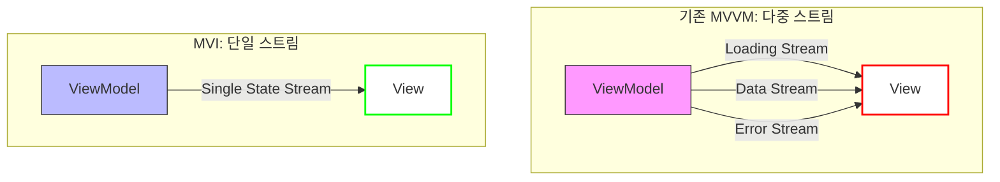
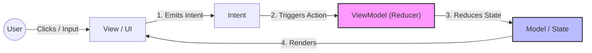

## MVI란 무엇인가?

MVI (Model-View-Intent)는 단방향 데이터 흐름(Unidirectional Data Flow, UDF)을 강제하여 앱의 상태(State)를 예측 가능하게 만드는 아키텍처 패턴이다. 상태를 예측가능하게 만든다는 게 어떤 의미냐면, 특정 시점에 앱이 어떤 상태에 있는지 쉽게 알 수 있고, 그 상태가 어떻게 변화했는지를 추적할 수 있다는 뜻이다. 이는 디버깅과 유지보수를 훨씬 수월하게 만든다.

기존 MVVM 패턴에서는 때때로 상태 불일치가 발생할 수 있다.



예를 들어 ViewModel 안에 isLoading, data, error 등 **여러 개**의 MutableLiveData나 MutableStateFlow가 존재할 때, 개발자의 실수로 로딩은 끝났는데 에러 메시지가 남아있거나, 데이터는 비어있는데 성공 상태로 표시되는 등 상태 간의 동기화가 깨지는 경우가 발생할 수 있다.

패턴의 문제는 아니지만 실수로 인해 발생한 상태 불일치다.

그에 비해 MVI는 화면의 모든 상태를 하나의 불변 객체(Single Immutable State)로 관리한다. 즉, 모델은 현재 시점의 UI 상태를 완벽하게 대변하는 단 하나의 스냅샷만을 가지기 때문에, 상태 불일치가 발생할 여지가 없다.

### MVI의 구성 요소 및 동작원리



- Model (State): UI에 렌더링될 데이터의 불변(Immutable) 객체. 단순히 데이터만 담는 것이 아니라, 로딩 여부, 에러 메시지 등 화면의 모든 정보를 포함하고 있다.
- View (UI): 상태를 받아 화면을 그린다. 사용자의 행동(클릭 등)을 Intent로 변환하여 ViewModel로 전달.
- Intent: 사용자의 의도(행동). 단순 이벤트 발생을 넘어 "데이터 로드 의도"라는 의미를 가짐.

동작원리는 UDF를 따른다.

1. 사용자가 버튼을 클릭하면 View는 이를 Intent로 변환하여 ViewModel에 전달하고
2. ViewModel은 이 Intent를 처리하여 새로운 Model(State)을 생성한다. 
3. ViewModel은 새로운 State를 View에 전달하고, View는 이를 기반으로 화면을 다시 그린다.

상태는 항상 불변 객체로 관리되며, 이전 상태는 변경되지 않고 새로운 상태가 생성된다. 이를 통해 상태 변화의 추적이 용이해지는데, Intent와 결합되면서 이슈재현에서 강력한 이점이 생긴다.

앱이 크래시가 났을 때, "사용자가 어떤 행동을 했길래 이 상태에 도달했는가?"를 Intent 단위로 추적할 수 있기 때문이다. MVI가 복잡한 화면에서 특히 유용한 이유이라고 할 수 있겠다.

Android에서 MVI를 구현할 때는 Kotlin의 Sealed Class, Data Class, StateFlow 등을 활용하여 상태와 이벤트를 명확하게 정의하고 관리하는 것이 일반적이다.

```kotlin
// 화면의 모든 상태를 정의 (불변 객체)
data class MainState(
    val isLoading: Boolean = false,
    val items: List<String> = emptyList(),
    val error: String? = null
)

// 사용자의 행동(의도) 정의
sealed interface MainIntent {
    data object LoadData : MainIntent
    data class OnItemClicked(val id: String) : MainIntent
}

// 상태 외의 일회성 이벤트 (토스트 메시지, 네비게이션 등)
sealed interface MainSideEffect {
    data class ShowToast(val message: String) : MainSideEffect
    data class NavigateToDetail(val id: String) : MainSideEffect
}
```

State에 `@Immutable` 어노테이션을 붙여주기도 하는데, 이는 컬렉션 객체가 포함될 때 Compose에서 상태가 변경되지 않음을 보장하여 불필요한 재컴포지션을 방지하기 위함이다.

Compose는 UI를 다시 그릴지(Recomposition) 결정할 때, 데이터가 안정적(Stable)인지 확인한다. Primitive Type (Int, String, Boolean 등)들은 변경 불가능하므로 Stable로 간주하고, Collection (List, Map, Set 등)들은 기본적으로 컴파일러가 Unstable로 간주한다. 

따라서 Collection이 포함된 State에 `@Immutable`을 붙여주면 이 객체는 생성된 후에 절대 내부 값이 변하지 않으니 안에 List가 들어있어도 최적화(Skip)해달라는 요구가 되는 것이다. 

논리적으로 데이터가 변하지 않아 같은 값을 들고 있어도 Unstable로 간주되어 불필요한 리컴포지션이 일어나던 걸 컴파일러에게 미리 알려 최적화하는 기술이라고 할 수 있다.

`@Immutable` 어노테이션은 컴파일러에게 선언해두는 거라서 컴파일러가 계산을 스킵하게 된 만큼 개발자가 주의를 기울여야한다. 내부 State에 val만을 사용하고, Mutable 컬렉션을 쓰지 않는 등 불변성을 지켜야 한다.

상태를 정의했으니 이제 ViewModel에서 Intent를 처리하고 상태를 관리하는 로직을 구현해보겠다.

```kotlin
class MainViewModel : ViewModel() {

    private val _state = MutableStateFlow(MainState())
    val state: StateFlow<MainState> = _state.asStateFlow()

    private val _effect = Channel<MainSideEffect>()
    val effect = _effect.receiveAsFlow()

    fun handleIntent(intent: MainIntent) {
        when (intent) {
            is MainIntent.LoadData -> loadData()
            is MainIntent.OnItemClicked -> navigateToDetail(intent.id)
        }
    }

    private fun loadData() {
        viewModelScope.launch {
            _state.update { it.copy(isLoading = true, error = null) }
            
            try {
                val result = fetchDataFromRepository()
                _state.update { 
                    it.copy(isLoading = false, items = result) 
                }
            } catch (e: Exception) {
                _state.update { 
                    it.copy(isLoading = false, error = e.message) 
                }
                _effect.send(MainSideEffect.ShowToast("에러 발생"))
            }
        }
    }

    private fun navigateToDetail(id: String) {
        viewModelScope.launch {
            _effect.send(MainSideEffect.NavigateToDetail(id))
        }
    }
}
```

선언해둔 Intent에 따라 ViewModel에서 상태를 업데이트하거나 사이드 이펙트를 발생시킨다. 상태는 항상 불변 객체로 관리되며, `copy()` 메서드를 사용하여 새로운 상태를 생성한다. 사이드 이펙트는 Channel을 통해 일회성 이벤트로 처리된다.

copy를 사용하면 상태 객체의 일부 속성만 변경하고 나머지는 그대로 유지할 수 있어 편리하다.

sideEffect를 SharedFlow가 아니라 Channel + receiveAsFlow()로 구현한 이유는 이벤트의 유실을 방지하고, 딱 한 번만 소비되게 하기 위해서다.

SharedFlow는 HotStream이라 구독자가 없을 때 발생한 이벤트를 놓칠 수 있지만, Channel은 이벤트가 발생하면 버퍼에 담아두기 때문에, Channel 유형에 따라 반드시 소비자가 받아야 버퍼에서 소비되게 할 수도 있다.

replay를 사용해서 SharedFlow로 유실을 방지하면, 이벤트가 중복 소비될 위험이 있다. 예를 들어 화면 회전 등으로 구독자가 재구독되면, 이전에 발생한 이벤트가 다시 전달될 수 있기 때문이다.

또한 Channel은 한 번에 한 개의 구독자만 허용하므로, 이벤트가 여러 번 소비되는 문제도 방지할 수 있다.

receiveAsFlow()를 사용하면 Channel이 UI에서 소비할 때 Flow 형태로 변환되는데, Flow는 ColdStream이므로 구독자가 있을 때만 이벤트를 전달한다. 따라서 UI가 활성화된 상태에서만 이벤트를 처리하게 되어 불필요한 리소스 낭비를 줄일 수 있다. 

이때 SharedFlow와 Channel이 다른 점은 Channel은 버퍼에 담긴 이벤트가 구독자에게 전달될 때까지 유지된다는 점이다. SharedFlow는 구독자가 없으면 이벤트가 사라질 수 있지만, Channel은 구독자가 나타날 때까지 이벤트를 보관한다.

어떤 게 정답이다라기 보다는 상황에 맞게 선택하면 될 것 같다.

UI에서 소비하는 건 간단하다.

```kotlin
@Composable
fun MainScreen(
    viewModel: MainViewModel = hiltViewModel()
) {
    val state by viewModel.state.collectAsStateWithLifecycle()
    
    val context = LocalContext.current
    LaunchedEffect(viewModel.effect) {
        viewModel.effect.collect { effect ->
            when (effect) {
                is MainSideEffect.ShowToast -> {
                    Toast.makeText(context, effect.message, Toast.LENGTH_SHORT).show()
                }
                is MainSideEffect.NavigateToDetail -> {

                }
            }
        }
    }

    MainContent(
        state = state,
        onIntent = viewModel::handleIntent
    )
}
```

collectAsStateWithLifecycle과 LaunchedEffect를 사용하여 ViewModel의 상태와 사이드 이펙트를 구독한다. 상태가 변경되면 Compose가 알아서 UI를 다시 그린다.

## 항상 좋은가?

그건 또 아니다. 잘못 구현하면 보일러 플레이트가 늘어나고, 오히려 복잡해질 수 있다.

MVI는 상태를 단일 객체로 관리하기 때문에 상태가 커지면 관리가 어려워질 수 있다. 예를 들어, 화면에 표시되는 데이터가 많아지면 상태 객체도 커지고, 이를 업데이트하는 로직도 복잡해지게 된다.

copy로 효율적인 객체 생성을 지원하지만, state가 커질 수록 매번 전체 객체를 복사하는 비용이 증가할 수 있다. 그래서 UI에서는 단일 상태 객체만을 구독하게 하되, ViewModel 내부에서는 여러 개의 작은 상태 객체로 나누어 관리하는 전략을 사용할 수도 있다.

보일러 플레이트가 늘어나는 경우는 예시 하나로 바로 설명할 수 있다.

예를 들어 간단한 카운팅을 구현한다고 해보자.

MVVM는 버튼 클릭 시 숫자를 1 올리는 기능이라면 ViewModel에 함수 하나 `fun increase()`만 만들면 끝이다. 이에 반에 MVI는 Intent, State, ViewModel에서 Intent 처리 함수 등 여러 구성 요소를 만들어야 한다.

이런 경우에는 MVI가 오히려 과한 설계가 될 수 있다. 따라서 MVI를 도입할 때는 프로젝트의 복잡도와 요구사항을 고려하여 적절한 아키텍처 패턴을 선택하는 것이 중요하다.

### 번외. `MVVM + UDF + SSOT`와 `MVI`

이런 질문을 들었었다. MVVM 패턴에서 단방향 데이터 흐름(UDF)과 단일 진실의 원천(SSOT)을 적용하면 MVI라고 할 수 있는가? 였는데, 엄밀히 말하면 Intent가 없으니 MVI라고 할 수는 없다.

Intent 대신 함수 호출로 대체된 MVVM 패턴이라고 하면 될 것 같다.

엄격한 MVI는 모든 사용자 행동을 객체로 포장한다. 행동 자체가 기록 가능한 데이터가 되기 때문에 로그를 남겨 디버깅에 사용할 수도 있다. 반면 MVVM + UDF + SSOT는 함수 호출로 행동을 처리하므로, 행동 자체를 데이터로 다루지 않는다. 그대신 매우 직관적이고 간단해진다.

MVVM + UDF + SSOT 형태를 가져갈 때 MVI보다 못한 점은 어떤 함수가 언제 호출됐는 지 추적하기 어렵다는 점, 딱 한 가지라고 생각한다.

그래서 이미 위와 같은 형태로 프로젝트가 구성되어있다면 굳이 MVI를 고집할 필요가 없고, 인터렉션이 많아 복잡한 화면에서만 MVI를 도입하는 게 좋다고 생각한다.