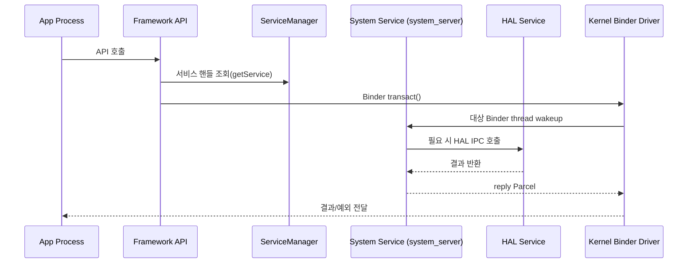

Android 개발을 하다 보면 RemoteException, TransactionTooLargeException, ANR 같은 오류를 만나게 된다. 이 오류들의 공통점은 모두 프로세스 경계에서 발생한다는 것이다. 이 경계들이 걸쳐져있는 게 Binder다.



글 시작 전 이 Exception들의 내용을 풀어보겠다.

### RemoteException

RemoteException은 “원격 프로세스와의 Binder 통신이 정상적으로 끝나지 않았다”는 뜻으로 대표적으로는 다음 경우에 발생한다.

- 대상 프로세스가 죽었을 때
- Binder 트랜잭션 중 예외가 발생했을 때
- 서비스 연결은 되어 있지만 실제 서버 객체가 더 이상 유효하지 않을 때

이건 프로세스 경계 너머의 상대가 응답을 끝내지 못했다는 IPC 예외에 가깝기 때문에 네트워크 예외처럼 보면 안 된다.

### TransactionTooLargeException

Binder는 큰 데이터를 보내기 위한 채널이 아니다!!!

Intent, Bundle, CursorWindow, 큰 리스트, 큰 Bitmap 메타데이터 등을 한 번에 넘기면 Binder transaction buffer 한계에 걸릴 수 있다.

- savedInstanceState에 큰 데이터를 넣었을 때
- Activity/Service 간 Intent extras에 대형 객체를 담았을 때
- AIDL 호출에 큰 리스트/대형 Parcelable을 넣었을 때

이것들이 문제상황인데, 해결 방향은 단순하다.

큰 객체를 Binder로 직접 보내지 말고, ID만 전달하고 실제 데이터는 파일/DB/shared memory로 넘기고, 반복 조회가 필요하면 배치 API로 합쳐야 Binder에 적합한 통신 형태라고 할 수 있다.

### ANR

Binder 호출은 상대 프로세스가 처리해줄 때까지 현재 스레드가 기다릴 수 있다.
그래서 메인 스레드에서 느린 Binder 호출을 하면 UI가 멈추고 그 대기 시간이 길어지면 ANR로 이어진다.

안드로이드 공식문서에서는 5초 runtime으로 잡고있다.

- 앱 메인 스레드에서 system service를 반복 호출
- system_server가 이미 바빠서 응답이 늦어짐
- 서버 쪽 Binder thread가 긴 작업이나 락 대기로 막힘

Binder는 크게 다음 세 가지 역할을 하고 있다.

- 호출자 신원(UID/PID) 전달 — 커널이 직접 부여하므로 위변조가 불가능하다.
- 권한/정책 집행 지점 제공 — 계층별 보안 체크를 통과해야 서비스에 접근할 수 있다.
- 레이어 간 API 계약(AIDL) 강제 — 인터페이스 정의가 컴파일 타임에 검증된다.

## 왜 Binder가 필요한가

| 구성 요소          | 역할                        | 실무 포인트                      |
| -------------- | ------------------------- | --------------------------- |
| Client (Proxy) | 원격 서비스 호출자                | 로컬 메서드처럼 보이지만 IPC 비용이 있음    |
| Server (Stub)  | 호출 수신자                    | `onTransact()`에서 코드 분기/언마샬링 |
| ServiceManager | 이름 -> 서비스 Binder 핸들 등록/조회 | 서비스 discovery 첫 관문          |
| Parcel         | 요청/응답 직렬화 버퍼              | 큰 객체/빈번한 호출은 성능 병목          |
| Binder Driver  | 트랜잭션 전달/스레드 wakeup        | 최종 IPC 라우팅과 identity 전달     |
| Binder Thread Pool | 서버 측 요청 처리 스레드 집합 | 오래 점유하면 전체 IPC 지연 유발 |
| Death Recipient | 원격 Binder 종료 감지 | 서비스 죽음 복구 로직의 핵심 |

Android는 앱 샌드박스가 기본이다. 앱마다 프로세스와 UID가 분리되어 있으며 직접 하드웨어나 공유 자원에 접근하면 보안과 안정성이 무너지기 때문에 앱과 공유자원에 대해 시스템 서비스가 중재하고, Binder가 그 중재 경로를 표준화한다.

Binder가 없다고 가정하면 다음 문제들이 발생한다.

- 앱마다 소켓/공유메모리 프로토콜을 제각각 정의해 호환성과 보안 검증이 파편화된다.
- 호출자 신원 검증이 사용자 공간 구현에 의존해 취약해진다.
- 서비스 생명주기처리 방식이 제각각이 된다.

| 관점 | Binder 제공 가치 | 실무 효과 |
|------|----------------|----------|
| 보안 | 커널이 호출자 identity를 부여 | 권한 체크 기준이 일관됨 |
| 안정성 | Death notification, 표준 예외 경로 | 서비스 다운 시 복구 로직 표준화 |
| 유지보수 | AIDL 기반 계약 관리 | API 변경 영향 범위가 명확 |
| 디버깅 | 공통 계층(log/dumpsys/driver) | 원인 추적 경로가 표준화 |

Binder객체의 실제 호출은 "객체 포인터"가 아니라 "핸들(handle)" 기반으로 동작한다. 서버 프로세스는 Binder 노드를 보유하고, 클라이언트는 그 노드를 가리키는 핸들 참조를 보유한다. 드라이버가 핸들 <-> 대상 노드 매핑을 관리하기 때문에, 같은 서비스 객체라도 프로세스별로 보이는 참조 형태가 다를 수 있다.

## AIDL은 Binder 인터페이스다
 
AIDL은 "호출 가능한 메서드와 데이터 타입"을 선언하는 인터페이스다. 컴파일 단계에서 Stub/Proxy 코드가 생성되고, 런타임에 Binder transact로 연결된다.
 
```aidl
interface IExampleService {
    int add(int a, int b);
    oneway void notifyEvent(String msg);
}
```
 
빌드 시 자동 생성되는 코드가 하는 일은 다음 네 가지다.
 
1. `Stub extends Binder` — 서버 디스패치 진입점 생성
2. `Proxy implements IExampleService` — 클라이언트 호출 어댑터 생성
3. `Parcel` 마샬링/언마샬링 자동화
4. 트랜잭션 코드(메서드 ID) 기반 분기

binder가 메인이긴하니까, aidl은 oneway설명만 하고 끝내보겠다.

### 동기 호출과 oneway

AIDL 메서드는 기본적으로 동기 호출이다.

클라이언트는 서버가 응답할 때까지 대기하고, 서버의 처리 결과나 예외를 reply Parcel로 받는다.

반면 oneway 메서드는 비동기 단방향 호출로 응답이 필요 없는 요청을 비동기로 분리하는 계약이다.

```aidl
interface IExampleService {
    int add(int a, int b);
    oneway void notifyEvent(String msg);
}
```

하지만 oneway가 무조건 빠른 건 아니다. 호출자만 안 기다릴 뿐이고, 서버 쪽에는 여전히 처리해야 할 작업이 쌓이기 때문에 이벤트를 너무 많이 밀어 넣으면 서버 큐 적체와 지연이 생길 수 있다.

## Binder 스레드 모델

Binder 서버는 보통 Binder thread pool 위에서 요청을 받는다.

클라이언트가 transact()를 날리면 커널 드라이버가 대상 프로세스의 Binder 스레드 중 하나를 깨워서 onTransact()를 실행하게 만드는데, 서버 메서드는 어떤 스레드에서 실행될지 보장되지 않는다.

AIDL 메서드 구현은 메인 스레드가 아니라 Binder thread pool의 임의 스레드에서 실행될 수 있기 때문에 서버 구현은 기본적으로 thread-safe해야 한다.

또 한가지로 Binder 스레드를 오래 잡으면 전체 서비스가 막힌다. 이게 맨 처음 예시에서 ANR의 경우라고 보면 된다.

서버가 Binder 스레드 안에서 다음 같은 작업을 오래 하면 안 된다.

- 긴 디스크 I/O
- 네트워크 호출
- 무거운 디코딩/파싱
- 큰 락을 오래 잡는 코드

이런 작업은 Binder 스레드에서 바로 처리하지 말고 워커 스레드로 넘겨야 한다. 그렇지 않으면 다른 클라이언트 요청도 줄줄이 대기하게 된다.