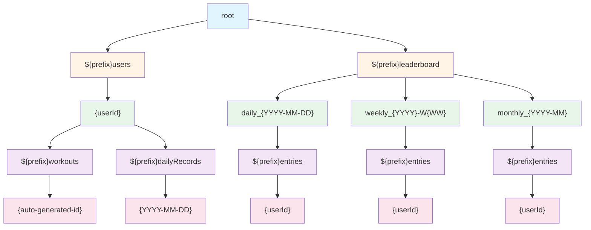

MLkit을 활용한 푸시업 앱을 만들고 있다. 로컬로 사용하면 끝날 일이지만, 약간의 게이미피케이션 느낌을 주기위해 리더보드를 넣으려고 한다.

현재 구조를 보자.

firebase firestore를 사용하고 있고, 지금 설계된 collections을 보면 아래와 같다.

크게 user와 leaderboard로 나눴고 prefix가 붙은 것들은 collection/subcollection, 아닌 것들은 documents다. 테스트 환경 구성을 위해 prefix로 구분해놔서 그렇다.

리더보드의 서브컬렉션이 3개씩이나 되는 건, firestore가 collection-document 구조의 NoSQL이라 그렇다고... 말할 수 있을 것 같다.

문제를 정의하고 한 단계씩 풀어보겠다.

## 현 상태에서 발생하는 비용 측정

문제를 개선하기 전, 지금 얼마나 Read/Write가 발생하는 지 측정하겠다.

usecase는 아래와 같다.

1. 회원가입
2. push-up
3. leaderboard screen 조회
4. history screen 조회
5. nickname 변경
6. history screen 조회
7. 회원탈퇴

