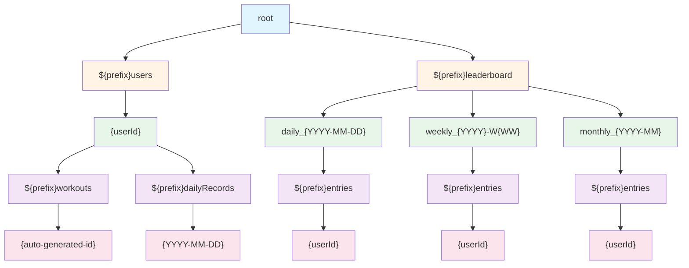

MLkit을 활용한 푸시업 앱을 만들고 있다. 로컬로 사용하면 끝날 일이지만, 약간의 게이미피케이션 느낌을 주기위해 리더보드를 넣었는데 비용문제가 발생할 것으로 보인다.

현재 구조를 보자.

firebase firestore를 사용하고 있고, 지금 설계된 collections을 보면 아래와 같다.



크게 user와 leaderboard로 나눴고 prefix가 붙은 것들은 collection/subcollection, 아닌 것들은 documents다. 테스트 환경 구성을 위해 prefix로 구분해놔서 그렇다.

리더보드의 서브컬렉션이 3개씩이나 되는 건, firestore가 collection-document 구조의 NoSQL이라 그렇다고... 말할 수 있을 것 같다.

문제를 정의하고 한 단계씩 풀어보겠다.

## 현 상태에서 발생하는 비용 측정

문제를 개선하기 전, 지금 얼마나 Read/Write가 발생하는 지 측정하겠다.

usecase는 아래와 같다.

1. 회원가입
2. push-up
3. leaderboard screen 조회
4. history screen 조회
5. nickname 변경
6. leaderboard screen 조회
7. 회원탈퇴

측정을 어떻게 할지 고민을 좀 많이 해봤는데 GCP 도구를 쓰기에는 이게 호출에 대한 소비만 측정되는 게 아니라서 직접 함수 호출 횟수를 세기로 했다.

```kotlin
object UsageTracker {
    const val TAG = "UsageTracker"
    var totalReads = 0
    var totalWrites = 0

    fun logRead(tag: String) {
        totalReads++
        Log.d(TAG, "[$tag] Read: $totalReads")
    }

    fun logWrite(tag: String) {
        totalWrites++
        Log.d(TAG, "[$tag] Write: $totalWrites")
    }
}
```

읽기에는 logRead, 수정,삭제,생성에는 logWrite를 호출 시킨다. await() 뒤에다가 달아두면 정확하게 돌아가는 걸 볼 수 있을 것 같다.

batch 메서드의 경우에는 commit 시점 보단 transaction 내부에서 batch set 되는 곳에 로그를 달아 뒀다.


지금 정의한 시나리오에서 읽기 로그 39회, 쓰기 로그 30회를 기록했다. 트리거의 절반이 리더보드에서 발생하고 있는데, 실제로 앱을 배포하고 서비스를 운영할 경우 리더보드 조회가 더 많아질 걸 고려하면 꼭 줄여야하는 비용이다.

2단계로 최적화를 진행해보려고 한다. 첫번째는 주간 리더보드만 살리는 것이고, 두번째는 불필요한 snapshotListener를 제거하는 것이다.

그 이유는 기록 저장, 닉네임 변경과 같은 리더보드에 영향을 주는 동작이 리더보드가 3종류로 나누어진 탓에 3번씩 발생하고 있었고, 조회시에도 sanpshotListener로 3개가 항상 같이 조회되기 때문에 이게 최우선이라고 판단했다.


주간 리더보드만 남기고 나니 읽기 로그 39회, 쓰기 로그 18회를 기록했다. 읽기로그는 동일하지만 쓰기 동작을 약 절반으로 줄일 수 있게 된 것이다.

처음 시나리오에서 탭으로 나누어진 리더보드를 하나씩 다 조회했다면 읽기 동작도 차이가 났을 것이다.

읽기 동작을 더 줄여보기 위해 snapshotListener도 없애보자.

기존에 snapshotListener를 사용했던 이유는 리더보드를 조회할 때 조금이라도 최신 정보를 보여주기 위함이었는데, 이게 잘못된 것이라는 걸 깨달았다.

먼저, snapshotListener를 사용하게되면 connection을 계속 들고 있게된다. 그 상태로 firestore의 데이터가 변경 되면 리스너가 변경사항을 ui에 반영하게 되는데, 사람이 한 두명이면 모르겠으나 100명만 되어도 1초에 수십번 이상 바뀔 수도 있게 되는 로직이고 그렇게 되면 UX가 최악으로 달하게 될 것이다.

특히 Firestore는 읽기 횟수당 과금되므로, 사용자가 많은 서비스에서 실시간 업데이트가 필요한 게 아니면 이 방향이 무조건 맞다.

그래서 기존 방식을 완전히 버리고, pull to refresh와 get.await()를 사용한 방식으로 변경할 것 이다.

리더보드가 아니더라도 지금 snapshotListener를 다수 사용하고 있는데, 모두 일회성 방식으로 바꿔보자.

userprofile 컬렉션을 예시로 보면 아래와 같다.

```kotlin
val listener = firestore.collection(USERS_COLLECTION)
    .document(uid)
    .addSnapshotListener { snapshot, error ->
        logRead("User profile snapshot received")
        if (error != null) {
        trySend(null)
        return@addSnapshotListener
    }

    val profile = snapshot?.toObject(UserProfile::class.java)
    trySend(profile)
    }

awaitClose { listener.remove() }
```

snapshotListener를 떼고 동작을 전환하면

```kotlin
try {
    val snapshot = firestore.collection(USERS_COLLECTION)
        .document(uid)
        .get()
        .await()
    logRead("User profile one-time fetch")
    emit(snapshot.toObject(UserProfile::class.java))
} catch (e: Exception) {
    emit(null)
}
```

이렇게 바꿔볼 수 있다.

pull to refresh는 material3에서 제공하는 `PullToRefreshBox`를 사용했다.

필요한 건 3가지인데, pullToRefreshState, 새로고침 여부를 알려주는 state, refresh 트리거 역할을 해줄 state 이렇게 3개다.

```kotlin
PullToRefreshBox(
    isRefreshing = isRefreshing, // 로딩 인디케이터 표시 여부
    onRefresh = {
        isRefreshing = true    // 로딩 시작
        refreshKey += 1        // 키를 변경하여 데이터 요청 트리거
    },
    state = pullToRefreshState,
    modifier = Modifier.fillMaxSize().padding(paddingValues)
) {
    // 리스트 등 실제 화면에 보여줄 내용
}
```

데이터 갱신 로직에는 produceState를 사용했다.

```kotlin
val leaderboardState by produceState(
    initialValue = LeaderboardData(emptyList(), true), 
    selectedPeriod, 
    refreshKey // refreshKey가 바뀌면 이 블록이 다시 실행됨
) {
    value = LeaderboardData(emptyList(), true) // 로딩 상태로 변경
    try {
        workoutRepository.getLeaderboard(selectedPeriod).collect { entries ->
            value = LeaderboardData(entries, false) // 데이터 로드 완료
        }
    } finally {
        // produceState가 취소되거나 완료될 때 로딩 인디케이터를 숨김
        if (isRefreshing) isRefreshing = false 
    }
}
```

remember { mutableStateOf(...) }와 LaunchedEffect를 합쳐둔 게 produceState라고 이해하면 될 것 같다. 그대신 외부 데이터를 사용해 state를 변경하는 작업을 더 간편하게 할 수 있다.

사실 그냥 viewmodel에서 처리하면 더 간단하게 collectAsStateWithLifecycle로 처리할 수 있지만, 지금은 일단 빠르게 앱을 배포하는 게 목적이라 추후에 리팩토링할 때 고칠 예정이다.

아무튼 이렇게 개선하니 read 횟수도 2/3정도로 줄었다.

### 삭제도 신경써야된다.

이제 문제가 하나 더 있다.

유저가 회원탈퇴하게 되면 리더보드의 모든 collection을 돌면서 유저의 데이터가 있는 지 확인하고, 있으면 삭제하는 로직으로 구성헀는데 문서의 개수가 많아지면 이 작업이 엄청난 read/write를 유발하게 될 것이라는 점이다.

그래서 방법을 조금 바꿔서, user가 참여한 리더보드를 기록해두고 그 데이터들만 삭제하는 방식을 적용해볼 것이다.

```kotlin
firestore.collection(USERS_COLLECTION)
    .document(uid)
    .update("participatedPeriods", FieldValue.arrayUnion(period))
    .await()
```

push-up을 수행하고 완료버튼을 누를때 leaderboard에 반영되는데, 그 때 반영될 리더보드의 ID를 user 컬렉션에 리스트로 관리하는 것이다.

arrayUnion을 써서 array.add()랑 동일한 효과를 내게 했다.


이제 완전히 처음의 절반으로 줄어든 모습을 볼 수 있다.

1차 비용 최적화는 이정도로 하고... 이제 로직 다듬고 에러 흐름만 잘 짜서 배포하면 되겠다.

