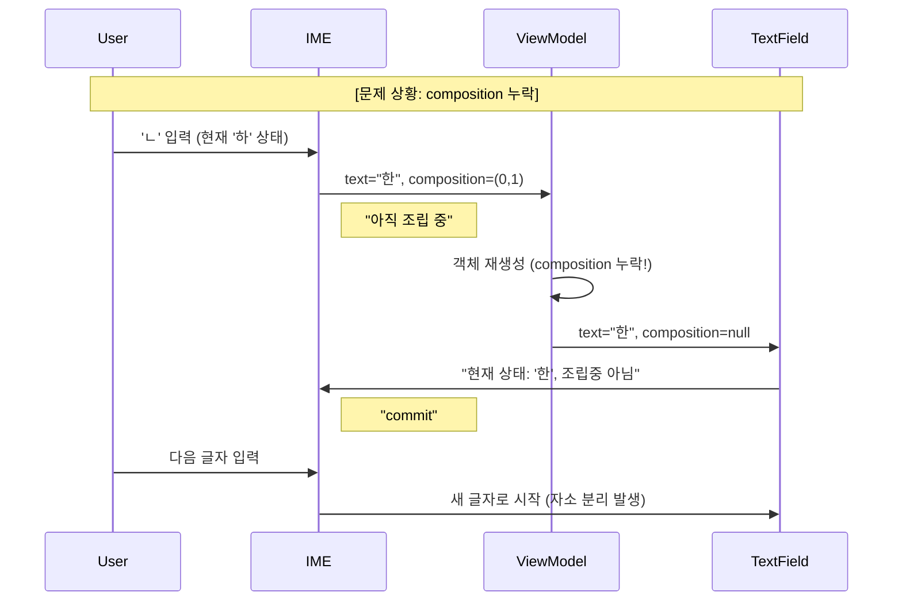
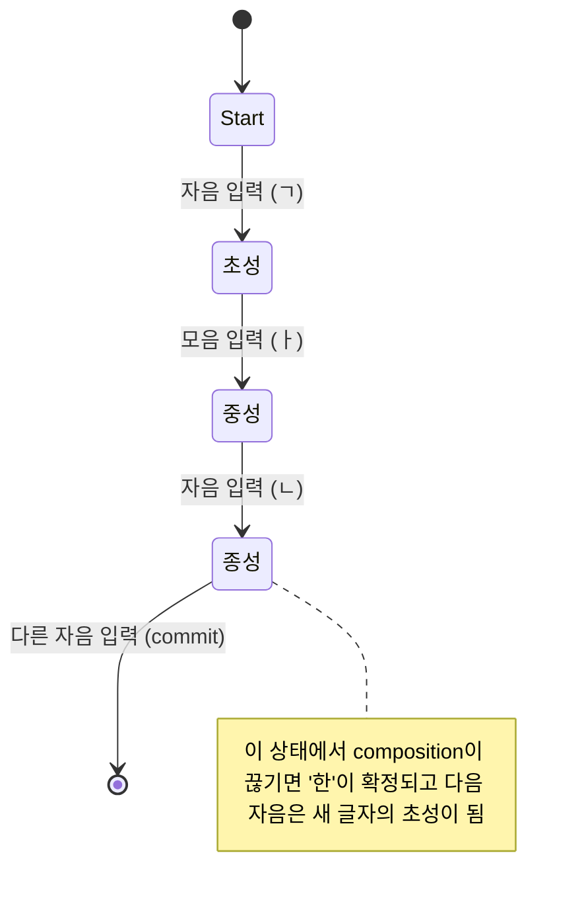

메모장 앱을 만들어 배포했는데, 스토어에서 다운로드 받아 테스트 해보니 한글 입력 시 자소 분리가 되는 문제를 발견했다...

원인은 TextFieldValue다. 

formatting을 지원하기 위해 viewmodel에 TextFieldValue를 사용했는데, 입력이 발생하는 도중에 IME가 처리해야될 composition 정보가 계속 초기화되고 있었다.

Android의 입력기(IME)는 한글처럼 조합이 필요한 언어를 처리할 때 Composition(조합 중인 상태) 정보를 TextFieldValue 객체 안에 담아서 전달하기 때문에 조합 상태가 끊기면 자소가 분리되는 것이다.

```kotlin
TextFieldValue(
    text = finalContent,
    selection = finalSelection,
    composition = finalComposition,
)
```

이렇게 composition 정보를 새 객체 생성 시 copy 해주는 것으로 해결했다. TextFieldValue를 계속 사용할 지는 조금 더 고민해봐야될 것 같다. data 레이어에 전달되지는 않지만, viewmodel에서 compose의 context를 알고있는 것과 비슷해지기 때문에 개선이 필요해 보인다.

### TextFieldValue

TextFieldValue는 단순한 문자열이 아니라, 다음 세 가지 정보를 담고 있는 스냅샷(Snapshot) 객체다.

- text (String): 현재 화면에 보이는 전체 문자열
- selection (TextRange): 커서의 위치 또는 드래그 선택 영역
- composition (TextRange?): 현재 IME(키보드)가 "조합 중"이라고 표시하고 있는 영역 (밑줄이 그어진 부분)

알파벳은 키 하나가 글자 하나(a -> a)지만, 한글은 자소(초성 중성 종성)의 결합(ㅎ+ㅏ+ㄴ)이 필요한 구조다. IME는 글자가 완성되기 전까지 해당 글자를 composition 상태로 두는데 이게 유지되어야만 다음 자음/모음이 들어왔을 때 기존 글자와 합칠 수 있다.

문제 상황을 다시 자세히 적어보겠다.



사용자가 "한"을 입력하기 위해 ㅎ을 치고 ㅏ를 쳤을 때라고 가정하자.

IME가 App으로 올바른 신호를 전달하는 시나리오다.

- 사용자가 ㅏ를 입력
- IME는 "ㅎ"을 "하"로 바꾸고, Compose에게 전달
- 전달된 데이터:
    - text: "하"
    - composition: (0, 1) (0번부터 1번 인덱스까지는 아직 조립 중이라는 뜻)

반면 문제 상황에서는 입력이 발생하고 UI가 Recomposition되면서 TextField는 ViewModel이 준 상태를 IME에게 다시 알려주는데, IME는 composition 정보를 null로 인식한다.

- 사용자가 받침 ㄴ을 입력
- IME는 앞선 "하"가 이미 끝난 글자라고 판단. 그래서 ㄴ을 앞 글자에 붙이지 않고, 새로운 글자 시작으로 처리한다
- 결과: "하" + "ㄴ" -> "하ㄴ" (분리됨)

### IME(Input Method Editor)?

알파벳은 IME의 고마움을 모른다. 하지만 한국어, 중국어, 일본어는 다르다. 

물리적인 키의 개수보다 표현해야 할 문자가 훨씬 많기 때문에, 여러 번의 키 입력을 받아서 하나의 문자로 완성해 주는 '조립 공정'이 필요하고 이 조립 공정을 담당하는 소프트웨어가 바로 IME이다.

[libhangul](https://github.com/libhangul/libhangul/blob/main/hangul/hangulinputcontext.c)을 보면 한글 IME는 내부적으로 오토마타(Finite State Machine) 알고리즘을 사용하는데 상태(State)에 따라 다음 입력이 어떻게 처리될지 결정된다.



- 초성 상태: 자음이 들어오면 -> 중성 상태로 이동
- 중성 상태: 모음이 들어오면 -> 종성 상태로 이동하거나, 이중 모음(ㅘ, ㅞ)으로 합침
- 종성 상태: 자음이 들어오면 -> 받침으로 쓸지, 다음 글자의 초성으로 넘길지 결정

이전 composition 정보가 없으면 초성 대기상태로 머무른다.