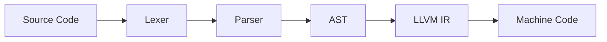

ai slop이 만연하는 요즘 시대에 근본에 대한 공부를 좀 하고 싶어서 llvm을 알아보기로했다.

kaleidoscope라는 언어를 만드는 tutorial을 천천히 해보고, mandoolang을 가볍게 만들어보는 것이 목표다.

# Lexer

컴파일러의 전체 흐름을 단순화하면 다음과 같다.



Lexer는 문자열을 직접 해석해서 의미를 완성하지 않는다.
def foo(x) x + 1 같은 입력을 보고 "이건 함수 정의다"까지 판단하는 것은 Parser의 역할이다.

Lexer는 그보다 앞 단계에서 입력을 다음과 같은 토큰 흐름으로 바꿔준다.

```cpp
// Lexer가 반환할 토큰 종류들
enum Token {
  tok_eof = -1,           // 파일의 끝

  // 명령어(Keywords)
  tok_def = -2,           // 'def'
  tok_extern = -3,        // 'extern'

  // 식별자 및 숫자
  tok_identifier = -4,    // 변수명, 함수명 등
  tok_number = -5,        // 숫자
};

static std::string IdentifierStr; // tok_identifier일 때 이름 저장
static double NumVal;             // tok_number일 때 숫자 값 저장
```

이게 내 언어에서 사용될 토큰들이다. 여기서 `tok_eof`, `tok_def` 같은 값이 음수인 이유는 단일 문자 토큰과 겹치지 않게 하기 위해서다. 뒤에서 보겠지만 `+`, `-`, `(`, `)` 같은 문자는 별도 enum으로 만들지 않고 그 문자 자체의 ASCII 값을 그대로 반환한다. 그래서 직접 정의하는 토큰은 음수 영역에 두면 충돌을 피할 수 있다.

`IdentifierStr`와 `NumVal`은 Lexer가 토큰을 반환할 때 같이 넘겨줘야 하는 부가 정보다. 예를 들어 `foo`를 읽으면 반환값은 그냥 `tok_identifier` 하나뿐이라서 실제 이름이 `foo`였는지 `bar`였는지는 따로 저장해야 한다. 숫자도 마찬가지로 `tok_number`만으로는 값이 `1.0`인지 `3.14`인지 알 수 없으니 `NumVal`에 담아둔다.

아래 함수는 표준 입력에서 문자를 하나씩 읽어 토큰을 반환하는 역할을 한다.

```cpp
#include <iostream>
#include <string>
#include <vector>

enum Token {
  tok_eof = -1,
  tok_def = -2,
  tok_extern = -3,
  tok_identifier = -4,
  tok_number = -5,
};

static std::string IdentifierStr;
static double NumVal;

static int gettok() {
  static int LastChar = ' '; // static으로 사용해서 마지막 문자를 기억하게 하는 것

  while (isspace(LastChar))
    LastChar = getchar(); // 공백이면 그냥 계속 받기 -> 무시나 마찬가지

  if (isalpha(LastChar)) { // 알파벳이면?
    IdentifierStr = LastChar;
    while (isalnum((LastChar = getchar())))
      IdentifierStr += LastChar; // 그 토큰 뒤에오는 모든 알파벳, 숫자를 이어붙인다. -> 공백오면 끊긴다.

    if (IdentifierStr == "def") return tok_def; // 그게 def면 def 토큰(-2)
    if (IdentifierStr == "extern") return tok_extern; // 그게 extern이면(-3) 반환
    return tok_identifier; // 그 외에는 -4
  }

  // 숫자 인식  - 숫자가 처음오면 double형으로 바꾼다.
  if (isdigit(LastChar) || LastChar == '.') { // 문자가 숫자(0~9)이거나 소수점(.)이면 숫자로 인식
    std::string NumStr;
    do {
      NumStr += LastChar;
      LastChar = getchar();
    } while (isdigit(LastChar) || LastChar == '.');
    // 일단 다 이어붙이고
    // 실제 숫자 값으로 변환함. strtod
    NumVal = strtod(NumStr.c_str(), 0); // 숫자는 NumVal로
    return tok_number; // -5
  }

  // 주석 처리 (#으로 시작) 
  if (LastChar == '#') { // 주석은 그냥 줄바꿈이 나올때까지 토큰 패싱
    do
      LastChar = getchar();
    while (LastChar != EOF && LastChar != '\n' && LastChar != '\r');

    if (LastChar != EOF)
      return gettok(); // 재귀 호출해서 주석 뒤에나오는 토큰으로
  }

  // 파일 끝 처리
  if (LastChar == EOF)
    return tok_eof;

  // 그 외 문자(특수문자 같은거)는 그대로 반환
  int ThisChar = LastChar;
  LastChar = getchar();
  return ThisChar;
}
```

전체 흐름은 단순하다. 먼저 공백을 버리고 첫 글자가 알파벳이면 identifier나 keyword로 읽는다. 

첫 글자가 숫자나 `.`이면 숫자로 읽어서 `double` 값으로 바꾸고 `#`이 나오면 주석으로 보고 줄 끝까지 버린다. 그 외의 문자는 `+`, `-`, `(`, `)` 같은 연산자나 구분자일 가능성이 있으니 문자 그대로 반환한다.

여기서 `LastChar`를 `static`으로 둔 점이 중요하다. Lexer는 한 토큰을 만들기 위해 다음 문자를 미리 읽어야 하는 순간이 있다. 예를 들어 `foo + bar`에서 `foo`를 읽다가 공백을 만나면 identifier는 끝났지만, 그 공백 이후의 문자는 다음 토큰을 읽을 때 필요하다. `LastChar`는 이런 식으로 "방금 읽었지만 아직 처리하지 않은 문자"를 기억하는 간단한 lookahead 역할을 한다.

아직은 완벽한 Lexer는 아니다. `1.2.3` 같은 입력도 일단 숫자 문자열로 모아버리고 `strtod`에게 맡긴다. 에러 메시지도 없다.

동작을 바로 확인하려면 임시로 아래처럼 `main`을 붙여볼 수 있다.

```cpp
int main() {
  while (true) {
    int CurTok = gettok();

    if (CurTok == tok_eof)
      break;

    if (CurTok == tok_identifier)
      std::cout << "identifier: " << IdentifierStr << "\n";
    else if (CurTok == tok_number)
      std::cout << "number: " << NumVal << "\n";
    else
      std::cout << "token: " << CurTok << "\n";
  }

  return 0;
}
```

예를 들어 `def foo(x) x + 1`을 입력하면 `def`는 `tok_def`, `foo`와 `x`는 identifier, `1`은 number로 분류된다. 괄호나 `+`는 따로 enum으로 만들지 않았기 때문에 문자 코드 그대로 출력된다. 이 부분은 나중에 Parser가 받아서 "함수 정의", "인자 목록", "이항 연산" 같은 더 큰 구조로 묶게 된다.

## 컴파일 및 실행

작성한 코드는 `clang++ -g -O3 my_llvm.cpp -o out/my_llvm`처럼 컴파일할 수 있다. 여기서 `-g`는 디버깅 정보를 실행 파일에 포함하라는 뜻이고 `-O3`는 최적화 단계를 지정하는 옵션이다. 숫자 `0`이 아니라 Optimization의 `O`를 사용한 `O3`이다.

컴파일이 끝나면 `./out/my_llvm`로 실행해서 표준 입력에 코드를 넣어볼 수 있다. 지금 만든 프로그램은 파일을 읽는 구조가 아니라 `getchar()`로 표준 입력을 직접 읽기 때문에, 터미널에 한 줄씩 입력하거나 `echo "def foo(x) x + 1" | ./out/my_llvm`처럼 파이프로 넘겨 확인하면 된다.


컴파일러 옵션 `-O` 뒤에 붙는 숫자가 커질수록 컴파일러는 코드를 더 많이 고민하고 분석한다. `-O0`은 최적화를 거의 하지 않는 단계라서 컴파일이 빠르고 디버깅하기 좋다. 작성한 코드와 실제 실행 흐름이 비교적 잘 맞기 때문에 변수 값을 따라가기 쉽다. 반대로 실행 속도는 최적화된 바이너리보다 느릴 수 있다.

`-O1`은 코드 크기나 컴파일 시간을 크게 늘리지 않는 선에서 기본적인 최적화를 적용한다. `-O2`는 대부분의 배포용 소프트웨어에서 흔히 쓰는 단계로, 실행 속도를 높이는 최적화를 꽤 적극적으로 적용하되 실행 파일 크기가 과하게 커지지 않도록 균형을 잡는다. 

`-O3`는 더 공격적으로 최적화한다. 루프를 펼치거나, 짧은 함수를 호출 위치에 인라인으로 넣거나, 벡터화 같은 최적화를 더 시도할 수 있다. 대신 컴파일 시간이 늘거나 실행 파일 크기가 커질 수 있다.

대표적인 최적화로는 상수 접기, 죽은 코드 제거, 함수 인라이닝이 있다. 상수 접기는 `3 + 5`처럼 컴파일 시점에 결과를 알 수 있는 계산을 미리 `8`로 바꿔두는 것이다. 

죽은 코드 제거는 절대 실행될 수 없는 분기나 사용되지 않는 코드를 지워 실행 파일을 더 단순하게 만든다. 함수 인라이닝은 자주 호출되는 짧은 함수의 본문을 호출 위치에 직접 넣어서 함수 호출 비용을 줄이는 방식이다.

`-O3`가 항상 좋은 선택은 아니라고한다. 디버거로 한 줄씩 따라가며 보고 싶다면 `-O0 -g`로 빌드하는 편이 더 낫다. 최적화가 강하게 걸리면 컴파일러가 변수나 흐름을 바꿔놓기 때문에, 내가 쓴 코드와 디버거에서 보이는 코드가 다르게 느껴질 수 있다. 

성능을 보는 단계에서는 `-O2`나 `-O3`를 쓰고, 동작을 이해하는 단계에서는 `-O0 -g`를 쓰는 식으로 나눠서 생각하면 된다.