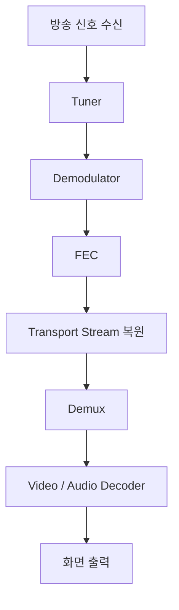
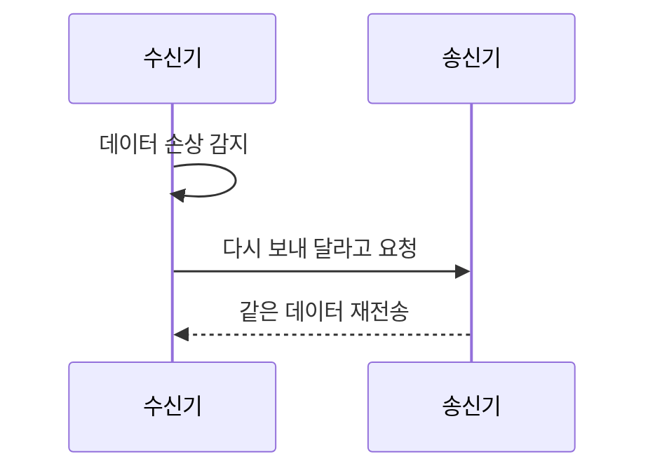
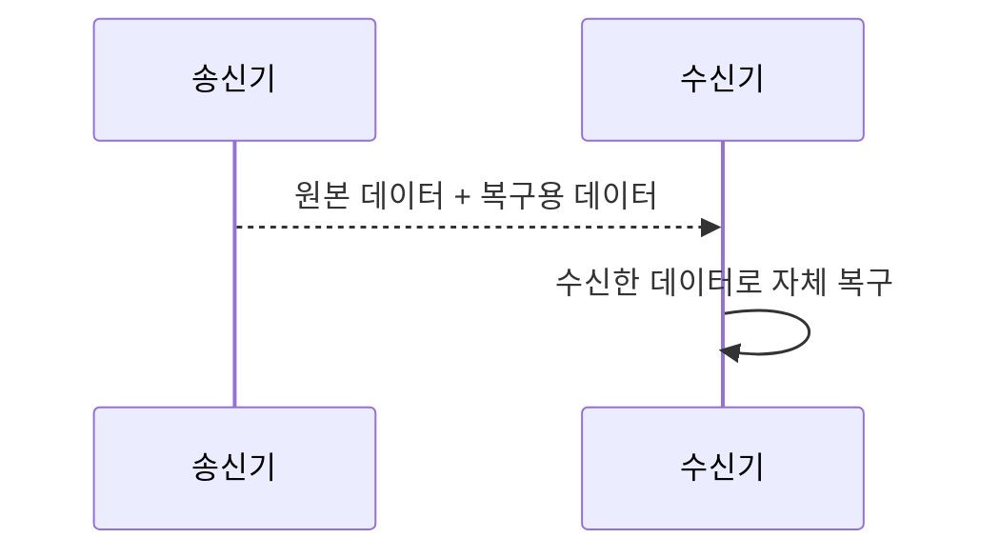
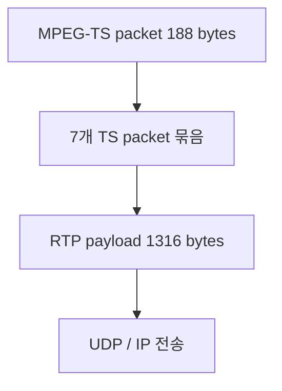
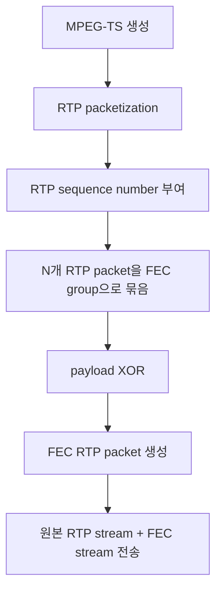
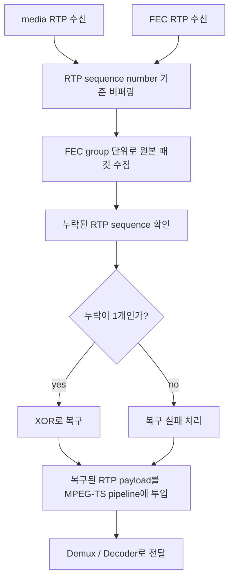
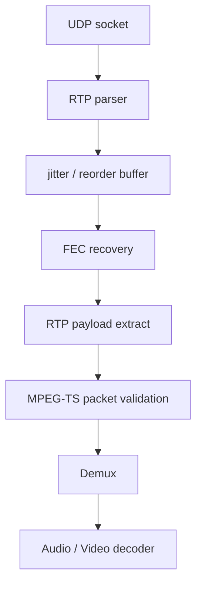
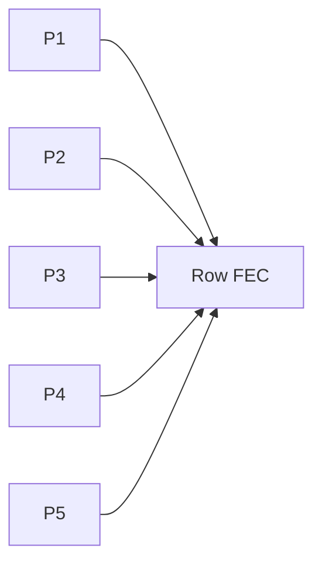
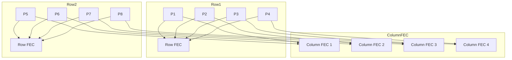

`FEC`는 `Forward Error Correction`의 약자다. 전방 오류 정정 기법으로, 전송 중 일부 데이터가 깨지거나 사라졌을 때, 방송 신호를 처리하는 튜너/디모듈레이터나 IPTV 스트림을 받는 클라이언트가 일정 범위 안의 오류를 직접 복구하도록 돕는 기술이라고 보면 된다.

## 왜 FEC가 필요할까

셋톱박스나 TV 내장 튜너처럼 방송을 받아 화면으로 내보내는 장치는 `위성`, `케이블`, `지상파` 신호를 처리한다. IPTV 클라이언트라면 `IPTV multicast`나 `OTT stream` 같은 네트워크 스트림을 받는다.

문제는 이 데이터가 항상 깨끗하게 들어오지 않는다는 점이다. 전파 간섭, 케이블 품질 문제, 신호 감쇠, 패킷 손실, 노이즈, 멀티패스, 네트워크 지터 같은 이유로 데이터 일부가 깨지거나 사라질 수 있다.

일반적인 파일 다운로드라면 데이터가 깨졌을 때 다시 보내 달라고 하면 된다. 하지만 방송이나 실시간 스트림에서는 이 방식이 잘 맞지 않는다.

재전송을 기다리는 동안 화면이 멈추고, 지연도 계속 늘어난다.

그래서 송신 쪽에서 원본 데이터와 함께 복구용 데이터를 미리 넣어 보낸다. 수신 쪽은 그 복구용 데이터를 이용해 깨진 부분을 가능한 만큼 복원한다. 이 방식이 FEC다.

## FEC의 기본 원리

아주 단순한 예를 들어 보자.

원본 데이터가 `A B C D`라고 하자. 송신 쪽은 여기에 복구용 데이터 `P`를 붙여 `A B C D P` 형태로 보낼 수 있다.

수신 중에 `C`가 사라져서 `A B ? D P`가 되더라도, 수신기는 `A`, `B`, `D`, `P`를 이용해 `C`를 복구할 수 있다.

실제 방송 표준은 이보다 훨씬 복잡하다. `LDPC`, `BCH`, `Reed-Solomon` 같은 코드가 쓰이고, 단순 parity 하나로 끝나지 않는다.

그래도 큰 그림은 같다. 원본만 보내지 않고, 복구에 필요한 여분의 정보를 같이 보낸다.

## RF 방송 수신 흐름에서 FEC 위치

RF 방송 기준으로 보면 FEC는 tuner와 demodulator 뒤쪽, TS가 만들어지기 전 단계에 놓인다.



조금 풀어 보면 tuner가 원하는 주파수를 고르고, demodulator가 변조된 신호를 디지털 비트로 되돌린다. 그 다음 FEC가 깨진 비트를 보정하고, 이후에야 `MPEG-TS` 같은 스트림으로 정리된다.

그래서 FEC는 디코더보다 훨씬 앞단에 있다.

화면이 깨졌을 때 decoder 로그만 보면 원인을 놓칠 수 있다. FEC 단계에서 복구하지 못한 오류가 TS까지 넘어오면, 뒤에서는 `continuity counter error`나 decoder error처럼 보이기 때문이다.

## 방송 방식별 FEC 예시

방송 표준마다 FEC 방식은 다르다.

### DVB 계열

`DVB-S/S2`, `DVB-C`, `DVB-T/T2` 같은 표준에서는 FEC가 핵심 요소다.

예를 들어 `DVB-S2`에서는 보통 `LDPC + BCH` 조합을 쓴다. `LDPC`는 강력한 오류 정정 코드이고, `BCH`는 남은 오류를 추가로 보정하는 역할을 맡는다.

위성 방송은 신호 환경이 흔들릴 수 있어서 FEC의 영향이 특히 크다.

### ATSC 계열

`ATSC 1.0`에서는 `Reed-Solomon`과 `Trellis coding` 같은 방식이 쓰였다.

`ATSC 3.0`에서는 `LDPC/BCH` 계열이 쓰인다.

표준은 달라도 목적은 같다. 전송 중 생기는 오류를 수신 쪽에서 최대한 줄이는 것이다.

### IPTV와 multicast

IPTV에서는 보통 `RTP/UDP` 기반 스트림에서 FEC가 등장한다.

`UDP multicast`는 TCP처럼 자동 재전송이 없다. 패킷 하나가 빠지면 그냥 빠진 채로 지나간다.

그래서 원본 RTP 패킷과 별도로 `FEC repair packet`을 보내고, IPTV 수신 단말이 이를 이용해 일부 패킷 손실을 복구한다. RF 방송의 FEC가 비트 오류 보정에 가깝다면, IPTV의 FEC는 패킷 손실 복구에 더 가깝다.

## FEC와 재전송의 차이

재전송과 FEC는 문제를 바라보는 방향이 다르다.



재전송은 정확도는 높지만 지연이 생긴다. 송신자와 수신자 사이에 양방향 통신도 필요하다.

FEC는 미리 준비한다.



재전송을 기다리지 않아도 되기 때문에 실시간 방송에 적합하다. 대신 복구용 데이터를 같이 보내야 하므로 대역폭을 더 쓰고, 복구 가능한 오류량에도 한계가 있다.

## FEC rate가 의미하는 것

방송 파라미터에서는 `FEC 1/2`, `FEC 2/3`, `FEC 3/4`, `FEC 5/6`, `FEC 7/8` 같은 값을 볼 수 있다.

이 값은 원본 데이터와 보정 데이터의 비율을 나타내는 `code rate`다.

예를 들어 `FEC 3/4`는 전체 전송 비트 중 대략 `3/4`가 실제 데이터이고, 나머지가 오류 보정에 쓰인다는 의미에 가깝다.

`FEC 1/2`는 보정 데이터가 많아서 안정성은 높지만 전송 효율이 낮다. 반대로 `FEC 7/8`은 보정 데이터가 적어서 효율은 좋지만 신호 품질이 좋아야 버틸 수 있다.

FEC rate는 낮을수록 안정성 쪽으로, 높을수록 효율 쪽으로 기운다.

튜너 드라이버나 디모듈레이터 드라이버 로그에는 `FEC lock failed`, `FEC unlock`, `FEC error`, `FEC corrected errors`, `FEC uncorrectable errors`, `BER before FEC`, `BER after FEC` 같은 메시지가 나올 수 있다.

### FEC lock failed

FEC 처리 단계에서 정상적으로 신호를 잡지 못했다는 뜻이다.

가능한 원인은 신호 세기 부족, 주파수 설정 오류, `symbol rate` 오류, `modulation` 설정 오류, `LNB`나 케이블 문제, 방송 표준 설정 오류 같은 것들이다.

예를 들어 `DVB-S/S2`에서 `frequency`, `symbol rate`, `polarization`, `modulation`, `FEC rate`가 맞지 않으면 lock이 잡히지 않을 수 있다.

### FEC unlock

처음에는 lock이 잡혔지만 중간에 풀린 상태다.

신호 품질 저하, 순간적인 노이즈, 케이블 접촉 불량, tuner나 demodulator 불안정, 수신 파라미터 변경 같은 원인을 의심해 볼 수 있다.

이 상태가 반복되면 화면이 깨지거나 멈출 수 있다.

### corrected errors

FEC가 오류를 고쳤다는 뜻이다.

이 값이 조금 있다고 해서 바로 문제는 아니다. 중요한 건 증가 속도다.

`corrected errors`가 천천히 증가한다면 신호 품질이 완벽하지는 않아도 아직 복구 가능한 상태일 수 있다. 반대로 빠르게 증가한다면 신호 품질이 나쁘고 화면 깨짐 직전일 가능성이 있다.

### uncorrectable errors

FEC로도 복구하지 못한 오류다.

`uncorrectable errors`가 증가하면 `TS packet` 손상, `continuity counter error`, video/audio decoder error, macroblock 깨짐, audio pop, freeze 같은 문제로 이어질 수 있다.

화면 깨짐이나 멈춤과 직접 연결해서 봐야 하는 값이다.

### BER before FEC / after FEC

`BER`은 `Bit Error Rate`로 비트 오류율이다.

`BER before FEC`는 보정 전 오류율이다. 신호 자체가 얼마나 불안정한지 보여준다.

`BER after FEC`는 보정 후에도 남은 오류율이다. 실제 스트림에 오류가 남는지를 보여준다.

보통 더 중요하게 보는 쪽은 `after FEC`다. `Before FEC`는 높지만 `After FEC`가 낮다면 FEC가 복구를 잘 하고 있는 상태다. `After FEC`까지 높다면 복구가 실패하고 있다는 뜻에 가깝고, 화면 문제 가능성도 커진다.

## IPTV에서 FEC를 구현한다면

IPTV에서 FEC 구현이라고 하면 보통 `UDP/RTP` 기반 `MPEG-TS` 스트림의 패킷 손실 복구를 말한다. 나도 실제로 해당 패킷을 다루기도 했다.

가장 단순한 시작점은 XOR 기반 FEC다. IPTV 스트림은 보통 `188 bytes`짜리 MPEG-TS packet 7개를 묶어 `1316 bytes` RTP payload로 만들고, 이를 `UDP/IP`로 전송한다.

일본 방송같은 곳은 4byte 가 추가로 들어가있지만, 일단 차치하고 보자.



하나의 RTP 패킷 안에 보통 TS packet 7개가 들어간다. 예를 들어 `RTP Packet #1000`, `#1001`, `#1002`가 각각 TS packet 7개씩 들고 가는 식이다.

이 경우 FEC는 TS packet 하나하나보다 RTP packet 단위로 거는 편이 자연스럽다.

## 단순 XOR FEC 예시

원본 RTP 패킷 5개, `P1000`부터 `P1004`까지 보낸다고 해보자.

송신 쪽은 이 5개 payload를 XOR해서 FEC 패킷 하나를 만든다.

```text
FEC = P1000 XOR P1001 XOR P1002 XOR P1003 XOR P1004
```

수신 쪽에서 `P1002` 하나만 유실됐다면 다음 식으로 복구할 수 있다.

```text
P1002 = FEC XOR P1000 XOR P1001 XOR P1003 XOR P1004
```

단순 XOR FEC의 한계도 여기서 바로 보인다.

같은 보호 그룹 안에서 1개 손실은 복구할 수 있지만, 2개 이상 빠지면 어떤 패킷이 어떤 값이었는지 구분할 수 없다.

## 송신 측 흐름

송신 측은 IPTV headend, streaming server, gateway 쪽이다.



보통 원본 스트림과 FEC 스트림은 포트를 분리한다. 예를 들어 media RTP는 `239.1.1.1:5000`, FEC RTP는 `239.1.1.1:5002`로 나눌 수 있다.

별도 스트림으로 보내면 FEC를 모르는 수신기도 원본 RTP 스트림만 받아서 동작할 수 있다.

## 수신 측 흐름

IPTV 수신 단말은 원본 RTP와 FEC RTP를 같이 받아서 sequence number 기준으로 맞춘다.



여기서 중요한 건 바로 decoder로 넘기면 안 된다는 점이다.

FEC 복구를 하려면 원본 패킷이 조금 늦게 올 수도 있고, FEC 패킷이 원본보다 늦게 올 수도 있다. 그래서 jitter buffer나 reorder buffer가 필요하다.

IPTV 수신 파이프라인에서 FEC 위치는 대략 이렇다.



FEC는 TS demux 이후가 아니라 RTP/UDP 수신 직후에 가까운 위치에 있어야 한다.

이미 demux까지 들어간 뒤에 `TS continuity counter error`를 보고 복구하려고 하면 구조가 꼬인다.

## 구현할 때 필요한 상태

개념적으로는 이런 자료구조가 필요하다.

```cpp
struct RtpPacket {
    uint16_t sequenceNumber;
    uint32_t timestamp;
    std::vector<uint8_t> payload;
};

struct FecPacket {
    uint16_t baseSequence;
    uint16_t packetCount;
    uint16_t payloadLength;
    std::vector<uint8_t> parityPayload;
};

struct FecGroup {
    uint16_t baseSequence;
    uint16_t packetCount;
    std::unordered_map<uint16_t, RtpPacket> mediaPackets;
    std::optional<FecPacket> fecPacket;
};
```

`baseSequence`는 FEC가 보호하는 첫 RTP sequence number다. `packetCount`는 보호 대상 원본 패킷 개수, `parityPayload`는 XOR 결과, `mediaPackets`는 실제 수신된 원본 RTP 패킷들을 담는다.

## XOR 생성 예시

단순화를 위해 RTP header는 빼고 payload만 XOR한다고 가정하자.

```cpp
std::vector<uint8_t> makeXorParity(
    const std::vector<std::vector<uint8_t>>& payloads
) {
    if (payloads.empty()) {
        return {};
    }

    size_t maxLen = 0;
    for (const auto& payload : payloads) {
        maxLen = std::max(maxLen, payload.size());
    }

    std::vector<uint8_t> parity(maxLen, 0);

    for (const auto& payload : payloads) {
        for (size_t i = 0; i < payload.size(); ++i) {
            parity[i] ^= payload[i];
        }
    }

    return parity;
}
```

실제 구현에서는 payload 길이가 모두 같지 않을 수 있다. 가장 긴 payload를 기준으로 parity buffer를 만들고, 짧은 payload의 뒤쪽은 0으로 패딩된 것처럼 처리한다.

## 복구 예시

수신 쪽 복구는 대략 이런 모양이다.

```cpp
std::optional<RtpPacket> tryRecoverMissingPacket(FecGroup& group) {
    if (!group.fecPacket.has_value()) {
        return std::nullopt;
    }

    const auto& fec = group.fecPacket.value();
    std::vector<uint16_t> missingSeqs;

    for (uint16_t i = 0; i < fec.packetCount; ++i) {
        uint16_t seq = fec.baseSequence + i;

        if (group.mediaPackets.find(seq) == group.mediaPackets.end()) {
            missingSeqs.push_back(seq);
        }
    }

    // 단순 XOR FEC는 1개 손실만 복구 가능하다.
    if (missingSeqs.size() != 1) {
        return std::nullopt;
    }

    uint16_t missingSeq = missingSeqs[0];
    std::vector<uint8_t> recovered = fec.parityPayload;

    for (const auto& [seq, packet] : group.mediaPackets) {
        if (seq >= fec.baseSequence &&
            seq < fec.baseSequence + fec.packetCount) {

            for (size_t i = 0; i < packet.payload.size(); ++i) {
                recovered[i] ^= packet.payload[i];
            }
        }
    }

    RtpPacket restored;
    restored.sequenceNumber = missingSeq;
    restored.timestamp = 0;
    restored.payload = std::move(recovered);

    return restored;
}
```

이 코드는 개념용이다.

실제로는 RTP timestamp, marker bit, payload type, sequence wrap-around 같은 처리가 더 필요하다. `RFC 5109` 같은 RTP FEC 구조에서는 payload뿐 아니라 일부 RTP header field 복구도 같이 고려한다.

## RTP sequence wrap-around

RTP sequence number는 16-bit라서 `65535` 다음에 `0`으로 돌아간다.

그래서 이런 단순 비교는 위험하다.

```cpp
if (seq >= base && seq < base + count)
```

실전에서는 wrap-around를 고려해서 비교해야 한다.

```cpp
static uint16_t seqDistance(uint16_t from, uint16_t to) {
    return static_cast<uint16_t>(to - from);
}

bool isInFecGroup(uint16_t base, uint16_t seq, uint16_t count) {
    return seqDistance(base, seq) < count;
}
```

이런 작은 부분이 빠지면 특정 시점마다 복구율이 갑자기 떨어지는 버그가 생긴다.

## 1D FEC와 2D FEC

N개 패킷마다 FEC 하나를 붙이는 방식은 1D row FEC에 가깝다.



하지만 IPTV에서 패킷 손실은 한 개씩 빠지기보다 여러 개가 연속으로 빠지는 경우가 많다. 이걸 burst loss라고 한다.

그래서 실전에서는 row/column을 함께 쓰는 2D FEC 구조가 자주 등장한다.



이렇게 하면 특정 패킷 하나가 빠졌을 때 row로 복구하거나 column으로 복구할 수 있다. 손실 패턴에 따라 여러 패킷도 단계적으로 복구할 수 있다.

문제는 FEC를 구현 품질은 파라미터에서 많이 갈린다.

### FEC group size

몇 개의 원본 RTP 패킷을 하나의 FEC 그룹으로 묶을지 정해야 한다.

`N = 5`라면 지연은 작지만 복구 범위가 좁고 FEC overhead가 크다. `N = 20`이라면 overhead는 줄지만 지연이 늘고, 복구를 위해 기다려야 하는 시간도 길어진다.

단순 XOR FEC 하나를 붙이면 overhead는 대략 `N=5`일 때 `20%`, `N=10`일 때 `10%`, `N=20`일 때 `5%`다.

### FEC delay

수신기가 복구를 위해 기다릴 수 있는 시간도 정해야 한다.

너무 짧으면 FEC가 도착하기 전에 원본을 decoder로 넘겨 버린다. 너무 길면 zapping이 느려지고 live latency가 늘어난다.

IPTV 수신 단말에서는 채널 전환 속도와 복구율, 지연 시간과 화면 안정성, 메모리 사용량과 burst loss 대응 사이에서 균형을 잡아야 한다.

### timeout

FEC group을 무한히 기다릴 수는 없다.

일정 시간이 지나면 복구 실패로 판단하고 다음 단계로 넘겨야 한다. timeout이 너무 짧으면 복구 기회를 놓치고, 너무 길면 화면 출력이 밀린다.