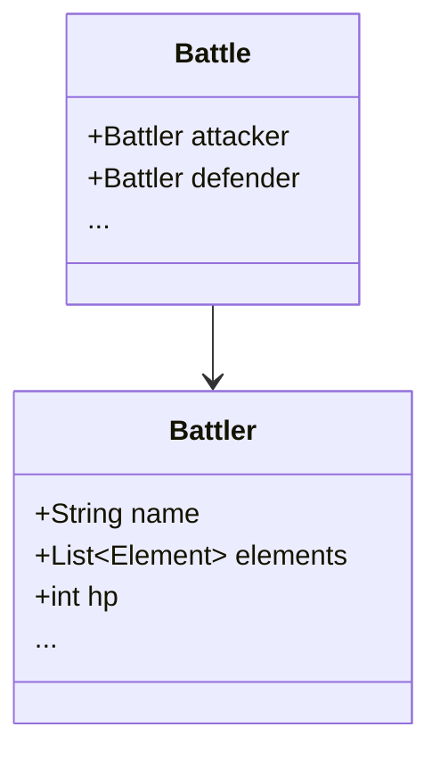
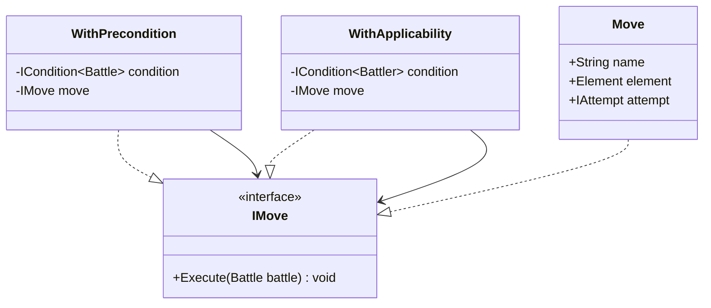
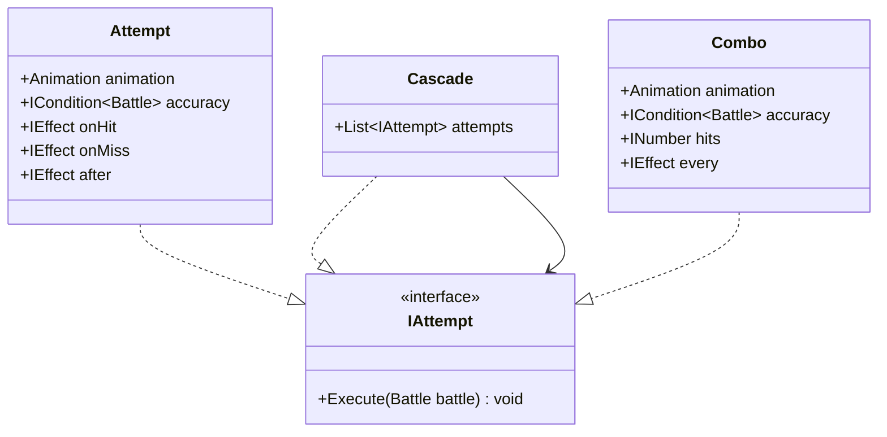

갑자기 알고리즘에 아래 영상이 나왔다.

https://www.youtube.com/watch?v=CyRtTwKeulE&list=PL-Q0gZw34HDQsmf28du1qmp2vGT6PX4Ob&index=18

OOP로 포켓몬 배틀 시스템을 설명하는 영상인데, 평소 좋아하던 게임이라 더욱 눈길이 갔고 이건 내 역량을 높이는 데도 도움이 될 것이라고 판단했다.

그래서 이 영상을 기반으로 하여 글을 써보겠다. 영상길이가 1시간이라 시리즈로 글을 작성하게 될 것 같다.

## Battles & Battlers

포켓몬은 공격/수비가 번갈아 일어는 턴 제 게임이다.

공격/수비가 가능한 객체들을 Battler라고 정의하고, 이 객체는 턴이 진행되고 있을 Battle에 속한다.(has-a 관계)

여기서 한 가지 더 명확히 하고 넘어가자.

Battler는 “개체(포켓몬/트레이너)의 상태”를 들고 있는 쪽이다. HP, 타입, PP, 상태이상, 능력치 랭크처럼 개별 상태가 여기에 모인다.

Battle은 “규칙을 진행시키는 오케스트레이션” 쪽이다. 턴 진행, 배틀 종료 조건 판단, 필드 상태(날씨/룰/턴 카운트 등) 같은 공유 상태가 여기에 모인다.

또, attacker/defender는 고정 속성이라기보다 “이번 턴(혹은 이번 액션)에서의 역할(role)”에 가깝다. 

그래서 실제 구현에서는 Battle 안에 source/target 같은 현재 행동 컨텍스트(혹은 이를 가리키는 포인터)가 존재한다고 생각하면 Execute(Battle) 시그니처가 자연스럽다.

## Move

Move를 공격/수비자의 입장에서 각 턴의 행동이라고 생각하면 되겠다.

포켓몬이 기술을 쓸 수도 있고, 아이템을 사용할 수 도 있고, 교체를 할 수도 있고, 도망갈 수도 있다. 이 모든 행동들을 move라고 정의한다.

그래서 이 모든 행동들이 포용될 수 있게, `IMove`에는 단지 해당 battle에서 턴을 실행하는 Execute만 존재한다.

플레이어가 선택할 수 있는 모든 선택지의 super type이 `IMove`다.

여기서 Execute(Battle)만 있는 게 너무 단순해 보일 수 있는데, 의도는 “Move/Attempt가 누가(source) 실행하고 누구(target)에게 적용되는지”를 별도 파라미터로 받지 않고, Battle이 들고 있는 현재 행동 컨텍스트를 통해 접근하게 하려는 것이다.

즉, battle 안에는 (직접 속성이든, 컨텍스트 객체든) “이번 행동의 주체/대상”이 항상 들어있다고 보면 된다.

구현체로 Move가 붙어있는데, `IAttempt`의 역할이 이제 잘 떠오를 것이다. 위에서 미리 나열한 행동들에 대한 구체적인 수행이다.

이건 Attempt 구현체에서 다시 보고, WithPrecondition, WithApplicability에 대해 마저 보고 넘어가자.

`ICondition<T>`으로 표현된 제네릭 타입을 갖는 조건을 갖고있다.

Precondition이 갖고있는 조건은 Battle에 대한 것이고 Applicability는 배틀 대상인 포켓몬, Battler에 대한 것이다.

이 둘은 이름이 비슷해서 헷갈릴 수 있는데, 목적이 다르다.

- Precondition: “이 턴/이 배틀에서 실행 자체가 가능한가?”
    -  배틀이 이미 종료 상태면(상대가 도망쳤다/전멸했다) 어떤 입력도 더 실행하면 안 된다.

- Applicability: “이 행동이 이 Battler에게 적용 가능한가?”
    - PP가 0이면 기술 선택은 가능하더라도 실제로는 기술이 나가지 않고(혹은) 발버둥치기같은 대체 행동으로 바뀐다.

is-a, has-a 관계도 보면, 일단 세 클래스 모두 IMove에 대해 is-a 관계인데, 조건 두 개는 has-a 관계다.

이 조건 두개는 IMove에 조건을 더 추가하는 Decorator이기 때문이다.

약간의 디자인패턴적인 얘기를 첨가하면, Decorator로 분리했을 때 좋아지는 건 두 가지다.

1. 중복 제거: “배틀이 끝났으면 아무것도 하지 마” 같은 로직을 모든 Move 구현체에 복붙하지 않는다.
2. 확장 용이: 새로운 규칙이나 제약이 추가돼도 기존 Move 코드를 안 건드리고 wrapper를 하나 더 씌우면 된다.

## Attempts

super 타입으로 정의된 IAttempt는 IMove와 같은 signature를 갖고 있다.

Attempt먼저 보자.

animation 속성은 상대방/내 포켓몬의 hp변화같은 각 attempt 마다 달라질 것들을 대비해 넣어두었고, ICondition 타입으로 정의된 accuracy는 확률을 의미한다.

게임 내에서 환경상태, 아이템 도핑 상태, 상대방이 나에게 건 디버프/버프들과 같이 Battle 내에서 받게 된 영향에 따라 accuracy가 달라지기 때문에 Battle을 타입을 갖는 ICondition으로 되어있다.

여기서 중요한 건 Attempt가 사실상 실행 파이프라인을 갖는다는 점이다. 이 규약이 있어야 Effect를 조합해도 결과가 예측 가능해진다.

1. animation/로그/연출
2. accuracy 평가(명중 판정)
3. hit면 onHit / miss면 onMiss
4. after(반동, 다음 트리거, 상태 정리 같은 후처리)

즉, Attempt는 명중 여부에 따라 분기하고, 마지막에 항상(after) 후처리를 수행하는 계약을 제공한다.

이 accuracy에 따라 onHit, onMiss를 타고, 그 후에 최종적으로 after를 탄다.

세 함수는 IEffect로 묶여있는 데, 어떤 걸 구현할 지에 따라서 계속 생성자를 확장하는 형태로 나아간다.

이 지점이 OOP 설계에서 자주 터지는 부분이라고 생각한다..

기술이 조금만 복잡해져도 “명중 시 데미지 + 급소 + 상태이상 + 흡혈 + 반동 + 능력치 변화…” 같은 조합이 생길텐데, 그걸 생성자 파라미터로 처리하려고하면 매우 골치아파질 것이다.

그래서 IEffect를 인터페이스로 빼고, 이후에는 Composite/Decorator 방식으로 효과를 조합 가능한 단위로 만드는 방향으로 추상화시키면 확장에 용이하고 유연한 처리가 가능해진다.

Cascade는 IAttempt와 has-a 관계인데, attempts의 나열이고 Combo는 각 Attempt가 어떤 accuracy, hits, every 값을 갖고 있는 지 알고있다.

Cascade는 Combo와 같이 봐야된다.

둘 다 “여러 번 때린다”로 보이지만, 핵심 차이는 단계/중단 규칙에 있다.

Cascade는 여러 Attempt를 “순서대로” 실행한다. 중간 단계마다 위력/판정이 달라질 수 있고, 어떤 단계에서 실패하면 그 시점에서 중단될 수 있다.

Combo는 하나의 Attempt가 내부적으로 N번 반복되는 모델이다. 기본적으로는 “같은 효과를 반복한다”에 가깝고, 반복 단위(매 타격마다 연출/효과)를 every로 표현한다.

예를 들면 카포에라의 트리플 킥이 Cascade고, Combo의 예시는 마구찌르기 같은 것이다.

> [트리플 킥]테크니션 카포에라라면 위력 90짜리를 세 번으로 나눠서(15, 30, 45) 때릴 수 있는 기술이 된다. 따라서 왕의징표석과 조합했을 때나 대타출동을 이용하는 상대를 박살낼 때 쓸만할 것 같지만, 세 번의 공격에 각각 명중 판정이 행해지고 그 중 한 번이라도 빗나가면 공격이 바로 중단되는 형식이라는 문제가 있다. 

마구찌르기의 경우에는 한 번 빗나가면 그대로 끝난다. 이렇게 바로 중단되는 규칙 차이가 Cascade/Combo를 나누는 지점이다.

Combo에서 hits가 원시 타입이 아니라 INumber로 정의된 이유는 여러 환경에 의해서 값이 다르게 작용할 것을 고려했기 때문이다.

every는 그냥 김밥말이같은 걸 생각하면 된다. 각 attempt마다 무조건 보여주는 그런 것이다.

이제 IEffect나 accuracy가 계산되는 방식같은 걸 제대로 관찰하기 위해 ICondition을 알아봐야하는데, 이건 다음 글에 이어서 작성하겠다.