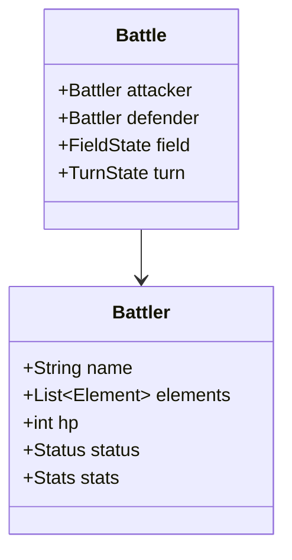
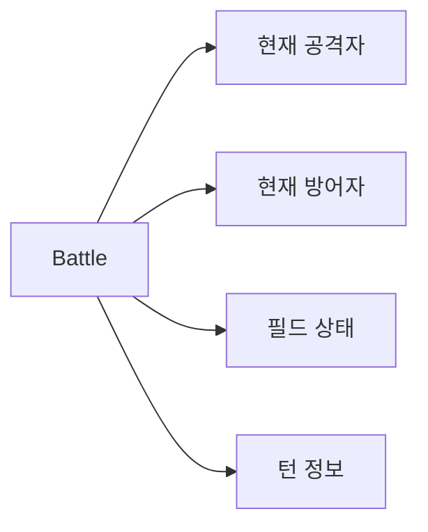
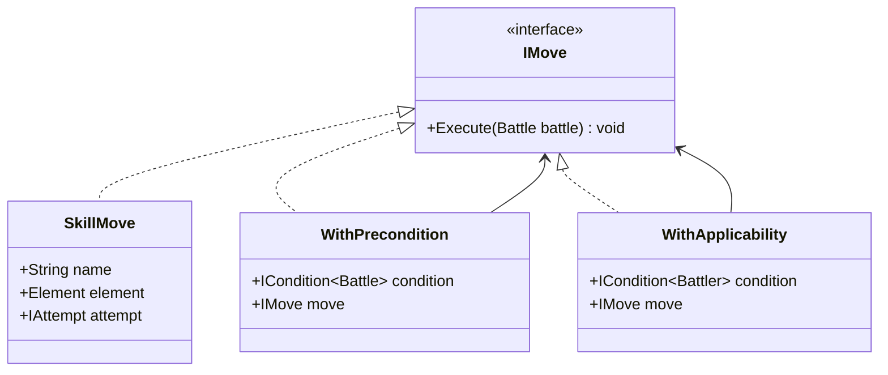
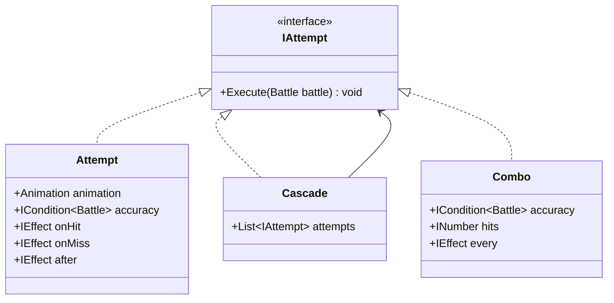
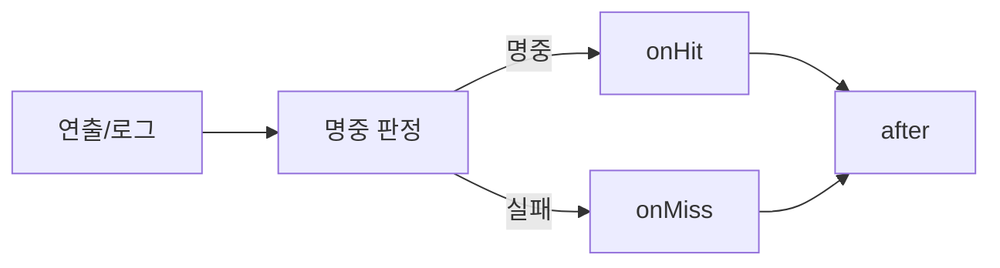
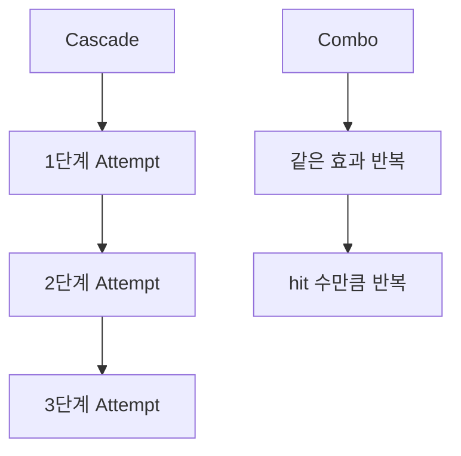

갑자기 유튜브 알고리즘이 아래 영상을 추천해 줬다.

https://www.youtube.com/watch?v=CyRtTwKeulE&list=PL-Q0gZw34HDQsmf28du1qmp2vGT6PX4Ob&index=18

OOP로 포켓몬 배틀 시스템을 설명하는 영상인데 평소 좋아하던 게임이라 더 눈길이 갔다. 그냥 재미로 보기 시작했는데 보고 나니 "이걸 글로도 정리해두면 좋겠다"는 생각이 들었다.

영상 길이가 제법 있어서 한 편에 다 넣기는 어렵고, 시리즈로 나눠 적어보려고 한다.

## Battles & Battlers

포켓몬 배틀 시스템을 구축하기 전에 제일 먼저 정의해야될 게 있다.

> "무엇이 상태를 들고 있고, 무엇이 규칙을 진행시키는가?"

이걸 분리하지 않으면 금방 꼬인다. 포켓몬 하나하나가 자기 HP, 타입, 상태이상, 능력치 랭크, PP를 들고 있어야 한다는 건 바로 알 수 있다. 그런데 턴 진행, 날씨, 기술에 따른 룸 효과, 교체, 승패 판정 같은 건 포켓몬 한 마리 안에 들어가면 이상하지 않을까?

그래서 이 구조에서는 `Battler`와 `Battle`을 나눠 생각한다.



`Battler`는 개체(포켓몬)의 상태를 담는다. HP가 얼마인지, 불 타입인지, 마비에 걸렸는지, 공격 랭크가 몇 단계 올라갔는지 같은 것들이 여기에 들어간다.

반대로 `Battle`은 배틀 규칙을 수행한다. 지금 몇 턴째인지(쾌청같은 날씨기술이 여기에 영향을 받는다), 날씨가 뭔지, 현재 행동의 주체와 대상이 누구인지, 배틀이 끝났는지 같은 정보는 개체와 분리하여 모아두는 편이 낫다.

```text
Battler = 개별 포켓몬의 상태
Battle  = 배틀 전체의 문맥과 진행
```

실제 배틀에서는 "이번 행동에서 누가 주체고 누가 대상이냐"가 계속 바뀐다. 공격자와 방어자가 고정 속성이 아니기 때문에 `attacker`, `defender`는 영원한 정체성이라기보다 현재 행동에서 맡는 역할에 가깝다.

예를 들어 리자몽이 `화염방사`를 쓰는 순간에는 리자몽이 공격자고 상대가 방어자다. 다음 턴 상대가 `락슬라이드`를 누르면 역할은 반대로 바뀐다. 그러니 Move나 Effect가 매번 "사용자"와 "대상"을 파라미터로 길게 받는 것보다, 현재 문맥을 들고 있는 `Battle`에서 꺼내 쓰는 편이 더 가볍고 자연스럽다.



## Move

이제 Battle 안에서 플레이어가 할 수 있는 행동을 생각해보자.

기술을 쓸 수도 있고, 아이템을 쓸 수도 있고, 교체를 할 수도 있고, 야생이라면 도망가기를 누를 수도 있다. 형태 다르지만, 전부 "하나의 배틀 내에서 이번 턴에 선택된 행동"이다.

그래서 이 글에서는 이런 선택지를 모두 `Move`라는 공통 타입으로 묶는다.



여기서 `IMove`는 "이 배틀에서 실행된다" 정도만 약속한다. 기술도, 교체도, 아이템도 결국은 전부 Execute 한 번으로 들어온다.

```text
기술 쓰기   = Move
교체하기   = Move
아이템 쓰기 = Move
도망가기   = Move
```

이렇게 묶어두면 상위 로직이 편해진다. 지금 선택된 게 기술인지 교체인지 매번 `if`로 나누지 않아도 된다. 그냥 "이번에 고른 Move를 실행한다"라고만 보면 된다.

여기 다이어그램에 적힌 구현은 모든 Move를 다 보여주려는 게 아니라 "기술 계열 Move"를 대표 예시로 세워 둔 것이다. 그래서 `SkillMove`는 이름, 타입, Attempt를 들고 있지만, 교체나 아이템 같은 다른 Move는 별도의 구현체로 붙는다고 보면 된다.

```text
IMove     = 모든 행동의 공통 타입
SkillMove = 그중 기술 계열 구현체 하나
```

아무 Move나 언제든 실행되는 건 아니기 때문에 실제 배틀은 그렇게 단순하지 않다. 배틀이 이미 끝났다면 어떤 입력도 더 실행되면 안 되고, 기술을 눌렀어도 PP가 0이면 그대로 처리하면 안 된다.

그래서 `Move` 주위에 조건을 감싸는 두 겹의 래퍼를 둘 수 있다.

`WithPrecondition`은 "이 행동을 지금 실행해도 되나?"를 Battle 문맥에서 묻는다. 배틀이 끝났는지, 현재 단계가 행동 입력을 받는 상태인지 같은 건 여기서 걸러진다.

`WithApplicability`는 "이 행동이 지금 이 포켓몬에게 제대로 적용되나?"를 묻는다. PP가 남았는지, 선택한 행동이 봉인되지 않았는지 같은 규칙이 여기에 해당한다. 그래서 `WithApplicability`는 Battle 전체보다, 현재 행동 주체 Battler에게 붙는 조건으로 보는 편이 더 자연스럽다.

둘이 비슷해 보여도 보는 범위가 조금 다르다.

```text
Precondition  = 배틀 전체 문맥에서 실행 가능한가?
Applicability = 지금 선택된 행동이 현재 주체에게 적용 가능한가?
```

이렇게 감싸두면 "배틀이 끝났으면 실행하지 마" 같은 공통 규칙을 모든 Move 구현체에 반복해서 넣지 않아도 된다. 새 규칙이 생겨도 기존 Move를 뜯지 않고 래퍼를 하나 더 씌우면 된다.

## Attempt

Move가 "무슨 행동을 선택했는가"라면, Attempt는 "그 행동이 실제로 어떻게 풀리느냐"를 의미한다.

예를 들어 `물기`를 선택했다고 해도 그 안에 작은 단계가 더 들어 있다. 기술 애니메이션이 나오고, 명중 판정을 하고, 맞았으면 데미지를 주고, 풀죽음 같은 추가 효과를 체크하고, 마지막에 후처리를 한다.

이 단계들을 한 덩어리로 잡는 게 `Attempt`다.



`Attempt`는 단계가 이어지는 흐름으로 읽으면 이해가 쉽다.



핵심은 마지막의 `after`다. 맞았든 빗나갔든, 어떤 후처리는 항상 돌아야 한다. 반동, 상태 정리, 로그 출력, 다음 단계로 넘길 정보 기록 같은 것들이 여기 붙는다.

이 구조가 필요한 이유는 포켓몬 기술이 조금만 복잡해져도 한 함수 안에서 관리하기 어려워지기 때문이다. "명중 시 데미지 + 10% 마비 + 마지막에 반동" 정도만 되어도 벌써 분기가 많아진다. 그런데 이걸 Attempt라는 틀 안에 넣어두면 적어도 단계 순서는 고정된다.

## Cascade 와 Combo

여기서 한 걸음 더 가면 마구햘퀴기같이 "여러 번 맞는 기술"을 어떻게 볼 것인가가 나온다.

겉으로 보기에 다단히트 기술은 전부 비슷해 보이지만 내부 규칙까지 꼭 같진 않다. 어떤 건 같은 타격을 여러 번 반복하는 느낌이고, 어떤 건 각 단계가 서로 다른 타격처럼 이어진다.

그래서 여기서는 `Cascade`와 `Combo`를 나눠 생각해볼 수 있다.



먼저 Cascade는 “이전 단계의 결과가 다음 단계에 영향을 주는 구조”다. 이건 단순히 공격을 여러 번 하는 게 아니라, 하나의 상태가 계속 이어지면서 진행되는 흐름이다.

대표적인 예가 구르기다. 이 기술은 5턴 동안 계속 사용되면서 매번 위력이 증가하는데, 중요한 건 “이전 턴이 성공했는지”가 다음 턴의 위력에 직접 영향을 준다는 점이다. 중간에 빗나가면 위력 증가가 끊기고 처음부터 다시 시작된다.

비슷하게 연속자르기도 같은 구조다. 맞을수록 위력이 올라가고, 실패하면 초기화된다. 이 두 기술의 핵심은 “현재 상태(state)”에 있다. 현재 몇 배까지 강화됐는지가 계속 유지되고, 그 상태를 기반으로 다음 공격이 계산된다. 이런 구조는 단순 반복으로는 표현이 안 되고 “시작 → 지속 → 종료”라는 단계가 있는 흐름이다. 그래서 Cascade는 본질적으로 state machine이라고 볼 수 있다.

반대로 Combo는 완전히 다르다. 이건 “같은 공격을 여러 번 독립적으로 수행하는 것”이다. 각 타격은 서로 영향을 주지 않는다. 대표적인 예가 연속뺨치기다. 2~5번 공격하지만 각 타격은 완전히 별개로 데미지가 들어간다. 첫 번째 공격이 크리티컬이든, 빗나가든, 두 번째 공격에는 아무 영향이 없다. 그냥 같은 연산을 여러 번 반복할 뿐이다.

씨기관총도 동일하다. 몇 번 때리느냐만 다르고, 구조는 단순 반복이다. 이런 경우는 상태를 유지할 필요도 없고 이전 결과를 기억할 필요도 없다. 그래서 Combo는 본질적으로 stateless loop다.

이 둘을 나누는 이유는 단순히 개념 정리가 아니라, 실제 구현에서 차이가 크기 때문이다. Cascade를 Combo처럼 구현하면 구르기같은 기술이 매번 같은 데미지를 내는 버그가 생긴다. 반대로 Combo를 Cascade처럼 만들면, 다단히트 공격이 점점 강해지는 이상한 결과가 나온다. 완전히 다른 게임이 되어버린다.

또 하나 중요한 차이는 “중단 조건”이다. Cascade는 흐름이 끊기면 전체가 종료되어야한다. 한 번 빗나가면 이후 강화는 전부 초기화되는 게 맞다. 반면 Combo는 중간에 한 번 실패해도 나머지 공격은 계속 진행된다.

이벤트 처리도 다르다. Cascade는 시작, 진행, 종료 각각에 대한 처리가 필요하지만 Combo는 각 히트마다 동일한 처리만 하면 된다.

말이 길었는데 결국 이걸 판단하는 기준은 하나다.

“이전 타격 결과가 다음 타격에 영향을 주는가?”

영향을 준다면 Cascade이고, 아니라면 Combo다.
