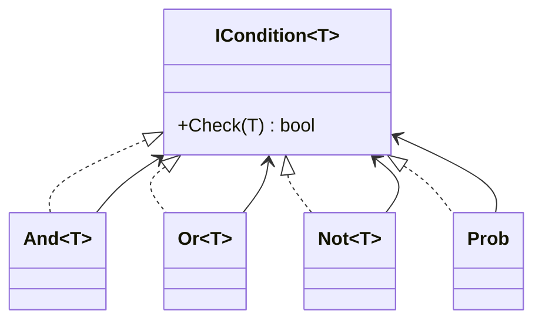
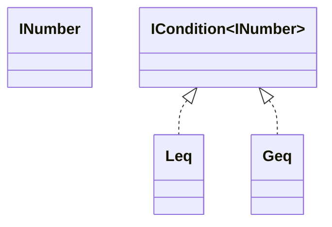
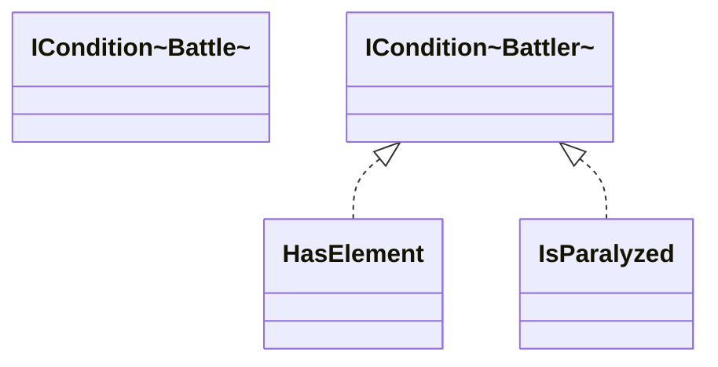
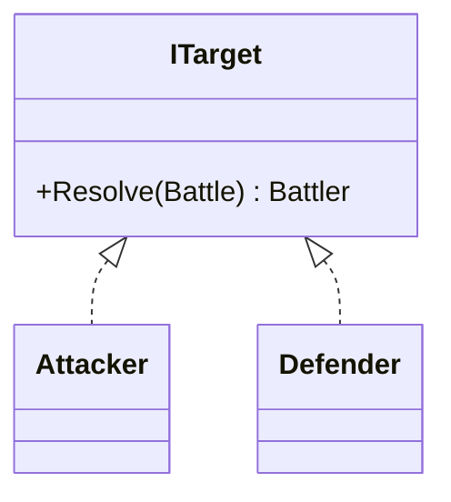
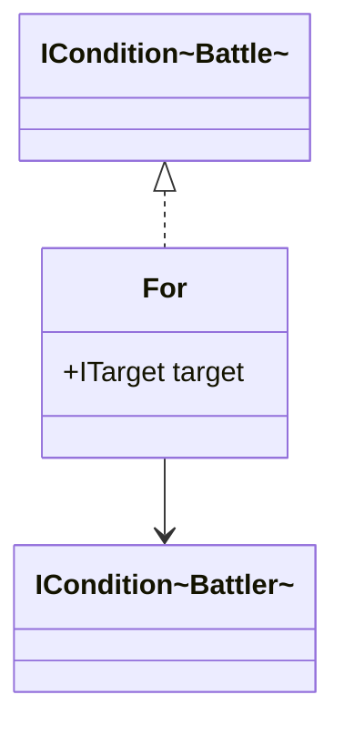

# Conditions

플레이어가 기술을 선택했다고 해서, 그 행동이 그대로 실행되진 않는다.

배틀은 보통 실행 직전에 이런 질문들을 연달아 던진다.

- 지금 행동 가능한 상태인가(기절, 잠듦, 마비로 인한 행동불능 등)
- PP가 남아 있는가
- 대상이 바뀌거나 무효화되는 상황은 아닌가(교체, 타입 무효 등)
- 명중 판정을 통과하는가
- 특정 수치 조건을 만족하는가(HP 비율, 턴 수, 속도 비교 같은 것들)

겉으로는 전부 다른 규칙처럼 보이지만, 설계 관점에서는 한 덩어리다. "지금 이 행동을 실행해도 되는가"를 묻는 조건들이다.

이 글에서는 이 조건들을 if문 뭉치로 쌓는 대신, 조립 가능한 부품으로 만드는 방식으로 정리해보겠다.

내 피카츄가 `번개`를 선택했다. 상대는 전기 기술이 통하지 않는 땅 타입을 뒤로 숨기고 있다가, 내가 기술을 누른 걸 보고 교체로 내민다.

유저는 "아, 번개 씹혔다"로 끝이지만, 배틀 진행은 그 한 줄을 여러 조각으로 나눠야 한다.

- 피카츄가 이번 턴에 행동할 수 있는지
- `번개`를 쓸 PP가 남아 있는지
- 현재 대상이 땅 타입인지(면역이면 여기서 종료)
- 면역이 아니라면 명중 판정을 통과하는지

이 조각들을 어떻게 쪼개고, 어떻게 다시 합칠지가 이번 글의 주제다.

## Logical Condition

먼저 모든 조건의 기반이 되는 인터페이스부터 잡는다.



핵심은 `ICondition<T>`다.

```
ICondition<T>
```

여기서 `T`는 조건을 평가할 대상, 즉 컨텍스트다. 예를 들면 다음과 같다.

- Battle
- Battler
- Move

조건을 인터페이스로 통일해두면, 어떤 규칙이든 "체크 가능한 조건"으로만 취급할 수 있다. 그러면 `And`, `Or`, `Not` 같은 논리 조합기를 위에 얹는 게 자연스러워진다.

디자인 패턴 용어로 보면 Composite Pattern에 가깝다. 작은 조건을 leaf 노드처럼 두고, `And`나 `Or`가 그 위를 감싸면서 조건 트리를 만든다.

이렇게 하면 규칙을 문장처럼 읽을 수 있게 된다. `if`가 중첩될수록 코드가 빨리 지저분해지는데, 조건 객체는 규칙 단위로 이름을 붙일 수 있어서 덜 썩는다.

예를 들어 `And` 조건은 내부에 여러 조건을 가지고 있고, 모든 조건이 참일 때만 참을 반환한다.

```java
class And<T> implements ICondition<T> {

    List<ICondition<T>> conditions;

    boolean check(T context) {
        for (var c : conditions) {
            if (!c.check(context)) {
                return false;
            }
        }
        return true;
    }
}
```

이 구조의 장점은 "조합"이다. 예를 들어 기술이 실제로 발동 가능한지 확인하는 규칙을 아래처럼 적을 수 있다.

```
HasPP
AND
Not(IsParalyzed)
AND
AccuracyCheck
```

이제 아까의 피카츄 상황으로 돌아가서, 규칙을 조금 더 현실적으로 만들어보자.

```
CanActThisTurn
AND
HasPP(selectedMove)
AND
Not(IsTauntedUsingStatusMove)
AND
Not(IsGroundType AND IsElectricMove)
AND
Prob(Accuracy)
```

여기서 좋아지는 건 한 가지다. 규칙이 늘어도 기존 조건을 뜯어고치지 않는다. "새 규칙 = 새 조건"으로 밀어 넣고, 조합만 바꾸면 된다.

상위 로직은 각 조건의 내부를 몰라도 된다. 그냥 체크만 하면 된다. 그래서 호출부가 안정적으로 버틴다.

### Prob

포켓몬 배틀은 확률이 많다. 명중, 추가 효과 발동, 급소, 상태이상으로 인한 행동불능 같은 것들.

예를 들어 다음과 같은 수치들이 있다.

- 명중률 90%
- 상태이상 확률 30%
- 급소 확률

이러한 확률 조건은 다음과 같은 형태로 표현할 수 있다.

```
Prob(Accuracy)
```

여기서 `Prob`를 따로 빼는 이유는 단순히 랜덤을 굴리기 위해서가 아니다. 확률도 조건으로 취급하면, 다른 규칙과 같은 레벨에서 조합할 수 있다.

아까 피카츄가 마비에 걸려 있다고 치면, "마비다"와 "이번 턴에 못 움직인다"를 같은 덩어리로 묶기 쉽다. 그런데 분리해두면 재사용이 된다.

```
IsParalyzed
AND
Prob(0.25)
```

그리고 이걸 조건 체인에 끼워 넣는 위치가 꽤 중요해진다.

1. 확정 실패 조건 검사: 기절, PP 0, 도발으로 인한 변화기 봉인
2. 대상/타입 기반 실패 조건 검사: 땅 타입에게 전기 기술 무효
3. 확률 조건 검사: 명중, 급소, 추가 효과 발동

이 순서를 지켜두면 "왜 실패했는지" 메시지도 뽑기 쉬워진다. 땅 타입 면역이면 명중 판정까지 갈 필요가 없고, 로그도 더 정확해진다.

이렇게 해두면 상태이상 여부와 확률 판정이 한 덩어리로 굳지 않는다. 나중에 다른 상태이상, 다른 특성, 다른 추가 효과에도 같은 부품을 그대로 끼워 쓸 수 있다.

## Number Condition

조건이 항상 true/false로 끝나는 건 아니다. 숫자부터 계산해야 하는 규칙이 훨씬 많다.

- 내 HP가 일정 비율 이하인지
- 상대보다 스피드가 높은지
- 현재가 몇 번째 턴인지

이런 규칙은 결국 "값을 계산한다"와 "비교한다"의 두 단계로 나뉜다. 그래서 숫자를 계산하는 책임과 조건을 판단하는 책임을 분리하는 편이 깔끔하다.

이를 위해 숫자를 계산하는 인터페이스를 따로 정의할 수 있다.



`INumber`는 배틀 상황을 바탕으로 숫자를 계산하는 객체다.

예를 들면 다음과 같은 값들이 될 수 있다.

- HP
- Speed
- Level
- TurnCount

이 값들을 이용하면 다음과 같은 조건을 표현할 수 있다.

```
HPPercent <= 50
Speed >= EnemySpeed
TurnCount >= 3
```

여기서 `HPPercent`나 `EnemySpeed`는 숫자를 뽑아오는 역할만 하고, `<=`, `>=` 같은 비교 조건이 최종 판정을 담당한다.

이 분리는 생각보다 자주 쓰인다. 피카츄가 상대에게 두들겨 맞아서 HP가 49%가 됐다고 하자. "HP가 절반 이하일 때 발동"하는 규칙은 도처에 있다. 회복열매처럼 아이템일 수도 있고, 특성일 수도 있고, 기술의 위력 변화 조건일 수도 있다.

중요한 건 비교 기준만 바뀐다는 점이다.

- "HP가 절반 이하"와 "HP가 1/3 이하"는 기준만 다르고, HP 비율을 계산하는 방식은 같다.
- "상대보다 빠르면"과 "상대보다 느리면"도 마찬가지다.

계산 로직을 따로 빼두면 같은 숫자를 여러 규칙에서 재사용할 수 있다.

- `HPPercent <= 50`: 체력이 일정 이하일 때 발동하는 규칙들
- `TurnCount >= N`: 일정 턴 이후에 끝나는 효과들
- `Speed > EnemySpeed`: 선공 관련 규칙들

이때 중요한 건 숫자 소스를 재사용하는 것이다. `HPPercent`는 아이템 체크에도 쓰고, 특성 체크에도 쓰고, 기술 위력 변동에도 그대로 쓸 수 있다.

결국 숫자 계산과 조건 판단을 분리해두면, 규칙이 늘어날수록 관리가 편해진다. 숫자 공급자와 비교기만 추가하면 된다.

---

## Battle Condition

배틀 중에 어떤 조건은 배틀 전체 상태를 봐야 하고, 어떤 조건은 개별 포켓몬 상태만 보면 된다.

그래서 조건을 다음 두 가지로 나눌 수 있다.

- Battle Condition
- Battler Condition



예를 들어 `IsParalyzed`는 포켓몬이 마비 상태인지 확인하는 조건이다. 이건 특정 포켓몬 하나만 보면 되므로 Battler 조건에 가깝다.

반대로 "현재 날씨가 비인가", "이번 턴이 몇 번째인가", "배틀이 이미 종료되었는가" 같은 질문은 포켓몬 한 마리만 봐서는 답할 수 없다. 이런 건 Battle 조건으로 보는 편이 자연스럽다.

예를 들어 한쪽이 전멸했거나 도망치는 처리로 배틀이 끝난 상태라면, 그 다음부터는 어떤 기술 선택도 실행되면 안 된다. 이런 건 딱 Battle 레벨의 조건이다.

즉, 조건을 나누는 기준은 복잡도가 아니라 바라보는 범위다. 어느 레벨의 정보를 참조하느냐에 따라 타입을 나누면, 조건의 책임이 훨씬 분명해진다.

### Target Resolver

Battle 조건에서 Battler 조건을 사용하려면
먼저 어떤 포켓몬을 대상으로 할 것인지 결정해야 한다.

이를 위해 Target Resolver를 정의한다.



`ITarget`은 Battle 상황을 기반으로 특정 Battler를 선택하는 역할을 한다.

아까처럼 상대가 교체로 땅 타입을 내밀면, 같은 Defender라도 "지금 Defender가 누구냐"가 바뀐다. 이걸 Battle에서 뽑아오는 책임을 Target Resolver로 고정해두면, 조건 쪽은 대상 교체에 덜 흔들린다.

여기서는 조금 단순화하기 위해 공격자와 방어자만 뒀지만, 실제 게임으로 가면 대상 종류는 더 많아진다.

- Attacker
- Defender
- Self
- Ally

이렇게 분리해두면 대상 선택과 조건 평가가 서로 얽히지 않는다.

예를 들어 피카츄가 번개를 쓰려는 그 턴에서, "공격자가 마비 상태인가?"와 "방어자가 땅 타입인가?"는 둘 다 Battler 조건을 평가하는 일이다. 차이는 어떤 대상을 집어오느냐뿐이다. 이 둘을 분리하면 조건 자체는 그대로 두고, 대상만 바꿔 재사용할 수 있다.

## For

Battle 조건이 Battler 조건을 사용하려면 먼저 대상을 선택한 뒤 조건을 평가해야 한다.

이를 위해 `For`라는 조건을 정의한다.



`For`의 동작은 다음과 같다.

1. Battle에서 대상 Battler를 선택한다.
2. Battler 조건을 평가한다.
3. 결과를 Battle 조건으로 반환한다.

예를 들어 다음과 같은 조건을 만들 수 있다.

```
For(Attacker, IsParalyzed)
```

이 조건의 의미는 다음과 같다.

> 공격하는 포켓몬이 마비 상태인지 확인한다.

또 다른 예는 다음과 같다.

```
For(Defender, HasElement(Fire))
```

> 방어하는 포켓몬이 불 타입인지 확인한다.

`For`는 다리 역할을 한다. Battle만 보고 있는 상위 로직이 Battler 조건을 재사용할 수 있게 연결해준다.

실제로는 이런 식으로 여러 개를 합쳐 한 문장처럼 쓸 수 있다.

```
And(
    For(Attacker, Not(IsAsleep)),
    For(Attacker, HasPP(selectedMove)),
    For(Defender, Not(HasElement(Ground) AND IsElectricMove(selectedMove))),
    Prob(selectedMove.Accuracy)
)
```

이 표현이 마음에 드는 이유는, "배틀 규칙을 코드로 번역"했다기보다 "규칙 문장을 코드로 적었다"에 가깝기 때문이다.

그래서 글이 길었지만, 전체 흐름은 꽤 단순해진다.

- Battle은 현재 문맥을 제공한다.
- Target Resolver는 그 문맥에서 대상을 고른다.
- Battler 조건은 선택된 대상을 평가한다.

역할이 이렇게 나뉘면 조건이 늘어나도 구조가 쉽게 무너지지 않는다. 누구를 볼 것인가와 무엇을 검사할 것인가가 분리되어 있기 때문이다.

결국 하고 싶은 얘기는 단순하다. 배틀 규칙을 if문 덩어리로 붙이지 말고, 이름 붙은 조건으로 쪼개서 조합하는 것이다.

피카츄가 번개를 누르는 그 한 턴도, "행동 가능", "자원(PP)", "대상 면역", "확률(명중)", "숫자(HP, 턴)" 같은 조각으로 분해하면 설명도, 테스트도, 확장도 쉬워진다.