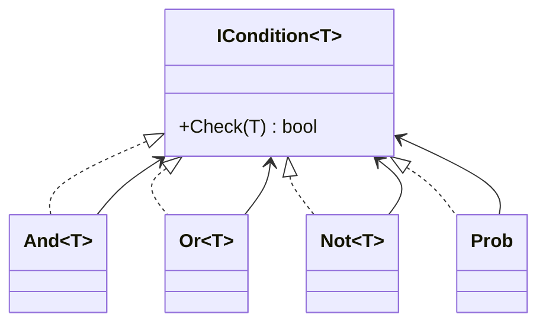
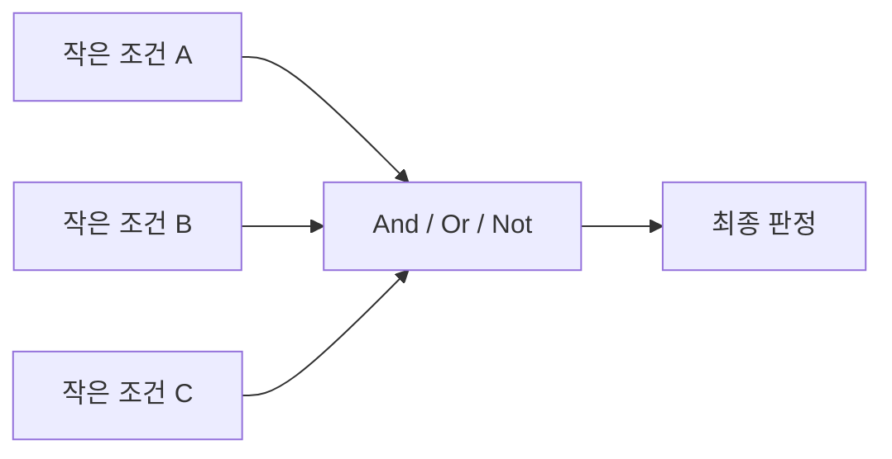
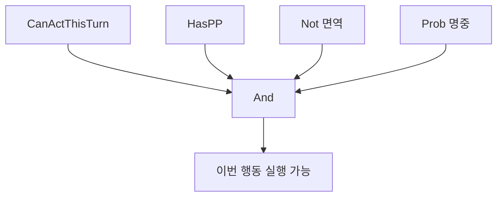
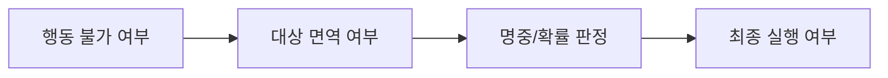
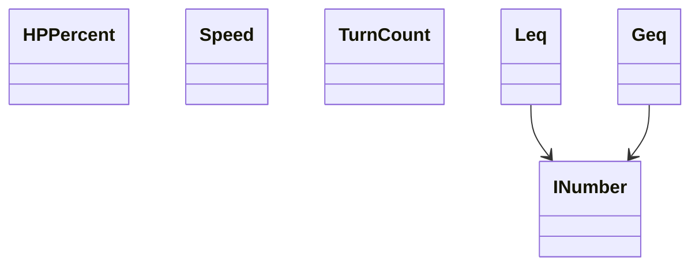
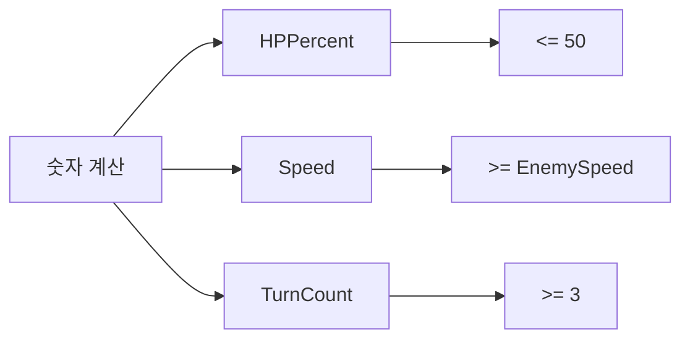
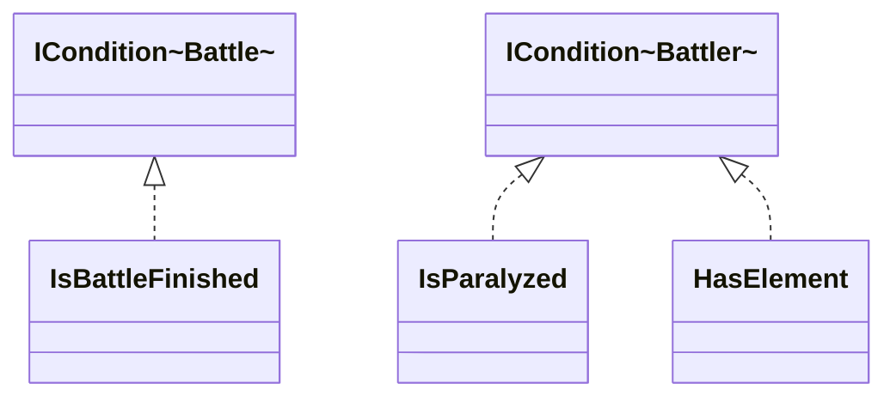
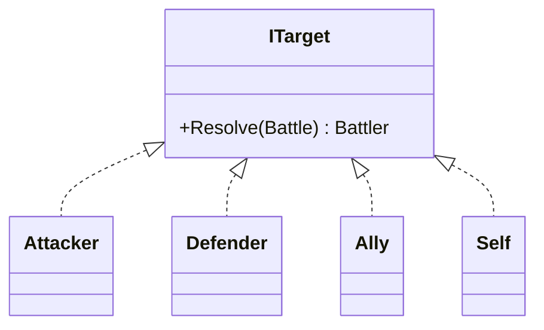
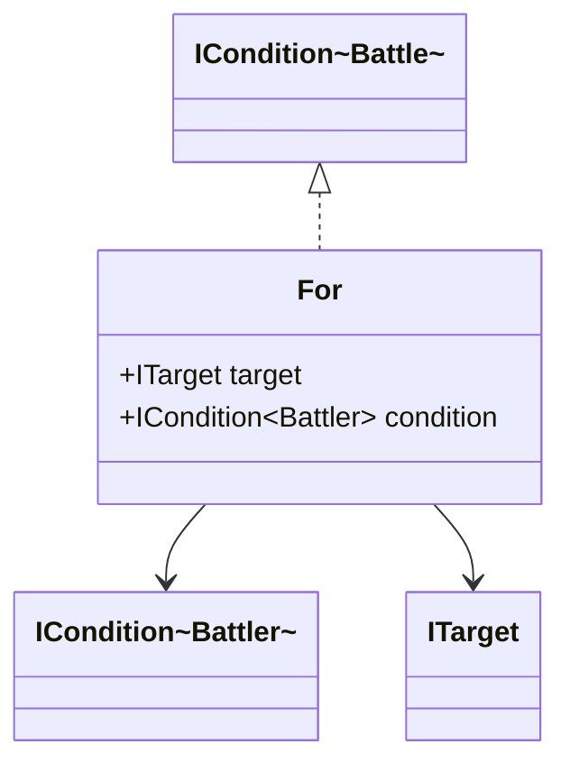
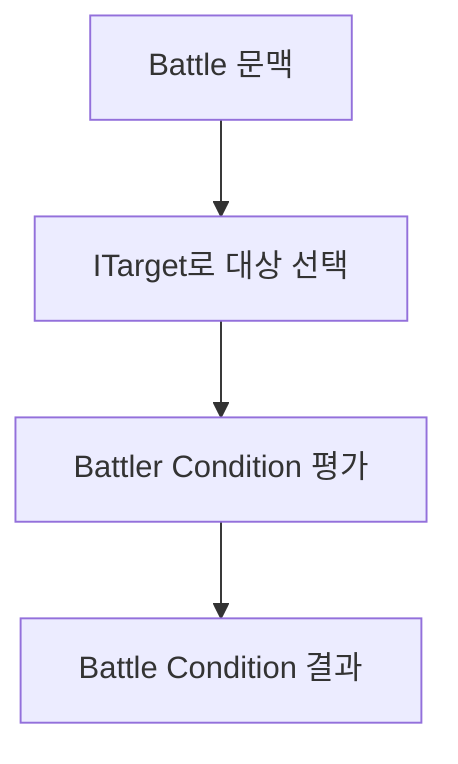

# Conditions

지난 글에서는 `Battle`, `Battler`, `Move`, `Attempt`처럼 배틀의 큰 틀을 먼저 봤다.

이번에는 그 안에서 훨씬 자주 마주치는 문제를 보자.

플레이어가 기술을 눌렀다고 해서 그 행동이 그대로 실행되지는 않는다. 배틀은 항상 그 직전에 여러 가지를 묻는다. 지금 행동 가능한 상태인지, PP가 남아 있는지, 대상이 면역은 아닌지, 명중 판정을 통과하는지 같은 것들 말이다.

만약에 한카리아스가 `지진`을 선택했고 상대는 땅 기술이 통하지 않는 비행 타입 포켓몬을 교체로 내민다고 가정하자. 플레이어는 그냥 "아, 지진이 안 통하네"라고 생각하고 끝난다. 하지만 배틀 시스템은 이런 결과를 만들기까지 여러 질문을 잘게 나눠서 검사해야 한다.

한카리아스가 이번 턴에 행동 가능한가? `지진`을 쓸 PP가 남아 있는가? 현재 대상이 비행 타입인가? 면역이 아니라면 다음 실행 단계로 넘어갈 수 있는가?

이 질문들을 `if`문 덩어리로 계속 붙이기보다 이름 붙은 조건으로 잘게 쪼개 조합하면 구조가 훨씬 덜 무너진다. 이번 글은 그 이야기를 해보려 한다.

## ICondition

조건의 제일 바깥 인터페이스는 단순하다. 어떤 문맥을 받아서 참인지 거짓인지를 돌려준다.



여기서 `T`는 조건이 바라보는 문맥이다. `Battle`일 수도 있고, `Battler`일 수도 있고, 어떤 숫자 계산 결과일 수도 있다.

중요한 건 "조건"이라는 공통 타입으로 통일하는 것이다. 이러면 어떤 규칙이 와도 일단 "체크 가능한 것"으로 취급할 수 있고, 그 위에 `And`, `Or`, `Not` 같은 조합기를 얹는 게 쉬워진다.



이 구조로 잡아두면 행동 규칙을 아래처럼 읽을 수 있다.

```text
행동 가능
AND
PP가 남아 있음
AND
대상이 면역이 아님
AND
명중 판정을 통과함
```

이렇게 적어두면 "새 규칙 = 새 조건"이라는 식으로 계속 확장해 나가기 쉽다.

## Logical Condition

예를 들어 도발, 봉인, 특정 특성, 특정 필드 룰이 추가돼도 기존 조건을 뜯어고치는 게 아니라 조각을 하나 더 넣으면 된다. 상위 로직은 여전히 "조건들을 조합해서 최종 판정을 만든다"만 알고 있으면 된다.

```text
CanActThisTurn
AND
HasPP(selectedMove)
AND
Not(TargetIsImmuneTo(selectedMove))
AND
Prob(Accuracy)
```

여기서 면역 조건을 `TargetIsGroundType`처럼 너무 직접적으로 적지 않고 `TargetIsImmuneTo(selectedMove)`처럼 적은 이유도 비슷하다. 실제로 중요한 건 "상대가 땅 타입인가?" 자체가 아니라, "현재 선택한 기술에 대해 상대가 면역인가?"이기 때문이다.



## Prob

포켓몬 배틀은 수많은 확률의 조합이다.

명중, 급소, 추가 효과, 상태이상으로 인한 행동불능 같은 것들이 전부 확률과 얽혀 있다. 그래서 `Prob`를 따로 떼어 조건으로 다루는 게 생각보다 중요하다.

`오물폭탄`은 상대에게 데미지를 주고 30% 확률로 독을 건다. 여기서 30%는 Effect를 설명할 때도 쓰이지만, 일단은 "확률 조건을 통과하는가?"라는 질문으로도 볼 수 있다.

마비로 인한 행동불능도 비슷하다. 마비 상태라는 사실과 그 턴에 실제로 못 움직이느냐는 별개의 문제다. 상태는 상태고 그 상태가 이번 턴에 어떤 확률 조건을 만들어내는지는 또 따로 볼 수 있다.

```text
IsParalyzed
AND
Prob(0.25)
```

이런 식으로 분리해두면 "마비 상태다"와 "이번 턴에 행동이 막힌다"를 한 덩어리로 굳히지 않을 수 있다. 나중에 다른 상태이상이나 다른 특성, 다른 추가 효과에도 같은 부품을 재사용하기 쉬워진다.

검사 순서도 중요하다.

```text
1. 확정 실패를 먼저 본다
2. 대상/면역 같은 구조적 실패를 본다
3. 마지막에 확률 판정을 본다
```

예를 들어 상대가 땅 타입이라 전기 기술이 아예 안 통하는데도 명중 판정을 먼저 굴리는 건 좀 이상하다. 그래서 확정 실패를 먼저 걸러내고, 확률은 그다음에 본다.



## Number Condition

조건이 항상 참/거짓만 바로 물을 수 있는 건 아니다. 이상해씨의 심록같은 특성처럼 연산 결과가 필요할 때가 있다.

내 HP가 절반 이하인지, 상대보다 더 빠른지, 이번이 몇 턴째인지 같은 규칙은 결국 "숫자를 구한다"와 "그 숫자를 비교한다"의 두 단계로 나뉜다.



`INumber`는 숫자를 계산해 가져오고, `Leq(Less equal than)`, `Geq(Great equal than)` 같은 비교 조건은 그 숫자를 보고 판정을 내린다.

이를테면 이런 식이다.

```text
HPPercent <= 50
Speed >= EnemySpeed
TurnCount >= 3
```

잠만보의 HP가 49%라고 해보자. 그러면 "HP가 절반 이하일 때 발동"하는 규칙에 걸릴 수 있다. 이건 자뭉열매일 수도 있고, 특성일 수도 있고, 특정 기술의 위력 변화일 수도 있다. 그런데 매번 "HP 비율 계산"을 새로 만들 필요는 없다. HP 비율을 계산하는 로직은 재사용하고, 비교 기준만 바꾸면 된다.



```text
HPPercent <= 50  = 절반 이하일 때 발동
TurnCount >= 3   = 3턴 뒤부터 활성화
Speed > Enemy    = 선공 관련 규칙
```

결국 숫자 계산과 조건 판단을 나눠두면, 규칙이 늘어날수록 오히려 관리가 쉬워진다.

## Battle Condition 과 Battler Condition

어떤 조건은 배틀 전체를 봐야 하고, 어떤 조건은 특정 포켓몬 하나만 보면 된다.



예를 들어 `IsParalyzed`는 특정 포켓몬이 마비 상태인지 보는 조건이다. 이건 Battler 조건에 해당한다.

반대로 "배틀이 이미 끝났는가", "현재 날씨가 비인가", "이번이 몇 번째 턴인가" 같은 건 포켓몬 하나만 봐서는 알 수 없다. 이런 건 Battle 조건으로 두는 편이 더 자연스럽다.

즉, 조건을 나누는 기준이 복잡도가 아니라 바라보는 범위다.

1편에서 봤듯이

```text
Battler Condition = 특정 개체를 본다
Battle Condition  = 배틀 전체 문맥을 본다
```

이 구분을 해두면 조건의 책임이 훨씬 또렷해진다.

## Target Resolver

그런데 여기서 하나 더 필요하다.

Battle 조건 안에서 Battler 조건을 재사용하려면, 먼저 "누구를 볼 것인가?"를 정해야 한다. 그래서 `ITarget` 같은 대상 해석기가 들어온다.



예를 들어 지금 턴의 공격자가 누구인지, 방어자가 누구인지, 듀얼 배틀이라면 자신과 아군이 누구인지는 `Battle` 문맥을 봐야만 알 수 있다. 그래서 그 해석은 `Battle`에 맡기고, 실제 공격 방어 행동에 사용될 조건은 선택된 Battler를 상대로만 검사하게 두는 편이 깔끔하다.

```text
Attacker = 이번 행동의 주체
Defender = 이번 행동의 대상
```

이렇게 두면 "공격자가 마비 상태인가?"와 "방어자가 땅 타입인가?"는 사실상 같은 종류의 검사다. 둘 다 Battler 조건을 평가하고, 달라지는 건 어떤 대상을 고르느냐뿐이다.

## For

이제 Battle 문맥에서 Battler 조건을 쓰기 위한 다리가 필요하다. 그 역할을 하는 게 `For`다.



`For`는 읽는 방식이 단순하다.

```text
For(Attacker, IsParalyzed)
= 공격자가 마비 상태인가?

For(Defender, HasElement(Ground))
= 방어자가 땅 타입인가?
```

즉 `For`는 Battle만 보고 있는 상위 로직이 Battler 조건을 재사용할 수 있게 이어주는 다리다.

한카리아스의 `지진` 상황을 다시 적으면 대략 이런 식이 된다.

```text
And(
  CanActThisTurn,
  For(Attacker, HasPP(selectedMove)),
  Not(
    And(
      IsElectricMove(selectedMove),
      For(Defender, HasElement(Ground))
    )
  ),
  Prob(selectedMove.Accuracy)
)
```

여기서 `CanActThisTurn`을 굳이 `For(Attacker, ...)`로 넣지 않은 것도 이유가 있다. "이번 턴에 행동 가능한가?"는 마비 같은 개별 상태만으로 끝나지 않고, 배틀 단계나 이미 행동을 소모했는지 같은 문맥도 섞이기 쉽다. 그래서 이건 Battle 조건으로 두는 편이 더 자연스럽다.


