# Effects

지난 글에서는 "지금 이 행동이 실행 가능한가"를 판단하는 `Condition`을 봤다.

이번에는 그 다음 단계다. 실행 가능 판정을 통과했다면 이제는 실제로 배틀 상태를 바꿔야 한다.

피카츄가 `볼트 태클`을 썼다고 해보자. 명중 판정을 통과했고 상대가 땅 타입도 아니라서 무효도 아니었다. 그러면 이제 남는 건 하나다. 실제로 무슨 일이 일어나는가?

급소에 맞을 수도 있고, 명중했으니 HP가 줄어들 것이고 운이 좋으면 마비가 걸릴 수도 있다. 이후 열매나 도구로 HP를 회복할 수도 있고 반동 데미지를 받을 수도 있고 날씨가 바뀔 수도 있다.

전부 다른 기능처럼 보여도 구조로 보면 다 배틀 상태를 바꾸는 일이다.

지난 글의 `Condition`이 질문이었다면 이번 글의 `Effect`는 변화다.

## IEffect

가장 바깥쪽 인터페이스는 단순하게 둘 수 있다.

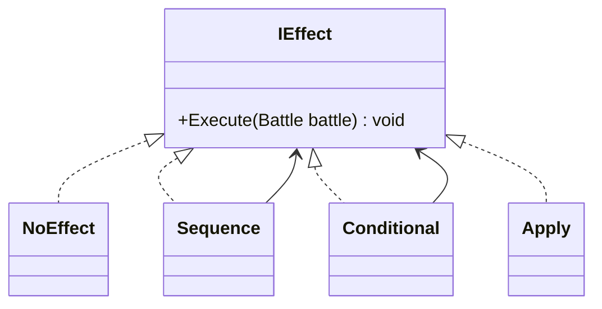

`Condition`이 `check`까지라면 `Effect`는 `execute`를 호출하는 순간 실제 상태를 바꾼다.

여기서도 필요한 정보를 이것저것 파라미터로 늘어놓기보다, 현재 배틀 문맥을 들고 있는 `Battle` 하나만 넘기는 편이 낫다. 누가 공격자인지, 누가 방어자인지, 이번 시도에서 어떤 결과가 났는지 같은 정보가 효과 판단에 한꺼번에 필요하기 때문이다. `흡혈`처럼 먼저 데미지를 주고 그 결과 일부만큼 회복하는 기술은 특히 그렇다.

`NoEffect`가 명시적으로 들어가 있는 점도 중요하다. 어떤 조건을 검사했는데 실패했을 때 굳이 예외 분기를 늘리는 대신 실패 쪽을 `NoEffect`로 두면 구조가 훨씬 덜 지저분해진다.

잉어킹의 튀어오르기같이 "아무 일도 안 일어난다"도 하나의 명시적인 선택지로 보는 셈이다.

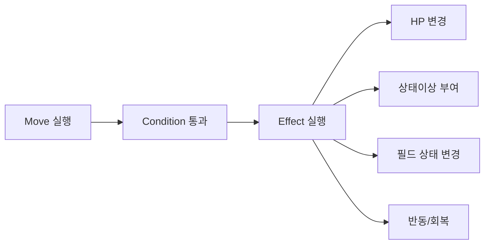

## Primitive Effect

문제는 여기서부터다.

기술 하나를 구현할 때마다 `ThunderboltEffect`, `FlamethrowerEffect`, `GigaDrainEffect` 같은 클래스를 하나씩 만들기 시작하면 기술 수만큼 Effect 클래스가 불어난다. 그러면 추상화를 했다고는 하지만 사실상 기술 목록을 클래스 목록으로 옮겨 적은 것밖에 안 된다.

그래서 여기서는 기술 이름이 아니라 상태 변화의 종류로 나누는 편이 더 깔끔하다.

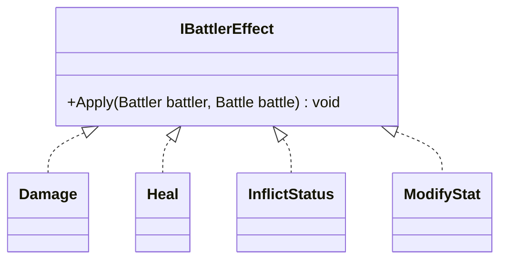

예를 들면 `Damage`는 HP를 깎고, `Heal`은 HP를 회복하고, `InflictStatus`는 상태이상을 걸고, `ModifyStat`는 공격이나 방어 같은 랭크를 바꾼다.

`몸통박치기`는 상대 HP를 깎는다. `회복`은 자기 HP를 회복한다. `전기자석파`는 상대를 마비 상태로 만든다. `칼춤`은 자기 공격 랭크를 올린다. 겉으로는 전부 다른 기술이지만, Effect 관점에서 보면 익숙한 몇 가지 조각으로 다시 읽힌다.

`섀도볼`, `화염방사`, `물의파동`도 마찬가지다. 이름과 속성만 다를 뿐 "상대에게 데미지를 주고 일정 확률로 추가 효과를 건다"는 구조는 같다. 그래서 기술마다 거대한 전용 클래스를 만드는 것보다 변화 단위를 잘게 쪼개 재사용하는 편이 낫다.

아래처럼 놓고 보면 더 잘 보인다.

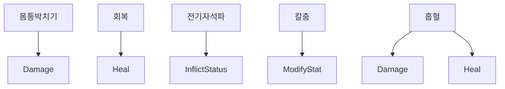

```text
몸통박치기 = 상대 HP를 깎는다
전기자석파 = 상대에게 마비를 건다
칼춤 = 자신의 공격 랭크를 올린다
흡혈 = 상대를 때리고 그 일부만큼 자신이 회복한다
```

여기서 한 단계 더 나아가보면 데미지도 전부 같은 데미지가 아니라는 점을 알 수 있다.

예를 들어 `지진`이나 `섀도볼`처럼 공격/방어/위력/상성을 반영해서 계산하는 데미지가 있는가 하면 `용의분노`나 `나이트헤드`처럼 고정으로 들어가는 류도 있다. 둘 다 "HP를 깎는다"는 점에서는 같지만 계산 방식은 다르다.

그래서 실제로는 이렇게 한 번 더 나눠볼 수 있다.

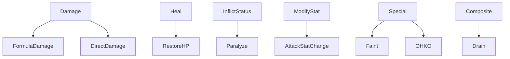

```text
FormulaDamage = 위력, 능력치, 상성 등을 반영해 계산하는 데미지
DirectDamage  = 계산식 없이 바로 들어가는 고정 데미지
RestoreHP     = 체력을 회복한다
AttackStatChange = 공격 랭크를 바꾼다
Paralyze      = 마비를 건다
Faint / OHKO  = 즉시 쓰러짐과 가까운 특수 효과
Drain         = 앞에서 발생한 데미지 결과를 읽어 회복으로 이어붙이는 조합 효과
```

이렇게 나눠두면 `Damage` 하나에 모든 걸 몰아넣지 않아도 된다. "HP를 깎는다"는 공통점은 유지하면서도 계산형 데미지와 고정 데미지를 편하게 구분할 수 있다.

## Apply

하지만 작은 효과만 만든다고 끝나지는 않는다.

`Damage`나 `Heal` 같은 효과는 "누구에게 적용할 것인가"가 빠지면 아직 반쪽짜리다. 그래서 2편의 `For`와 비슷하게 대상을 고른 뒤 그 효과를 붙여주는 다리 역할이 하나 필요하다.

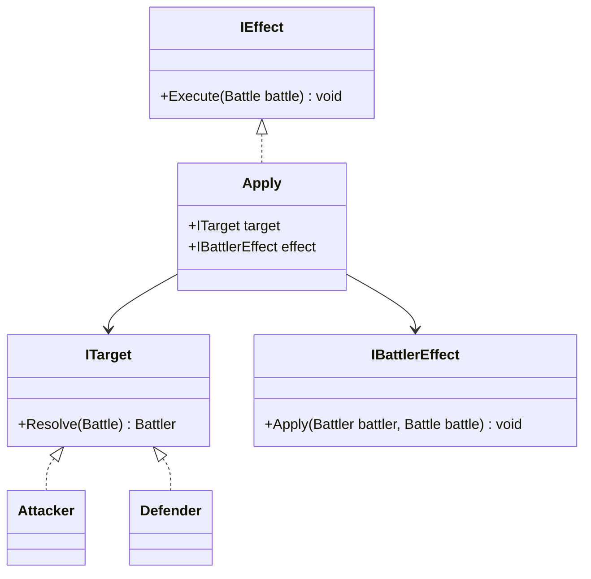

`Apply`의 역할은 단순하다. Battle에서 대상을 고르고 그 대상에게 Battler Effect를 적용한다.

예를 들어 `몸통박치기`는 방어자에게 데미지를 주고 `회복`은 공격자 자신에게 회복을 적용한다. `Damage`와 `Heal`은 무엇을 바꾸는지만 알고, 누구에게 붙일지는 `Apply`가 정한다. `돌진`처럼 상대에게 데미지를 주고 자신도 반동 데미지를 받는 경우도 같은 `Damage`를 대상만 바꿔 두 번 적용하면 된다.

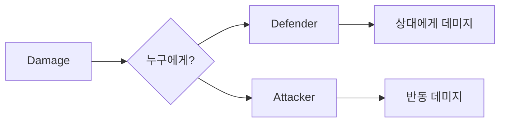

```text
몸통박치기      = Apply(Defender, Damage)
회복            = Apply(Attacker, Heal)
돌진            = Apply(Defender, Damage) + Apply(Attacker, Damage)
```

`RestoreHP`, `Paralyze`, `AttackStatChange`, `Faint`도 같은 방식으로 읽힌다. "누구에게 붙일 것인가?"만 정해지면 된다.

```text
전기자석파 = Apply(Defender, Paralyze)
칼춤       = Apply(Attacker, AttackStatChange)
회복       = Apply(Attacker, RestoreHP)
절대영도   = Apply(Defender, OHKO)
```

OHKO는 일격필살 기술이다.

## Sequence

포켓몬 기술은 대부분 데미지를 주고, 추가 효과를 걸고, 사용자가 회복하거나 반동을 받는 식으로 여러 단계가 이어진다. 그래서 Effect를 순서대로 묶는 Composite가 필요하다.

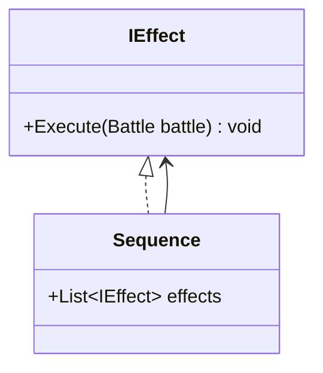

이제 기술 하나를 거대한 단일 로직으로 만드는 대신 작은 효과들의 순서로 적을 수 있다.

예를 들어 `흡혈`은 "상대에게 데미지를 준다. 그리고 방금 나온 데미지 결과의 일부만큼 자신이 회복한다"라고 읽으면 된다. `깨물어부수기`, `돌진`, `메가드레인`도 마찬가지다. 플레이어 입장에서는 전부 "기술 한 번 썼다"로 보이지만 내부적으로는 여러 단계가 순서대로 흘러간다. `Sequence`는 그 순서를 구조로 붙잡아두는 역할이다.

`돌진`을 예로 들면 흐름은 대략 이렇게 보일 것이다.

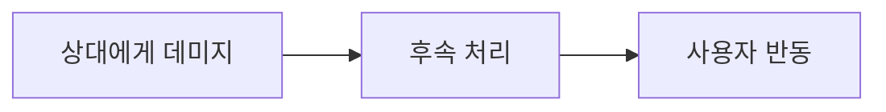

그리고 `흡혈`은 훨씬 단순하다.


독립된 leaf effect라기보다, 앞에서 나온 데미지 결과를 읽어 회복으로 이어 붙이는 조합 효과라고 보면 이해가 쉽다.

## Conditional Effect

모든 효과가 항상 실행되는 것도 아니다. 어떤 기술은 10% 확률로 마비를 걸고 어떤 효과는 상대가 이미 상태이상이 아닐 때만 발동하고 어떤 아이템은 체력이 절반 이하일 때만 터진다. 이런 것들은 "효과를 실행할지 말지"를 다시 조건으로 감싸는 게 자연스럽다.

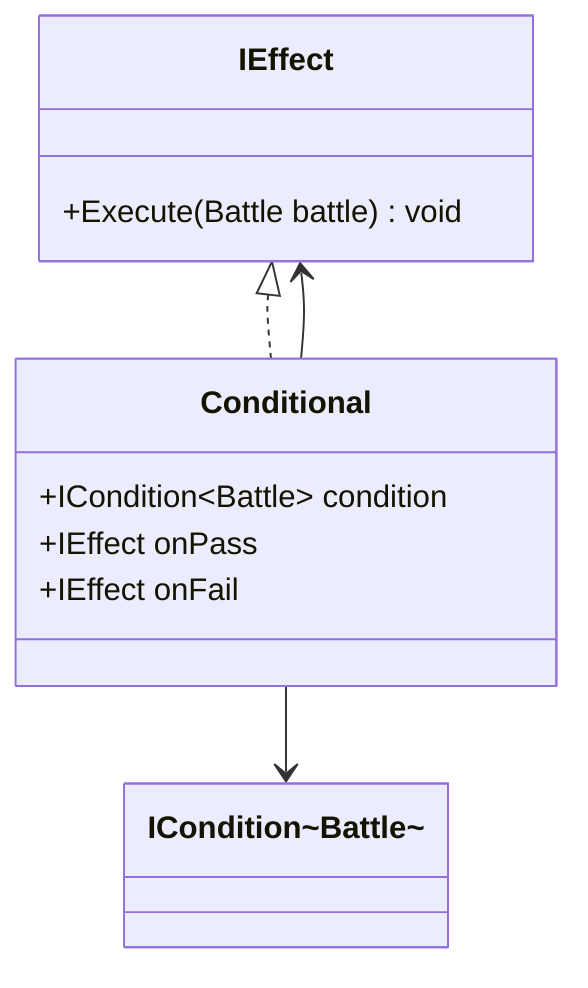

여기서 좋은 점은 2편에서 만들었던 `Condition` 부품들을 그대로 재사용할 수 있다는 것이다.

예를 들어 `섀도볼`의 추가 효과는 "20% 확률이면 상대의 특수방어를 떨어뜨린다"라고 읽을 수 있다. `화염방사`는 화상, `오랭열매`는 체력이 절반 이하일 때 회복 효과 실행으로 바뀔 뿐 형태는 같다. 앞 글에서 `Condition`이 "실행해도 되나?"를 물었다면 여기서는 "이 추가 효과가 발동하나?"를 묻는다. 규칙을 다루는 언어가 그대로 이어지는 셈이다.

조건을 통과했을 때만 효과를 실행하는 게 아니라, 실패했을 때는 다른 효과를 실행할 수도 있기 때문에 `onPass / onFail` 두 갈래로 나눠놨다.

가장 흔한 실패 처리 역시 `NoEffect`다.

```text
조건을 통과하면 = 마비를 건다
조건을 실패하면 = NoEffect
```

잉어킹은 조건을 통과해도 `NoEffect`다.

하지만 꼭 `NoEffect`만 있는 건 아니다. 예를 들어 명중 여부처럼 중요한 분기라면 성공 시 데미지를 주고 실패 시에는 그냥 빗나감 로그만 남기거나 다른 처리로 넘어갈 수도 있다. 그러니 `Conditional`은 사실상 "if-else를 Effect 영역으로 끌고 온 것"으로 볼 수 있다.

```text
섀도볼      = 상대에게 데미지
            + 20% 확률이면 특수방어 하락

화염방사    = 상대에게 데미지
            + 10% 확률이면 화상

회복열매    = HP가 절반 이하이면
            + 회복 효과 실행
```

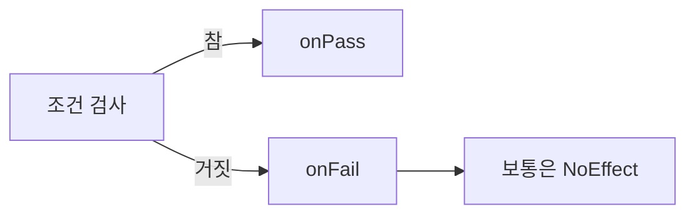

## Number + Effect

`INumber`를 따로 뺀 이유도 여기서 더 또렷해진다.

`Effect` 이후에는 "얼마나 바꿀지" 계산이 필요하다. 데미지를 얼마나 줄지, 회복을 얼마나 할지, 반동을 얼마나 받을지, 능력치 랭크를 몇 단계 바꿀지 같은 것들 말이다.

그래서 `Effect`는 변화의 종류를, `INumber`는 변화의 크기를 맡는 편이 깔끔하다. 이렇게 나눠두면 `Damage`는 그대로 둔 채 바깥에서 숫자 공급자만 바꾸면 되고, 고정 40 데미지든 타입 상성과 STAB(자기 타입 보정)가 반영된 계산식이든 이번 시도의 데미지 결과를 바탕으로 한 반동이든 모두 같은 `Damage`로 처리할 수 있다.

예를 들어 `지진`과 `용의파동`은 둘 다 "상대에게 데미지를 준다"는 점에서는 같은 Effect고 달라지는 건 실제 데미지를 계산하는 방식뿐이다. 반동도 마찬가지다. `돌진`의 반동은 Effect가 다른 게 아니라 숫자를 구하는 방식이 다르다.

무엇을 바꿀지와 얼마나 바꿀지를 나눠두면, 기술 수가 늘어날수록 구조는 오히려 더 관리하기 쉬워진다.

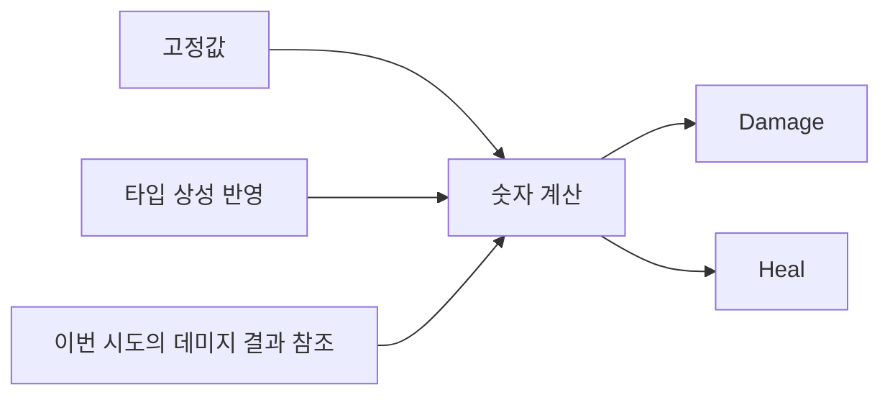

```text
고정 40 데미지
STAB(자기 타입 보정) + 상성 + 급소가 반영된 데미지
이번 시도의 데미지 결과를 바탕으로 한 반동

전부 "숫자를 만든 뒤 적용한다"는 점에서는 같은 구조다.
```

이건 `FormulaDamage`와 `DirectDamage`가 둘 다 `INumber`와 이어질 수 있다는 뜻이기도 하다. 하나는 복잡한 공식으로 숫자를 만들고, 다른 하나는 고정값 숫자를 만든다.

## Battle Effect

물론 모든 효과가 특정 Battler 한 마리에게만 적용되는 건 아니다. `비바라기`는 배틀 전체의 날씨를 바꾸고, `스텔스록`은 필드에 함정을 설치해서 이후 교체될 때 영향을 준다.

이런 기술까지 전부 "대상 하나에게 적용되는 효과"로 우겨 넣는 건 지금까지 설계해온 방향이랑 정면으로 부딪힌다. 그래서 한 마리의 상태를 바꾸는 효과와 배틀 문맥 전체를 바꾸는 효과를 나눠 보겠다.

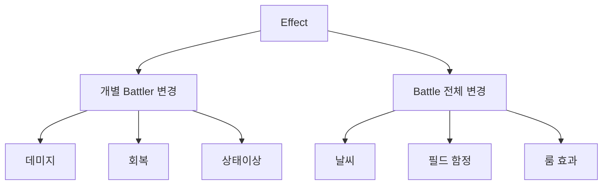

```text
비바라기   = Battle 전체 변경
스텔스록   = Battle 전체 변경
몸통박치기 = 개별 Battler 변경
칼춤       = 개별 Battler 변경
```

`Faint`, `OHKO` 같은 건 개별 Battler 하나를 바꾸는 것처럼 보여도 실제로는 쓰러짐 판정과 교체 흐름까지 이어지기 때문에 살짝 경계에 걸친 Effect라고 볼 수 있다.

이제 마무리로 기술을 다시 읽어보자. `섀도볼`, `돌진`, `흡혈`, `칼춤`, `스텔스록`은 이름은 달라도 데미지, 상태이상, 회복, 랭크 변경, 필드 변경 같은 Effect 조각의 조합으로 읽힌다. 차이는 이 조각들의 순서와 조건, 숫자 계산 방식에 있다.

```text
섀도볼
= Apply(Defender, Damage)
+ Conditional(20% 확률, Apply(Defender, 특수방어 하락))

흡혈
= Apply(Defender, Damage)
+ Apply(Attacker, Heal(이번 시도의 Damage 결과 기반))

돌진
= Apply(Defender, Damage)
+ Apply(Attacker, Damage(반동))
```
