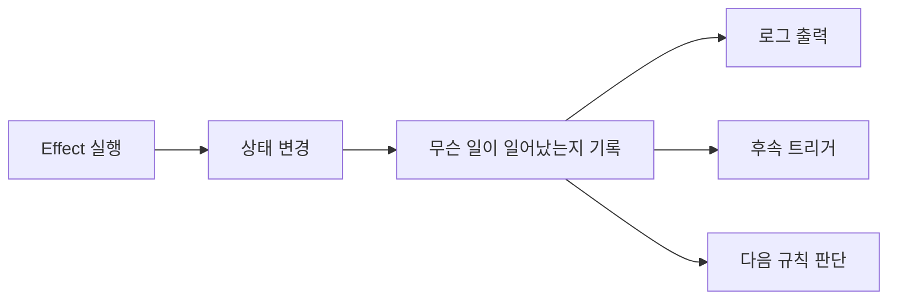
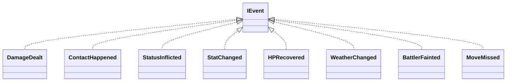
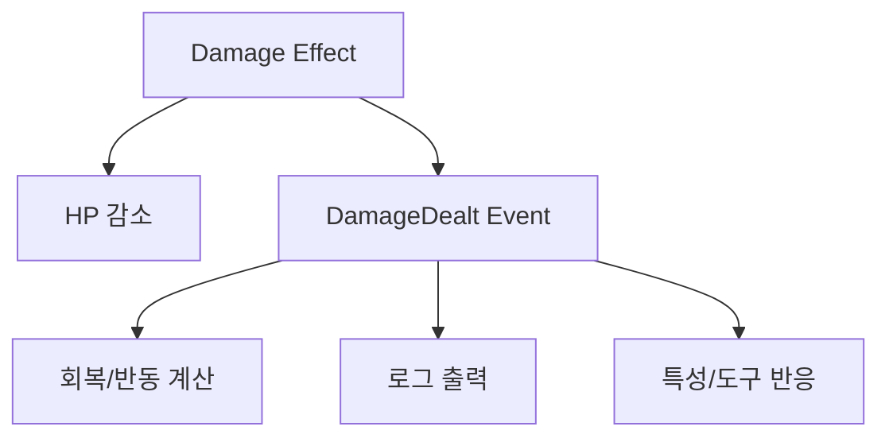
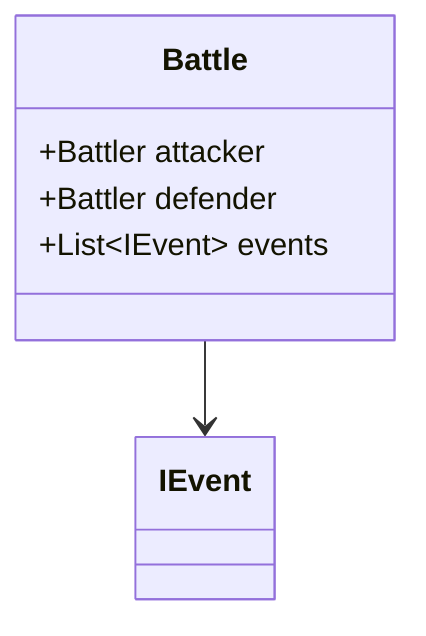
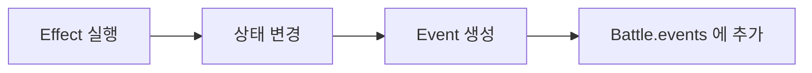
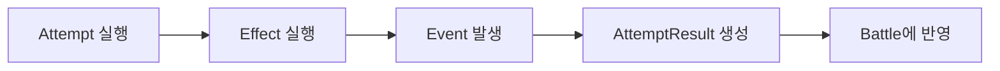

# Results & Events

지난 글에서는 조건을 통과한 뒤 실제로 HP가 깎이고, 상태이상이 걸리고, 날씨가 바뀌는 `Effect`를 봤다.

그런데 여기서 한 가지가 더 남는다.

> "무슨 일이 일어났는지"를 시스템은 어떻게 기억할까?

이 질문이 생각보다 중요하다. 피카츄의 `볼트태클`이 맞아서 상대 HP가 줄었다고 해보자. 플레이어 입장에서는 그냥 "맞았네"로 끝날 수 있지만 시스템 입장에서는 그 뒤에 알고 싶은 게 훨씬 많다.

누가 누구를 때렸는지, 얼마나 데미지가 들어갔는지, 추가 효과가 붙었는지, 그 결과 상대가 쓰러졌는지, 화면에는 무슨 로그를 띄워야 하는지 같은 것들 말이다.

그래서 `Effect`가 상태를 바꾸는 것만으로는 조금 부족하다. 그 변화가 일어났다는 사실도 함께 남겨야 한다.

## 왜 Event가 필요한가

`볼트태클`을 생각해보자. 이 기술은 상대에게 데미지를 주고 일정 확률로 마비를 입히고 마지막에 자신도 반동 데미지를 받는다.

상태 변화만 놓고 보면 "상대 HP 감소", "상대 마비", "사용자 HP 감소" 세 줄이면 끝이다. 그런데 실제 배틀은 여기서 멈추지 않는다.

상대가 쓰러졌다면 쓰러짐 메시지가 떠야 하고, 접촉 기술이니까 특정 특성이나 도구가 반응할 수도 있다. 사용자가 반동으로 기절했다면 그에 맞는 처리도 이어져야 한다.

즉, 시스템은 단순히 "HP가 바뀌었다"는 사실만 아는 걸로는 부족하고 "방금 배틀에서 실제로 무슨 일이 벌어졌는가"까지 알아야 한다.



## IEvent

이제 Event도 타입으로 잡아볼 수 있다.



`DamageDealt`는 누가 누구에게 얼마의 데미지를 줬는지 담고 `ContactHappened`는 접촉이 있었는지를 남긴다. `StatusInflicted`는 누가 누구에게 어떤 상태이상을 걸었는지 기록하고 `StatChanged`와 `HPRecovered`는 각각 랭크 변화와 회복량을 담는다. `BattlerFainted`는 어느 포켓몬이 쓰러졌는지를 남긴다.

```text
DamageDealt      = 데미지가 들어갔다
ContactHappened  = 접촉이 발생했다
StatusInflicted  = 상태이상이 걸렸다
HPRecovered      = 체력이 회복됐다
BattlerFainted   = 포켓몬이 쓰러졌다
WeatherChanged   = 날씨가 바뀌었다
MoveMissed       = 기술이 빗나갔다
```

이건 단순히 로그를 찍기 위해서만 필요한 게 아니라, 배틀 내부 규칙이 "무슨 일이 벌어졌는가"를 읽기 위해서도 필요하다.

## Effect만으로는 왜 부족한가

조금 단순하게 만들려고 하면 가끔 이런 식으로 생각하게 된다.

```text
데미지를 줬다
-> Battle.lastDamage 에 기록한다
-> 다음 효과가 그 값을 읽는다
```

실제로 `기가드레인`처럼 "방금 발생한 데미지 결과의 일부만큼 회복한다"는 기술은 이것만으로도 얼추 돌아갈 것처럼 보인다.

그런데 조금만 복잡해지면 금방 불편해질 수 있다. 예를 들어 이런 질문이 붙기 시작한다.

```text
그 lastDamage는 누가 준 데미지인가?
누가 맞은 데미지인가?
직전에 여러 번 맞았으면 어느 타격의 데미지인가?
접촉 기술이었는가?
급소였는가?
대타출동에 막힌 것인가?
상대가 구멍파기나 공중날기 1턴인가?
```

그제서야 "숫자 하나만 들고 있는 것"으로는 부족하다는 게 보인다. 필요한 건 단순한 값이 아니라 "무슨 일이 일어났는가"에 대한 구조화된 기록이다.



그림에 나온 구체적인 Effect까지 연결해 보면 대응 관계는 대략 다음과 같다.

```text
FormulaDamage   -> DamageDealt
DirectDamage    -> DamageDealt
접촉 기술의 타격   -> ContactHappened
RestoreHP       -> HPRecovered
Paralyze        -> StatusInflicted
AttackStatChange-> StatChanged
Faint / OHKO    -> BattlerFainted
NoEffect        -> 보통은 아무 Event도 남기지 않음
명중 실패 분기   -> MoveMissed
```

다만 이걸 너무 딱딱한 1:1 대응으로 볼 필요는 없다. 하나의 Effect가 Event를 여러 개 남길 수도 있고 `NoEffect`처럼 아무 Event도 남기지 않을 수도 있다. "상태를 바꾼다"와 "무슨 일이 일어났는지 남긴다"가 분리된다는 게 핵심이다.

## Battle Log

Event를 만들었으면 이제 그걸 어디엔가 남겨야 한다.

제일 자연스러운 자리는 `Battle` 안이다. Battle이 원래도 현재 문맥을 들고 있는 곳이니 배틀 중에 일어난 일들의 기록도 여기에 붙는 편이 잘 어울린다.



이렇게 하면 어떤 Effect가 실행될 때마다 Battle 안에 Event가 하나씩 쌓인다.



이 기록은 여러 군데서 읽을 수 있다.

화면 로그를 만드는 로직은 "무슨 문장을 보여줄까?"를 위해 읽고 후속 규칙은 "방금 무슨 일이 일어났지?"를 위해 읽는다.

예를 들어 `절대영도` 같은 OHKO 계열은 상태 변화만 보면 "HP가 0이 됐다"로 끝낼 수도 있다. 그런데 Event 관점에서는 보통 `BattlerFainted`가 더 중요하다. 실제 후속 규칙은 HP 숫자보다 "쓰러졌다"는 사실에 반응하는 경우가 많기 때문이다.

## AttemptResult

여기서 한 단계 더 생각해볼 수 있다.

Battle 전체에는 긴 로그가 쌓이지만 현재 Attempt 하나만 놓고 보면 "이번 시도에서 무슨 일이 일어났는가"를 따로 묶어 보는 편이 편할 때가 있다.

예를 들어 `AttemptResult` 같은 걸 두면 이런 정보를 담을 수 있다.

```text
명중했는가
빗나갔는가
이번 시도에서 발생한 Event 목록
그 Event들에서 바로 꺼내 쓰는 요약값
- 이번 시도의 데미지 결과
- 접촉이 있었는가
- 누가 쓰러졌는가
```

이건 Battle 전체 로그보다 범위가 좁다. 방금 실행한 행동 한 번을 따로 묶어 보여주는 정보라고 생각하면 된다. 원본 사실은 여전히 Event에 남고, `AttemptResult`는 그중 이번 시도에 필요한 값만 빠르게 읽도록 정리한 요약 뷰에 가깝다.



이런 게 있으면 `Sequence` 안에서 다음 단계가 앞 단계 결과를 읽기가 쉬워진다.

늘 나오는 기술 두 개로 다시 봐 보자.

`기가드레인`은 "이번 시도에서 발생한 데미지 결과"를 읽어야 하고, `볼트태클`은 "이번 타격이 접촉이었는가" 같은 정보를 읽을 수 있어야 한다. 단순히 전체 Battle 로그를 전부 탐색하는 것보다 현재 Attempt 결과를 요약한 묶음이 하나 있는 편이 구조적으로 이해하기 쉽다.

`NoEffect`도 의외로 의미가 있다. 추가 효과 판정이 실패했다면 새 Event는 없을 수 있지만 "이번 분기에서는 추가 변화가 없었다"는 사실 자체는 현재 Attempt의 흐름을 이해하는 데 필요할 수 있다.
