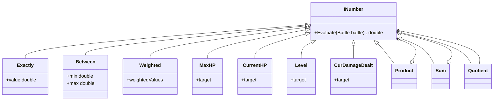
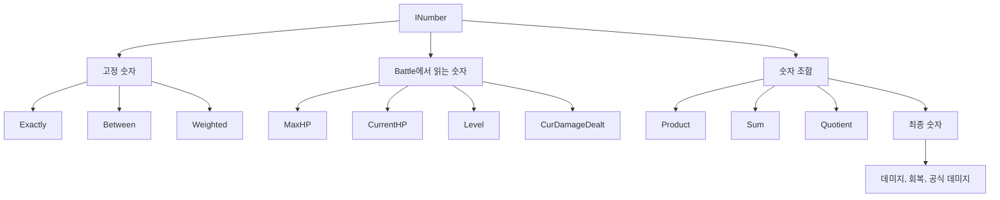
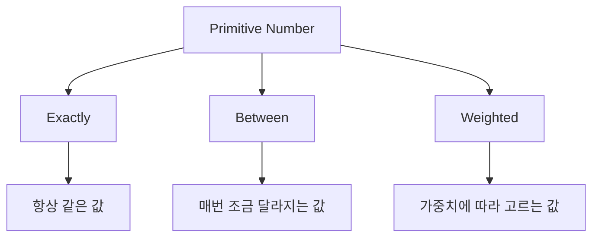
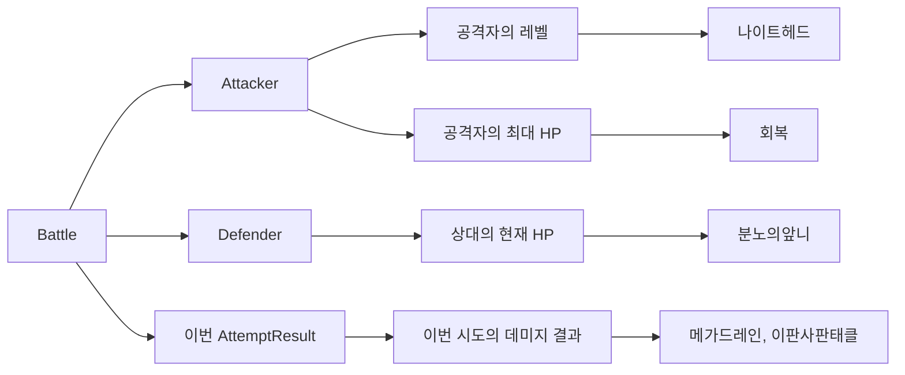
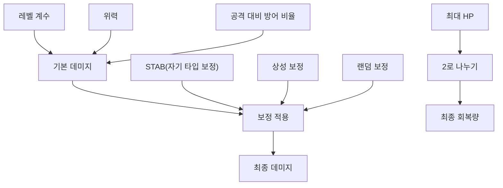
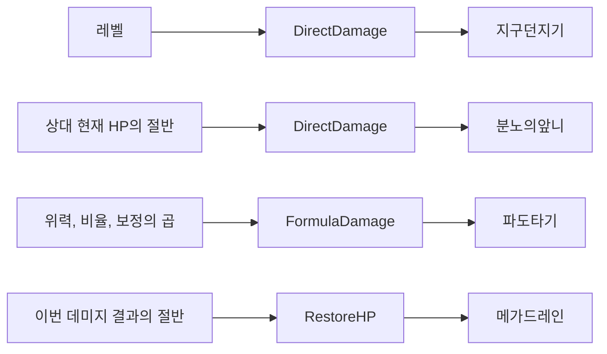

# Numbers

지난 글에서는 `Event`와 `AttemptResult`를 통해 "이번 시도에서 무슨 일이 일어났는가"를 기록하는 구조를 봤다.

그런데 배틀 시스템에는 한 가지 축이 더 필요하다.

> 그래서 얼마나 바뀌는가?

`파도타기`가 맞았다면 얼마만큼 HP가 줄어드는지 계산해야 하고, `회복`을 썼다면 얼마를 회복하는지도 알아야 한다. `메가드레인`처럼 방금 준 데미지의 일부를 다시 가져오는 기술도 있고, `이판사판태클`처럼 반동으로 일부를 되돌려받는 기술도 있다.

`Effect`가 "무엇을 바꾸는가"라면, `Event / Result`는 "무슨 일이 일어났는가"를 남기고, `Number`는 "얼마나 바꾸는가"다.

```text
Condition      = 실행 가능한가?
Effect         = 무엇을 바꾸는가?
Event / Result = 무슨 일이 일어났는가?
Number         = 얼마나 바뀌는가?
```

## INumber



이게 원본 영상에 있던 구조인데, 지금부터 나오는 도식들은 이 원형 구조를 읽기 쉽게 풀어쓴 버전이다.



`Evaluate(Battle)`가 중요한 이유는, 배틀에서 쓰이는 숫자가 단순 상수로 끝나지 않기 때문이다. 물론 40, 120처럼 고정된 값도 있다. 하지만 실제 배틀에서는 현재 문맥에 따라 달라지는 숫자가 훨씬 많다.

```text
내 최대 HP의 절반
상대 현재 HP의 절반
공격자의 레벨
이번 시도에서 방금 들어간 데미지의 절반
자기 타입 보정과 상성 보정이 반영된 최종 데미지
```

이런 값은 함수 안에서 즉석으로 계산할 수도 있다. 문제는 그렇게 두면 `if`, `*`, `/`, `반올림`, `예외 처리` 같은 계산 로직이 여기저기 흩어진다는 점이다. 반대로 숫자 자체를 INumber로 다루면, "숫자를 어떻게 만드는가"가 구조로 드러난다.

## Primitive Number

먼저 제일 작은 숫자 조각부터 본다.



`Exactly`는 말 그대로 고정값이다. `Exactly(40)`이라면 언제나 40을 돌려준다. 고정 데미지나 고정 회복량을 표현할 때 가장 단순하게 쓸 수 있다.

`Between`은 두 숫자 사이의 값을 뜻한다.
예를 들어 포켓몬 데미지의 랜덤 보정을 단순화해서 0.85에서 1.00 사이의 값으로 본다면, 같은 기술이라도 매번 피해량이 조금씩 달라지는 이유를 이 객체 하나로 표현할 수 있다.

`Weighted`는 여러 후보 숫자 중 하나를 가중치에 따라 선택하는 방식이다.
예를 들어 “대부분은 1.0배지만, 가끔 1.5배가 나온다” 같은 규칙을 숫자 자체로 모델링할 때 어울린다.

```text
Exactly(40)
= 항상 40

Between(0.85, 1.00)
= 0.85와 1.00 사이의 값

Weighted((1.0, 90), (1.5, 10))
= 90 비중으로 1.0, 10 비중으로 1.5
```

셋 다 출처는 다르지만, 바깥에서는 결국 숫자 하나로 다뤄진다. 이게 INumber로 추상화하는 핵심이다.

## Battle에서 읽어오는 숫자



배틀에서 쓰이는 숫자는 상수만이 아니다. 현재 상태에서 읽어오는 값도 숫자다.

`MaxHP`는 대상의 최대 HP를 읽는다. 그래서 `회복` 같은 기술은 "사용자의 최대 HP의 절반"처럼 바로 쓸 수 있다.

`CurrentHP`는 지금 남아 있는 HP를 읽는다. `분노의앞니`처럼 상대 현재 HP의 절반만큼 데미지를 주는 기술은 이런 숫자와 잘 맞는다.

`Level`은 레벨을 숫자로 가져온다. `나이트헤드`처럼 사용자의 레벨만큼 고정 데미지를 주는 기술을 떠올리면 바로 감이 온다.

`CurDamageDealt`는 앞 글의 `Event`와 `AttemptResult`와 직접 연결된다. 이 값은 임의의 숫자가 아니라, 이번 시도에서 실제로 발생한 데미지 결과를 읽어온 것이다. 그래서 메가드레인처럼 방금 준 데미지의 일부만큼 회복하거나, 이판사판태클처럼 방금 입힌 데미지 일부를 반동으로 되돌려받는 기술도 같은 구조 안에서 설명된다.

예시로 놓고 보면 이렇다.(이건 그냥 뇌피셜이다)

```text
회복
= MaxHP(Attacker) / 2

분노의앞니
= CurrentHP(Defender) / 2

지구던지기
= Level(Attacker)

메가드레인의 회복량
= CurDamageDealt / 2
```

물론 실제 데미지 공식으로 들어가면 여기에 위력, 공격, 방어, 자기 타입 보정, 상성 보정, 날씨 보정 같은 값들도 더 붙는다.

## Composite Number

숫자 조각이 생겼으니 이제 조합할 차례다. `Product`, `Sum`, `Quotient`는 숫자를 이어 붙여 더 큰 계산식을 만드는 역할을 맡는다.



`Product`는 곱셈이다. 포켓몬의 데미지 공식은 곱셈 구조가 특히 많이 드러난다. 위력에 공격 대비 방어 비율이 붙고, 자기 타입 보정이 붙고, 상성 보정이 붙고, 랜덤 보정이 붙는다. 이걸 한 덩어리의 거대한 함수로 보는 대신 "숫자들을 차례대로 곱하는 구조"로 보면 훨씬 읽기 쉬워진다.

```text
파도타기의 데미지 계산식 일부
= 위력
 * 공격/방어 비율
 * STAB(자기 타입 보정)
 * 상성 보정
 * Between(0.85, 1.00)
```

`Quotient`는 나눗셈이다. 회복량이나 반동처럼 “어떤 값의 일부”를 다룰 때 자주 나온다.

```text
회복
= MaxHP(Attacker) / 2

메가드레인의 회복량
= CurDamageDealt / 2

이판사판태클의 반동
= CurDamageDealt / 3

분노의앞니
= CurrentHP(Defender) / 2
```

`Sum`은 더하기다. 포켓몬 공식 전체를 보면 이런 더하기도 계속 나온다. 예를 들어 레벨 계수처럼 `2 * level / 5 + 2` 같은 값도 결국 `Product`, `Quotient`, `Sum`을 이어 붙인 조합으로 쓸 수 있다.

## Number + Effect

여기까지 오면 3편에서 봤던 `Effect`와 다시 연결된다.

`Effect`는 상태를 바꾸고, `Number`는 그때 필요한 크기를 계산하는데, 둘을 분리해 두면 같은 효과가 여러 숫자를 받아 재사용될 수 있다.



예를 들어 `RestoreHP`는 "HP를 회복한다"는 사실만 책임지면 된다. 최대 HP의 절반을 회복하든, 방금 준 데미지의 절반을 회복하든 그 차이는 `RestoreHP`가 아니라 바깥에서 넘겨주는 `INumber`가 맡는다.

그래서 같은 회복 효과도 이렇게 달라진다.

```text
회복
= RestoreHP(MaxHP(Attacker) / 2)

메가드레인
= RestoreHP(CurDamageDealt / 2)
```

데미지도 마찬가지다.

```text
지구던지기
= DirectDamage(Level(Attacker))

분노의앞니
= DirectDamage(CurrentHP(Defender) / 2)

파도타기
= FormulaDamage(여러 숫자의 곱)
```

이렇게 나누면 Damage나 RestoreHP가 숫자 계산까지 떠안을 필요가 없다. 결국 "무엇을 바꾸는가"와 "얼마나 바꾸는가"를 분리한 셈이고, 이 분리가 기술 조합이 많아질수록 힘을 발휘한다.

기술마다 거대한 계산 함수를 따로 만드는 대신, 효과는 효과대로, 숫자는 숫자대로 조립할 수 있기 때문이다.
