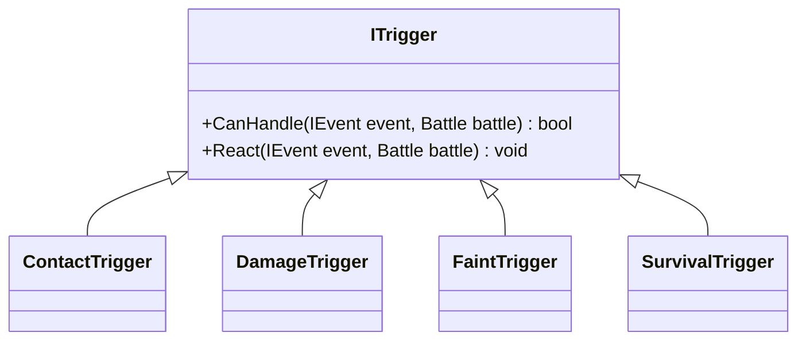
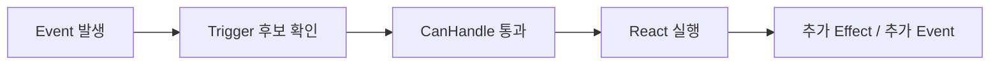
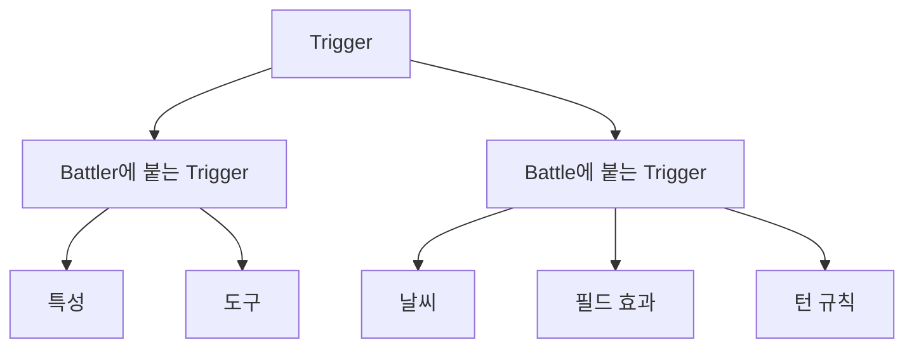
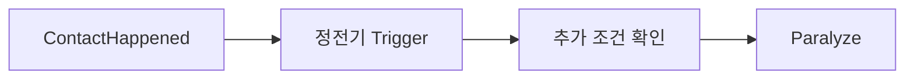
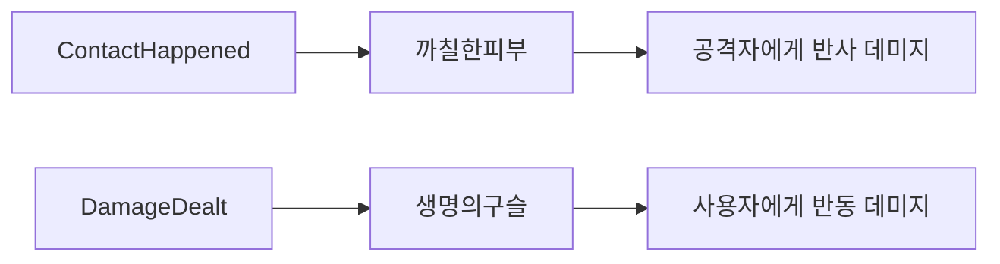
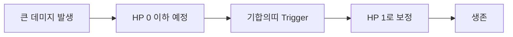
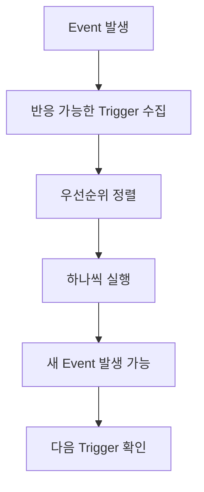

# Trigger

지난 글에서는 `Number`를 통해 "얼마나 바뀌는가"까지 객체로 분리했다.

그 다음 질문은 이것이다.

> 어떤 일이 일어났다면, 그걸 보고 누가 반응하는가?

포켓몬 배틀은 "이벤트 발생 → 끝" 구조가 아니고 이미 끝난 일에 반응하는 규칙들이 뒤에 줄줄이 붙는다.

예를 들어 접촉 공격이 일어났다고 해보자.

- 기술의 `Effect`는 이미 끝났다  
- 데미지도 계산됐고 `Event`도 남았다  

그런데 여기서 끝이 아니다.

- 상대 특성이 `정전기`라면 → 마비를 걸 수 있다  
- 도구가 `생명의구슬`이라면 → 반동 데미지가 들어간다  
- 상대가 `기합의띠`를 들고 있다면 → 쓰러지지 않고 버틴다  

이건 기술의 효과가 아니라 이미 일어난 결과에 대한 반응인데 이걸 담당하는 게 `Trigger`다.

## 왜 Trigger가 필요한가

처음에는 이렇게 만들고 싶어진다.

"접촉 기술이면 정전기 체크", "공격 성공이면 생명의구슬 반동", "HP가 0 이하가 되려 하면 기합의띠 체크" 같은 걸 전부 공격 처리 함수 안에 몰아넣는 식이다.

그런데 그렇게 가면 곧바로 힘들어질 게 뻔하다. 기술 하나를 처리하는 함수가 기술 자체 효과만 아는 게 아니라 상대 특성, 사용자 도구, 날씨, 필드, 생존 판정까지 전부 알아야 하기 때문이다. 여기에 상대 특성이 `까칠한피부`라면 접촉 반사 데미지가 붙을 수 있고, 사용자 도구가 `생명의구슬`이라면 또 다른 반동이 붙을 수 있다. 상대가 `기합의띠`를 들고 있었다면 생존 판정도 중간에 끼어든다.

이걸 전부 기술 하나의 `Effect` 안에 집어넣으면 그 순간 기술 구현은 더 이상 기술 구현이 아니게 된다.

그래서 Trigger도 기술 본체와 분리해서 보는 편이 훨씬 낫다는 것이다.

```text
기술은 자기 Effect를 실행한다
배틀은 Event를 남긴다
다른 규칙은 그 Event를 보고 각자 반응한다
```

이 분리가 있어야 기술, 특성, 아이템, 필드 효과가 서로 덜 엉킨다.

## ITrigger

가장 바깥쪽 인터페이스는 이런 모습으로 생각할 수 있다.



어떤 Trigger는 `DamageDealt`를 보고 반응하고, 어떤 Trigger는 `ContactHappened`를 보고 반응한다. 또 어떤 Trigger는 `BattlerFainted`나 그 직전 상황을 보고 끼어들 수 있다.

2편의 `Condition`이 "지금 실행 가능한가?"를 묻는 역할이었다면 `Trigger`는 "이 Event가 생겼을 때 내가 반응할 차례인가?"를 가려내는 역할이라고 볼 수 있다.



## Event를 보고 반응하기

여기서 Event 설계가 중요해진다. 단순히 HP가 줄었다는 사실만으로는 부족하다. 누가 누구를 때렸는지, 접촉이었는지, 데미지가 실제로 들어갔는지, 누가 쓰러졌는지 같은 정보가 있어야 다른 규칙이 올바르게 반응할 수 있기 때문이다.

`정전기`는 "접촉이 있었는가?"를 보고 반응한다.

```text
ContactHappened Event 발생
= 정전기 Trigger가 반응
= 공격자에게 Paralyze 적용 가능
```

`생명의구슬`은 "공격이 성공해서 실제 데미지가 들어갔는가?"를 보고 반응한다.

```text
DamageDealt Event 발생
= 생명의구슬 Trigger가 반응
= 사용자에게 반동 데미지 적용
```

`기합의띠`는 조금 다르다. 순수한 Event 하나만 본다기보다 풀피로 시작해서 데미지 결과를 바탕으로 만들어진 "빈사 직전" 상황에 끼어든다.

```text
빈사 직전 상황 발생
= 기합의띠 Trigger가 반응
= 풀피였다면 HP를 1로 남기고 생존
```

즉 `Trigger`는 이미 일어난 일 뒤에 따라붙는 후속 반응에 가깝다.

## 누가 Trigger를 가지는가



배틀에서는 Trigger가 한곳에만 붙어 있진 않는다.

특성과 도구같은 건 `Battler`가 가진다. `정전기`, `까칠한피부`, `기합의띠`, `생명의구슬`은 특정 포켓몬이 들고 있거나 가진 능력이므로, 각 `Battler` 주변에 붙는 규칙으로 해석할 수 있다.

어떤 것은 `Battle`이 가진다. 날씨, 필드, 룸 같은 필드 전체 규칙이 그렇다. 예를 들어 턴 끝에 모래바람 데미지를 주는 규칙은 특성이나 타입에 따라 아군한테도 피해를 주기 때문에 개별 포켓몬 하나의 반응이라기보다 배틀 전체의 반응으로 처리되는 편이 낫다.

이렇게 두면 각 규칙의 책임 범위를 나누기 훨씬 쉽다.

`정전기`를 예시로 보면 이 구조가 더 분명해진다. 플레이어 입장에서는 "접촉하면 가끔 마비 걸리는 특성" 한 줄이지만 시스템 입장에서는 접촉 Event를 받은 뒤 조건을 다시 확인하고 그 결과에 따라 반응한다.



```text
ContactHappened
+ 정전기 소유자
+ 마비 가능 조건 통과
= 공격자에게 Paralyze
```

`까칠한피부`와 `생명의구슬`을 같이 보면 Trigger가 더 선명해진다. 겉으로 보면 둘 다 "추가 데미지"지만 `까칠한피부`는 접촉 Event를 보고 반응하고 `생명의구슬`은 DamageDealt Event를 보고 반응한다.



`기합의띠`는 앞의 예시들보다 조금 더 흥미롭다. 이 경우는 공격이 끝난 뒤에 단순히 추가 데미지를 더하는 게 아니라, 쓰러짐 자체를 막아버리기 때문이다.



이런 규칙을 기술 쪽에 넣어두면 거의 모든 공격 기술이 `기합의띠`를 알아야 한다. 하지만 Trigger로 빼두면 공격 기술은 그냥 데미지를 만들기만 하면 되고, 생존 반응은 도구가 책임질 수 있다.

## 처리 순서

여기까지 오면 자연스럽게 또 하나의 문제가 나온다.

> Trigger가 여러 개면 어떤 순서로 처리할까?

실제 포켓몬 배틀은 이 순서가 꽤 중요하다. 누가 먼저 반응하느냐에 따라 생존 여부가 바뀌기도 하고, 로그 순서도 달라지고, 뒤에 이어질 Trigger가 달라지기도 한다.

위에서 들었던 예시만 갖고 봐도 접촉 공격 하나에 이런 것들이 한꺼번에 걸릴 수 있다.

```text
기술 자체의 추가 효과
까칠한피부
정전기
생명의구슬
기절 판정
```

그래서 Trigger 시스템은 보통 "반응할 것들을 모은 다음 정해진 순서대로 처리한다"는 구조를 가진다. 실제 포켓몬은 세대별 규칙과 세부 판정에 따라 순서가 더 복잡할 수 있지만 여기서는 개념 흐름만 단순화해서 보자.



이 구조가 필요한 이유는 Trigger 역시 다시 Event를 만들 수 있기 때문이다. 예를 들어 `까칠한피부`로 사용자가 쓰러질 수도 있고, 그러면 거기서 다시 쓰러짐 관련 Trigger나 후속 처리로 이어질 수 있다.

정리하면 `Trigger`는 "반응 규칙"을 담아두는 자리다. 기술은 자기 `Effect`를 실행하고, 배틀은 그 결과를 `Event`로 남기며, 특성이나 도구 같은 다른 규칙은 그 Event를 보고 `Trigger`로 뒤따라 반응한다.
