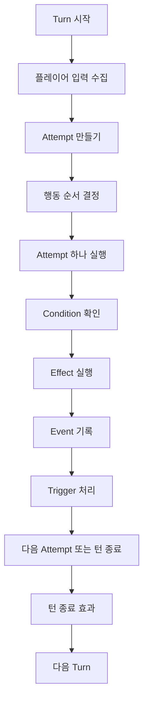
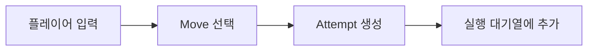
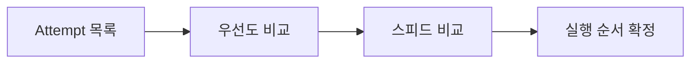
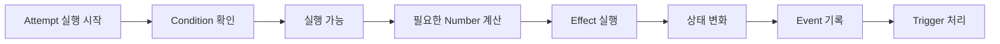
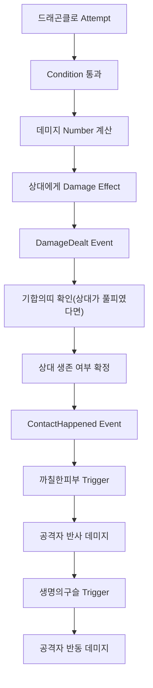
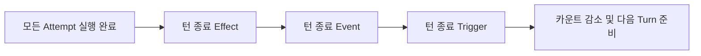
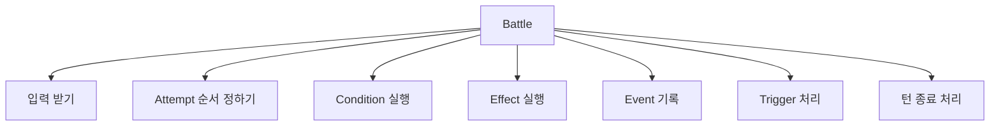

# Battle Loop

지난 글에서는 `Trigger`를 봤다. 어떤 일이 일어났을 때, 그 사실을 보고 특성이나 도구, 전장 규칙이 어떻게 반응하는지를 살펴봤다.

이제 마지막 질문이 남는다.

> 이 모든 것들이 실제 한 턴 안에서 어떤 순서로 돌아갈까?

지금까지 시리즈에서는 `Condition`, `Effect`, `Event`, `Number`, `Trigger`를 따로따로 떼어 봤다. 각각은 따로 놓고 보면 충분히 납득된다. 문제는 실제 배틀에서는 이 요소들이 따로 떨어져 움직이지 않는다는 점이다.

한 턴이 시작되면 입력을 받고, 행동 순서를 정하고, 실행 가능 여부를 확인하고, 상태를 바꾸고, 이벤트를 남기고, 반응을 처리한 뒤, 턴 종료 효과까지 이어진다.

## 왜 Battle Loop가 필요한가



처음 구현할 때는 공격 하나를 함수로 만들고, 그 안에서 일어나는 일을 차례대로 적고 싶을 수 있다.

"기술 선택", "명중 판정", "데미지 계산", "상태이상", "특성 반응", "도구 반응", "기절 판정", "턴 종료 처리"를 한 함수 안에 전부 밀어 넣는 식이다.

그런데 그렇게 가면 기술 하나를 처리하는 로직이 턴 전체 흐름, 반응 순서, 로그 타이밍, 교체 규칙까지 전부 알아야 하기 때문에 함수 하나가 너무 많은 책임을 갖게 된다.

반대로 배틀을 루프로 보면 각 조각이 들어갈 자리가 또렷해진다. `Condition`은 실행 전에, `Effect`는 실행 중에, `Event`는 실행 뒤에, `Trigger`는 그 다음 반응 단계에 들어간다. `Number`는 그 사이사이에서 필요한 값을 계산한다.

즉 `Battle Loop`는 새로운 규칙이 아니라, 지금까지 본 규칙들이 실제로 어떤 순서로 돌아가는지 보여주는 흐름이다.

## 입력은 Attempt로 받는다

`프레셔` 특성같이 시작 직후 바로 발동되는 경우를 제외하면 배틀은 보통 플레이어 입력부터 시작한다. 플레이어 입장에서는 그저 기술을 선택하거나 포켓몬 교체를 고를 뿐이지만, 시스템 입장에서는 그 선택을 곧바로 실행하지 않는다. 먼저 "이번 턴에 시도할 행동"으로 받아 놓는다.

이 시점에서 1편의 `Move`와 `Attempt`가 다시 등장한다.



이 구조가 필요한 이유는, 배틀이 입력을 받자마자 바로 실행되는 게임이 아니기 때문이다. 두 포켓몬의 선택을 모은 뒤, 누가 먼저 행동하는지 정하고, 그 순서에 따라 하나씩 처리해야 한다.

그래서 `Attempt`는 "지금 당장 실행된 행동"이라기보다 "곧 실행될 행동"을 의미한다.

## 행동 순서 정하기

입력을 모았다면 다음은 순서다.

포켓몬 배틀은 같은 턴 안에서도 누가 먼저 움직이느냐가 중요하다. 우선도, 스피드, 특정 전장 규칙이 모두 여기에 얽힌다. 세부 공식까지 깊게 들어가지는 않겠지만, 최소한 배틀 루프 안에서 순서 결정이 어디에 들어가는지는 보는 게 좋다.



이걸 따로 떼어 둬야 기술 효과와 순서 결정을 섞지 않을 수 있다.

예를 들어 `전광석화`가 먼저 나가는 이유는 데미지 공식 때문이 아니라 선제공격이 이뤄진다는 우선도 규칙 때문이다. 둘다 전광석화를 썼으면 기존 규칙으로 돌아가 스피드 높은 개체가 선공인 점도 이거로 쉽게 이해할 수 있다.

## Attempt 하나는 어떻게 실행되나

순서가 정해지면 이제 그 턴의 첫 번째 `Attempt`를 실행한다.



먼저 이 행동이 정말 실행 가능한지 본다. 마비 때문에 행동 불능은 아닌지, PP가 남았는지, 대상이 면역은 아닌지 같은 것들이 여기서 걸린다. 이 단계는 2편의 `Condition`이 맡는다.

통과했다면 실제 상태를 바꾼다. HP를 깎거나, 상태이상을 걸거나, 랭크를 바꾸거나, 날씨를 바꾼다. 이건 3편의 `Effect`다.

그 과정에서 숫자가 필요하면 5편의 `Number`가 계산을 맡는다. 단순 고정값일 수도 있고, 위력과 공격/방어 비율, 상성, 랜덤 보정이 섞인 공식일 수도 있다.

그리고 실행이 끝나면 4편의 `Event`가 남는다. 누가 누구를 때렸는지, 실제 데미지가 들어갔는지, 누가 쓰러졌는지 같은 사실들이 여기 기록된다.

마지막으로 6편의 `Trigger`가 그 이벤트를 보고 반응한다. 특성, 도구, 날씨, 필드 효과가 여기서 움직인다.

결국 한 번의 행동은 작은 단계들이 이어진 한 묶음이라고 볼 수 있다.

한 가지 시나리오로 자세히 풀어보겠다.

팬텀이 `섀도볼`을 쓰고, 상대는 별다른 반응 특성이나 도구가 없다고 해보자.

```text
1. 팬텀이 섀도볼을 선택한다
2. Attempt가 만들어진다
3. 행동 순서가 정해진다
4. Condition을 확인한다
5. 데미지 Number를 계산한다
6. Effect가 상대 HP를 깎는다
7. DamageDealt Event가 남는다
8. 추가 효과가 붙으면 StatChanged Event가 남는다
9. 반응할 Trigger가 없으면 다음 단계로 간다
```

그냥 맞추고 피깎고, 추가 효과까지 확인하고 끝났다. 이제 변수를 늘려보도록 하겠다. 공격자가 `드래곤클로`를 썼고, 상대 특성은 `까칠한피부`이며, 공격자는 `생명의구슬`, 상대는 `기합의띠`를 들고 있다고 해보자. 기술은 단순하게 두고, 4세대 도구 반응이 루프 중간에 어디 끼어드는지 보는 단순화된 예시라고 생각하면 된다.



여기서 중요한 건 이 모든 걸 `드래곤클로`라는 기술 하나가 전부 알고 있을 필요는 없다는 점이다. 기술은 자기 `Effect`를 실행하고, 그 뒤에 남은 `Event`를 보고 다른 규칙이 차례대로 반응하면 된다.

## 턴 종료

포켓몬 배틀에는 턴 종료에 따로 처리되는 것들이 많다. 날씨 데미지, 상태이상 데미지, 지속 효과, 남은 카운트 감소 같은 것들이 이 단계에서 처리된다.

그래서 배틀 루프는 보통 "모든 행동 실행"에서 끝나지 않고, 마지막에 턴 종료 단계가 한 번 더 붙는다.



이 단계를 따로 두는 이유는, 턴 도중 반응과 턴 종료 반응이 같은 종류가 아니기 때문이다. 예를 들어 `화상` 데미지는 "공격 성공 직후"가 아니라 "턴이 끝날 때" 들어간다.

## Battle은 지휘자 역할

여기까지 오면 1편에서 봤던 Battle의 역할도 더 분명해진다.

`Battle`은 직접 모든 규칙을 계산하는 거대한 객체라기보다, 여러 규칙이 순서대로 흘러가도록 만드는 지휘자에 가깝다.



`Battle`이 중요한 이유는 "모든 걸 혼자 안다"가 아니라, "각 조각이 어느 타이밍에 움직여야 하는지 흐름을 제어한다"는 점이다.

7편까지의 내용을 정리하면 시리즈 전체 흐름은 이렇다.

```text
Condition = 실행 가능한가
Effect    = 무엇을 바꾸는가
Event     = 무슨 일이 일어났는가
Number    = 얼마나 바뀌는가
Trigger   = 그 결과에 누가 반응하는가
Loop      = 이 전부가 어떤 순서로 이어지는가
```

결국 포켓몬 배틀 시스템을 OOP로 본다는 건 기술 하나를 거대한 함수로 구현하는 일이 아니라, 배틀을 이루는 요소들을 작은 객체와 단계로 나눠 읽어내는 과정에 가깝다.

이쯤 되면 "그래서 이게 왜 OOP냐?"라는 질문도 자연스럽게 따라온다.

사실 여기서 중요한 건 클래스 개수를 많이 만드는 게 아니다. 진짜 중요한 건 "서로 다른 이유로 바뀌는 것들을 분리하는지"이다.

`Condition`은 실행 가능 여부가 바뀔 때 수정된다. `Effect`는 상태를 바꾸는 방식이 바뀔 때 수정된다. `Number`는 계산식이 바뀔 때 수정된다. `Trigger`는 후속 반응 규칙이 바뀔 때 수정된다. `Battle Loop`는 그 조각들의 실행 순서가 바뀔 때 수정된다.

이걸 전부 한 함수 안에 넣어두면, 명중률 하나 고치려 해도 데미지 계산과 상태이상과 특성 반응과 턴 종료 처리까지 같이 읽어야 한다. 반대로 역할을 나눠두면 "무엇이 왜 바뀌는가"가 단순해진다.

요약하면 OOP를 설계하는 좋은 기준은 클래스를 많이 만드는 게 아니라 바뀌는 부분을 잘 나누는 것이라고 할 수 있게된다.

이 관점에서 보면 포켓몬 배틀은 OOP 예시로 꽤 재밌다.

규칙이 많고, 예외도 많고, 세대별 차이도 있고, 특성이나 도구나 날씨처럼 서로 다른 계층의 규칙이 한 턴 안에서 계속 부딪힌다. 이런 도메인을 절차적으로만 밀어붙이면 코드가 금방 "이번엔 여기서 if 하나 더"의 연속이 된다.

그런데 객체로 잘게 나눠 보기 시작하면 질문도 바뀐다.

"이 기술은 무슨 if가 더 필요하지?"가 아니라,
"이건 Condition인가, Effect인가, Trigger인가?"
"이 숫자는 Number로 빼는 게 맞나?"
"이 반응은 Battler가 가져야 하나, Battle이 가져야 하나?"

이렇게 질문 자체를 바꾸면 유연한 설계가 가능해진다.

결국 OOP로 포켓몬 배틀을 본다는 건 포켓몬을 객체로 만든다는 뜻보다 배틀을 이루는 규칙들을 "읽을 수 있는 단위"로 쪼갠다는 뜻에 더 가깝다.

이건 포켓몬 배틀에만 해당하는 얘기도 아니다. 결제 시스템이든, 채팅 시스템이든, 게임 서버든, 복잡한 서비스일수록 결국 비슷한 문제가 반복된다. 입력이 들어오고, 조건을 확인하고, 상태를 바꾸고, 결과를 기록하고, 다른 규칙이 반응한다.

도메인은 달라도 구조는 비슷하다.

그래서 이 시리즈를 쓰면서 제일 재밌었던 부분도 그거였다. 처음에는 그냥 "포켓몬 배틀을 OOP로 보면 재밌겠다" 정도였는데, 끝까지 와보니 이건 포켓몬 얘기이면서 동시에 복잡한 규칙을 어떻게 다뤄야 하는가에 대한 얘기이기도 했다.
