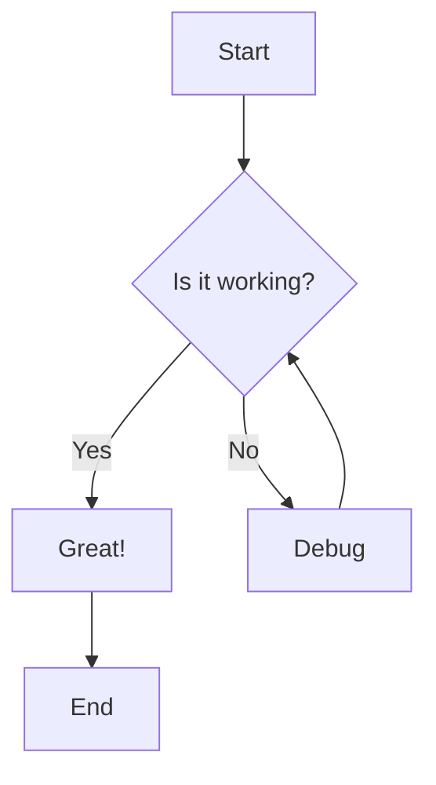
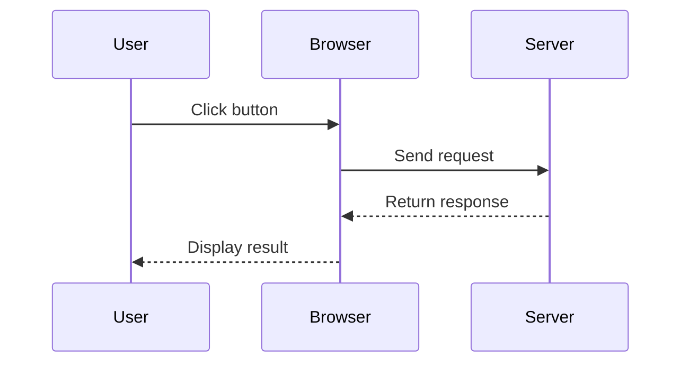
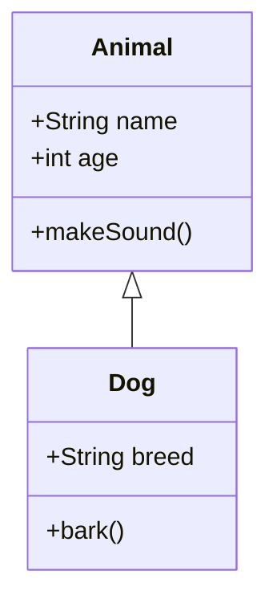

# Code Block Test

This post demonstrates various code blocks.

## JavaScript Example

```javascript
function greet(name) {
  console.log(`Hello, ${name}!`);
  return true;
}

const result = greet("World");
```

## Python Example

```python
def calculate_sum(numbers):
    total = sum(numbers)
    return total

result = calculate_sum([1, 2, 3, 4, 5])
print(f"Sum: {result}")
```

## TypeScript Example

```typescript
interface User {
  id: number;
  name: string;
  email: string;
}

function getUserById(id: number): User | null {
  // Implementation here
  return null;
}
```

## Inline Code

You can use `inline code` like this, and it should look good too.

## Long Code Block

```javascript
// This is a longer code block to test scrolling
const express = require('express');
const app = express();

app.get('/', (req, res) => {
  res.send('Hello World!');
});

app.listen(3000, () => {
  console.log('Server is running on port 3000');
});
```

## Mermaid Diagrams

### Flowchart



### Sequence Diagram



### Class Diagram


