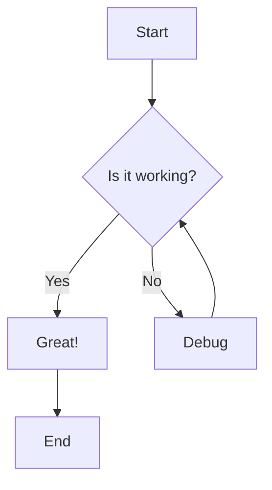
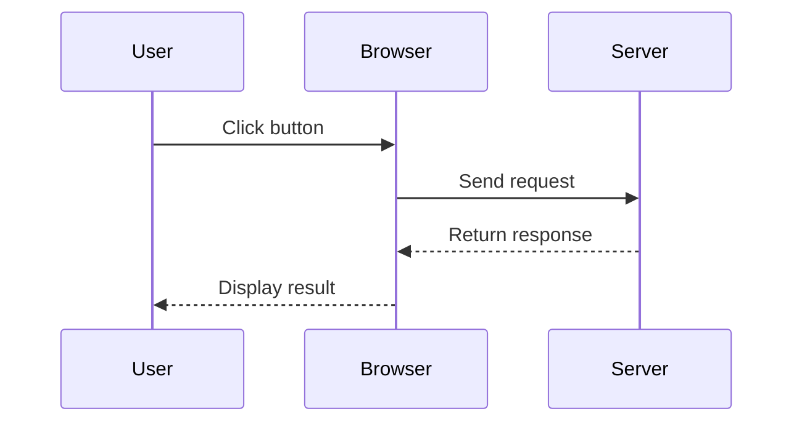
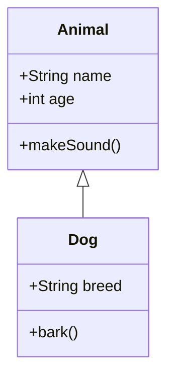

---
# ============================================================================
# COMPLETE POST TEMPLATE
# ============================================================================
# This template includes ALL available frontmatter fields.
# Use this as a reference for all options available when writing posts.
# 
# Usage:
# 1. Copy this file to posts/your-post-name.md
# 2. Fill in the fields you want to use
# 3. Remove fields you don't need (or leave them as shown)
# 4. Write your content below the frontmatter
# ============================================================================

# ===== REQUIRED FIELDS =====

# Required: The title of your post
# - Shown as the main heading on the post page
# - Used in browser tab title
# - Used in meta tags for SEO and social sharing
title: "Complete Guide: Using All Post Features"

# Required: Publication date in YYYY-MM-DD format
# - Must be in ISO format: "YYYY-MM-DD"
# - Used for sorting posts (newest first)
# - Displayed on post cards and post pages
date: "2025-01-20"

# ===== OPTIONAL FIELDS =====

# Optional: Short description of your post
# - Shown on the homepage post list under the title
# - Used as the meta description for SEO
# - Used in social media previews (Open Graph, Twitter Cards)
# - Recommended length: 150-200 characters
# - If not provided, a default description will be used
excerpt: "Learn how to use all available post features including categories, tags, images, code blocks, math equations, and more. Complete guide with examples."

# Optional: Single category for this post
# - Used for organizing posts
# - Displayed as a colored badge on post cards
# - Categories are automatically collected and shown on homepage for filtering
# - Use 1-3 words, descriptive names
# - Examples: "Tutorial", "Web Development", "DevOps", "Book Review"
category: "Tutorial"

# Optional: Array of tags for detailed categorization
# - Used for detailed categorization and filtering
# - Displayed as hashtag badges on post cards
# - Tags are automatically collected and shown on homepage
# - Recommended: 3-7 tags per post
# - Use lowercase, hyphenated format for consistency
# - Examples: ["nextjs", "react", "typescript", "tutorial"]
tags: ["nextjs", "blogging", "markdown", "tutorial", "guide"]

# Optional: Draft status
# - If set to true, the post will NOT be visible on the live site
# - Useful for work-in-progress posts
# - Default is false (post is published)
# - Remove this line or set to false when ready to publish
draft: true

# ============================================================================
# That's all the frontmatter fields! Now write your content below.
# ============================================================================
---

# Complete Guide: Using All Post Features

This post demonstrates all available features and best practices for writing blog posts.

## Introduction

Welcome! This guide covers everything you need to know about writing great blog posts with this platform.

## What You'll Learn

- Front matter configuration
- Markdown formatting
- Adding images
- Code blocks and syntax highlighting
- Mathematical equations
- Diagrams with Mermaid
- Best practices

## Basic Formatting

### Text Styles

You can use standard Markdown for formatting:

- **Bold text** with `**bold**` or `__bold__`
- *Italic text* with `*italic*` or `_italic_`
- ~~Strikethrough~~ with `~~strikethrough~~`
- `Inline code` with backticks

### Headings

```markdown
# H1 - Main Title (automatically generated from title)
## H2 - Major Section
### H3 - Subsection
#### H4 - Minor Section
##### H5 - Tiny Section
###### H6 - Smallest Section
```

**Best Practice:** Use H2 for main sections, H3 for subsections. Don't skip heading levels.

## Links and Images

### Links

Basic link syntax:

```markdown
[Link text](https://example.com)
[Link with title](https://example.com "Hover text")
```

Examples:
- [Next.js Documentation](https://nextjs.org/docs)
- [GitHub Repository](https://github.com "View on GitHub")

### Images

```markdown


```

**Image Example:**


**Best Practices for Images:**
1. Save local images in `public/images/`
2. Use descriptive alt text for accessibility
3. Optimize images (< 500KB recommended)
4. Use meaningful file names

## Lists

### Unordered Lists

```markdown
- Item 1
- Item 2
  - Nested item
  - Another nested item
- Item 3
```

Example:
- JavaScript frameworks
  - React
  - Vue
  - Angular
- CSS frameworks
  - Tailwind
  - Bootstrap

### Ordered Lists

```markdown
1. First step
2. Second step
3. Third step
```

Example:
1. Install dependencies
2. Configure settings
3. Run the application

### Task Lists

```markdown
- [x] Completed task
- [ ] Pending task
- [ ] Another pending task
```

Example:
- [x] Read documentation
- [x] Set up environment
- [ ] Write first post
- [ ] Deploy to production

## Code Blocks

### Inline Code

Use single backticks for inline code: `const x = 42;`

### Code Blocks with Syntax Highlighting

Use triple backticks with language identifier:

**JavaScript:**
```javascript
function greet(name) {
  console.log(`Hello, ${name}!`);
  return true;
}

const result = greet("World");
```

**Python:**
```python
def calculate_sum(numbers):
    """Calculate the sum of a list of numbers."""
    total = sum(numbers)
    return total

result = calculate_sum([1, 2, 3, 4, 5])
print(f"Sum: {result}")
```

**TypeScript:**
```typescript
interface User {
  id: number;
  name: string;
  email: string;
}

function getUserById(id: number): User | null {
  // Implementation here
  return null;
}
```

**Bash:**
```bash
npm install
npm run dev
```

**JSON:**
```json
{
  "name": "my-blog",
  "version": "1.0.0",
  "scripts": {
    "dev": "next dev",
    "build": "next build"
  }
}
```

## Tables

Create tables using pipes and hyphens:

```markdown
| Header 1 | Header 2 | Header 3 |
|----------|----------|----------|
| Cell 1   | Cell 2   | Cell 3   |
| Cell 4   | Cell 5   | Cell 6   |
```

Example:

| Feature | Supported | Notes |
|---------|-----------|-------|
| Markdown | ✅ Yes | GitHub Flavored Markdown |
| Math | ✅ Yes | KaTeX support |
| Diagrams | ✅ Yes | Mermaid support |
| Comments | ✅ Yes | Optional Giscus |

## Blockquotes

Use `>` for quotes:

```markdown
> This is a blockquote.
> It can span multiple lines.
```

Example:

> "The best way to predict the future is to invent it."
> — Alan Kay

## Horizontal Rules

Create a horizontal line with three hyphens:

```markdown
---
```

Example:

---

## Emoji Support

Use emoji codes:

```markdown
:smile: :rocket: :heart: :+1: :tada:
```

Result: 😄 🚀 ❤️ 👍 🎉

## Mathematical Equations (KaTeX)

### Inline Math

Inline equations with single dollar signs: $E = mc^2$

```markdown
The equation $E = mc^2$ represents mass-energy equivalence.
```

### Block Math

Display equations with double dollar signs:

$$
\int_{-\infty}^{\infty} e^{-x^2} dx = \sqrt{\pi}
$$

```markdown
$$
\int_{-\infty}^{\infty} e^{-x^2} dx = \sqrt{\pi}
$$
```

More examples:

$$
f(x) = \frac{1}{\sigma\sqrt{2\pi}} e^{-\frac{1}{2}\left(\frac{x-\mu}{\sigma}\right)^2}
$$

## Mermaid Diagrams

### Flowchart



### Sequence Diagram



### Class Diagram



## Best Practices Summary

### Content

1. ✅ Start with a clear introduction
2. ✅ Use headings to structure content
3. ✅ Include code examples when relevant
4. ✅ Add images to illustrate concepts
5. ✅ End with a conclusion or summary

### SEO

1. ✅ Write descriptive titles (< 60 characters)
2. ✅ Add meaningful excerpts (150-200 characters)
3. ✅ Use relevant categories and tags
4. ✅ Include alt text for all images
5. ✅ Use descriptive link text

### Formatting

1. ✅ Use consistent heading hierarchy
2. ✅ Add blank lines between sections
3. ✅ Use code blocks with language identifiers
4. ✅ Keep paragraphs reasonably short
5. ✅ Use lists for multiple items

### File Management

1. ✅ Use lowercase file names
2. ✅ Use hyphens instead of spaces
3. ✅ Organize images in `public/images/`
4. ✅ Use meaningful file names
5. ✅ Keep posts in logical folders

## Conclusion

You now know how to use all available features for writing blog posts! Remember:

- Start with the required fields (`title`, `date`)
- Add optional fields as needed (`excerpt`, `category`, `tags`)
- Use Markdown for formatting
- Add images, code blocks, and diagrams
- Follow best practices for SEO and readability

Happy blogging! 🎉

## Additional Resources

- [POST_GUIDE.md](../../POST_GUIDE.md) - Complete post writing guide
- [FORK_SETUP.md](../../FORK_SETUP.md) - Setup and configuration
- [IMAGE_GUIDE.md](../../IMAGE_GUIDE.md) - Image usage guide
- [THEME_CONFIG.md](../../THEME_CONFIG.md) - Customization options

---

**Need help?** Check the documentation or open an issue on GitHub.
